# ハンズオンワークショップ前の事前準備
このハンズオントレーニングでは、各参加者に以下のことをしていただきます。
- Azure Storage アカウントの作成
- Azure AI Search アカウントの作成
- Azure AI Foundry - Hub の作成
- Azure AI Foundry - Project の作成
- Azure AI Search アカウントに対して Azure Storage アカウントへアクセスするための権限を付与
- Azure AI Search アカウントに対して Azure AI Services アカウントへアクセスするための権限を付与
- Azure Web Apps リソースに対して Azure AI Project へアクセスするための権限を付与

Azure リソースのシステム割り当てマネージドIDに対して権限付与(ロールの割り当て)を行う必要があるため、参加者には、使用する Azure サブスクリプション、またはリソースグループレベルでの```所有者```ロールの付与が必要です。  

以下に、以下を実施するための方法の説明を記述します。
- 参加者の Entra アカウントを、トレーニングに使用する Azure サブスクリプションが所属する Microsoft Entra テナント に所属していることを確認し、必要に応じて招待する
- リソースグループを作成して、参加者の Entra アカウントに、作成したリソースグループに対する```所有者```ロールを付与する

## 参加者の Entra アカウントがテナントに属するかの確認
サブスクリプションを含む、Azure のリソースに対するアクセス権限を付与するためには、その対象者の Entra アカウントが Azure サブスクリプションが所属する Microsoft Entra テナントに所属しておく必要があります。まず、参加者の Entra アカウントが当該テナントに所属しているかを確認するために、[Microsoft Azure Portal](https://portal.azure.com/) へアクセスします。そして、サイドメニューの```[全てのサービス]```をクリックします。

### 参加者の Entra アカウントがテナントに属するかの確認

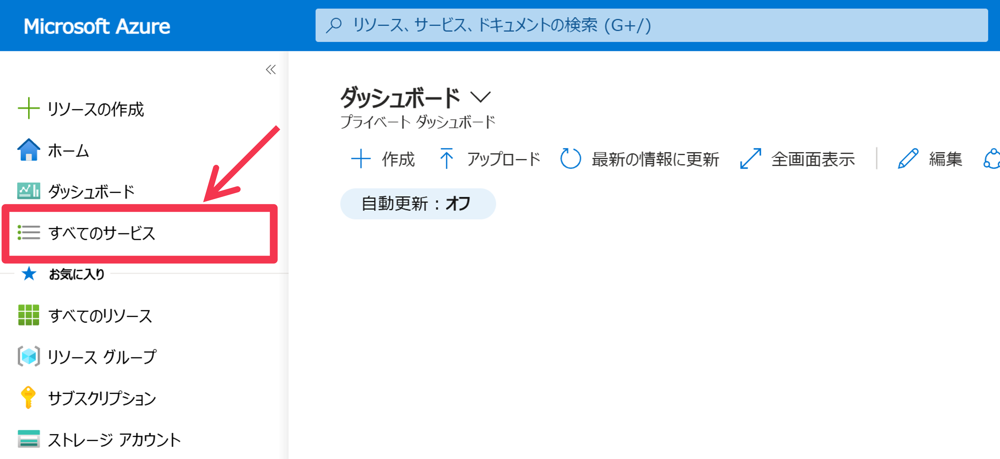

表示されたウィンドウのサイドメニューのカテゴリ内にある ```[ID]``` をクリックし、表示された ID 関係の Azure サービスの中にある、```Microsoft Entra ID``` のエリアにある```[表示]```をクリックします。

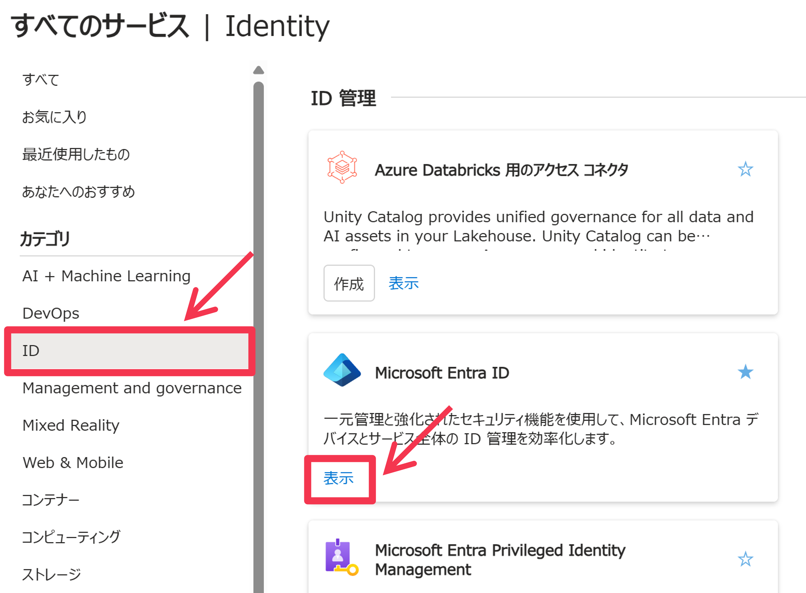

現在選択中の Entra テナントの設定画面が表示されます。サイドメニューの```[管理]>[ユーザ]```クリックします。

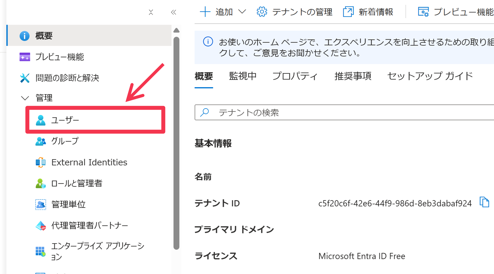

Entra テナントに所属しているユーザ一覧が表示されます。ここで、今回の参加者の Entra ユーザがテナントに所属していることを確認します。

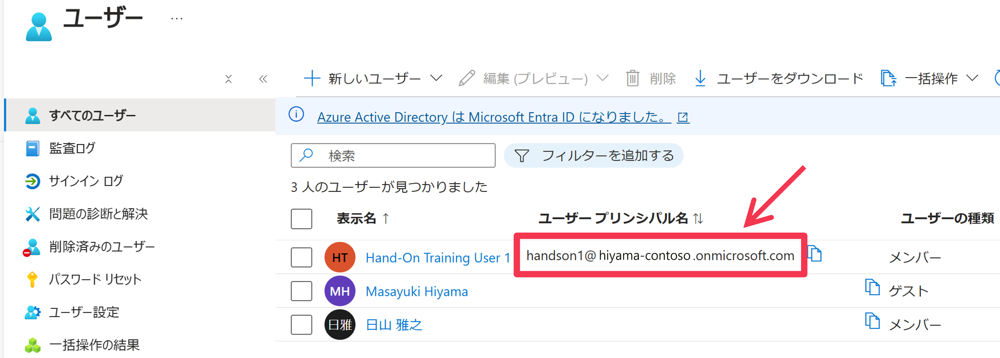

### 参加者の Entra アカウントのテナントへの招待

もし参加者の Entra ユーザがテナントに所属していない場合、テナントに招待する必要があります。上部メニューの```[＋新しいユーザ]```をクリックし、```[外部ユーザの招待]```をクリックします。

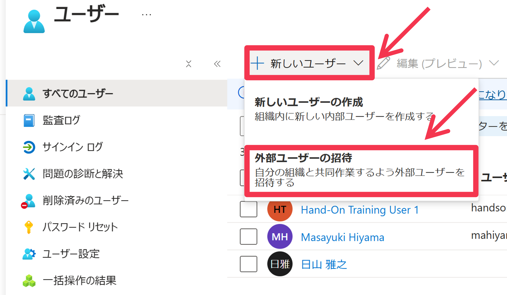

参加者の```[Entra ユーザ名(メールアドレス)]```を入力し、必要に応じて[表示名]を入力し、```[レビューと招待]```ボタンをクリックします。

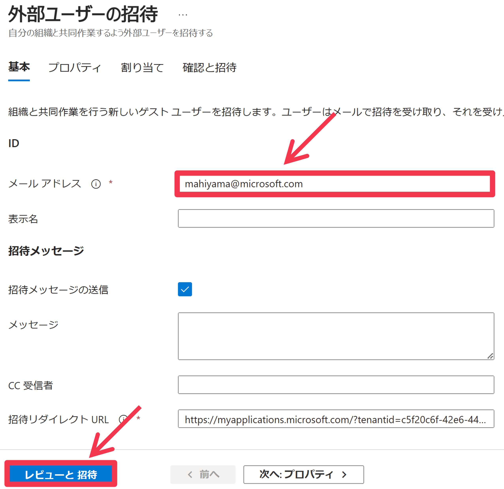

```[招待]```ボタンをクリックすると、参加者のメールアドレスに招待メールが送信されます。メールのタイトルは```"XXXXX(テナント名) invited you to access applications within their organization"``` といった内容で、参加者はメール中にある ```[Accept invitation]``` をクリックすることで、招待を承諾する必要があります。

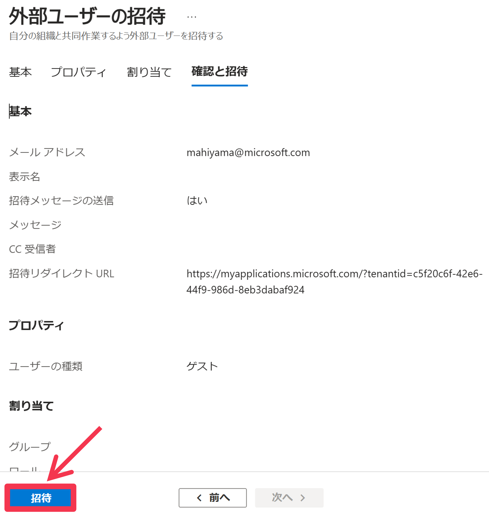

## リソースグループの作成と所有者権限の付与
続いて、参加者用のリソースグループを作成して、参加者の Entra アカウントに対して、リソースグループへの所有者ロールを付与します。リソースグループは参加者ごとに作成されることを想定していますが、1つのリソースグループを複数の参加者で共有することも可能です。  
まず、[Azure Portal](https://portal.azure.com/) のサイドメニューの```[全てのサービス]```をクリックします。

### リソースグループの作成

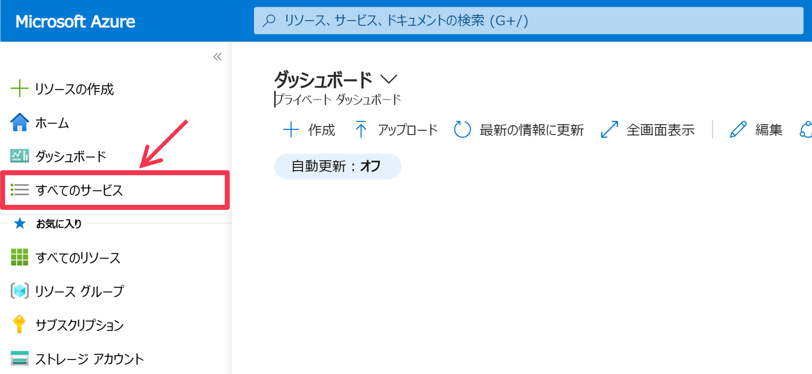

表示されたウィンドウのサイドメニューのカテゴリ内にある ```全般``` をクリックし、表示された Azure サービスの中にある、```リソースグループ``` のエリアにある```[作成]```をクリックします。

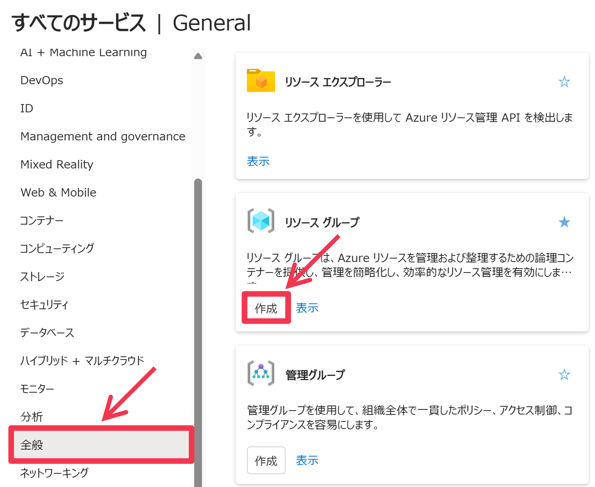

リソースグループ作成のページが表示されます。まず```[サブスクリプション]```が今回使用するサブスクリプションが選択されていることを確認し、```[リソースグループ名]```を入力します。[リージョン]はどのリージョンでも構いません。入力を終えたら、```[確認と作成]```ボタンをクリックします。

> リソースグループ内の Azure リソースのリージョンは、リソースグループのリージョンと同一でなければならない、というルールはありません。Japan East リージョンのリソースグループ内に、East US リージョンの Azure Storage アカウントを作成することもできます。リソースグループのリージョンは、グループ内のリソース一覧を表示する際に、どのリージョンの Azure REST API を呼び出すの違いしかないため、どのリージョンを選択しても大きな問題になることはありません。

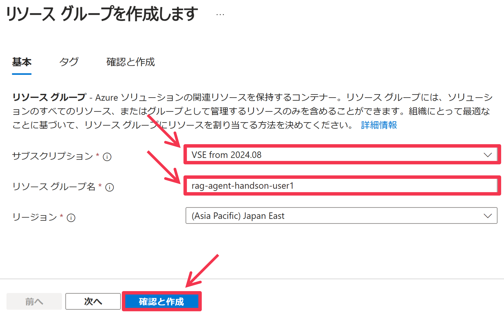

作成するリソースグループの確認を行います。内容を確認したら、```[作成]```ボタンをクリックし、リソースグループの作成を開始します。

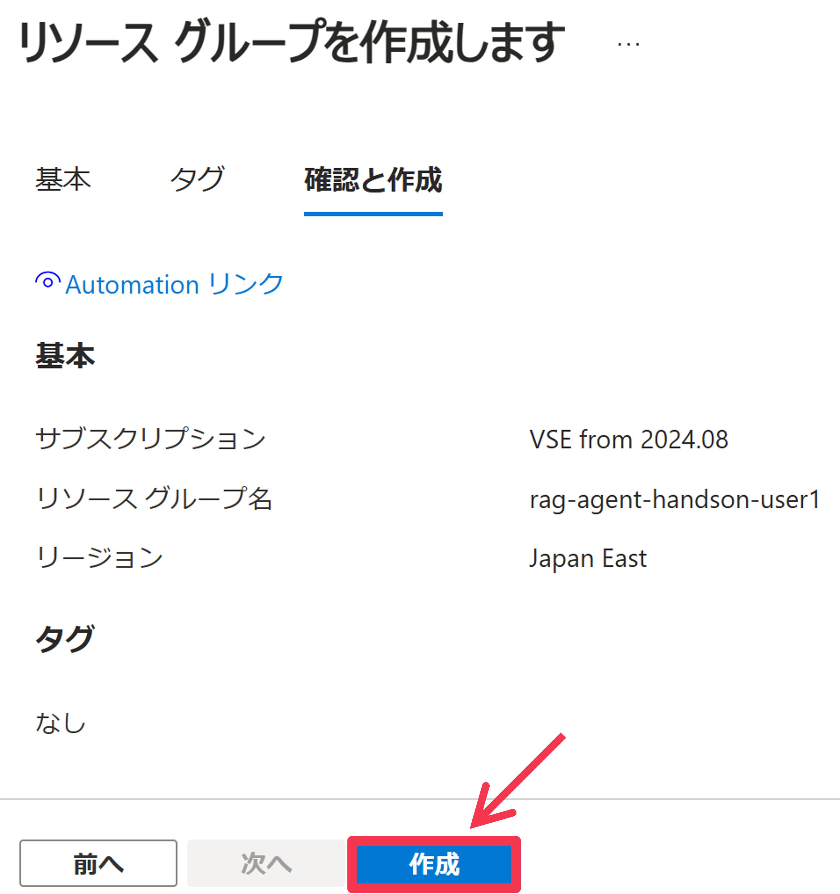

### リソースグループへの所有者権限の付与

リソースグループの作成が完了すると、画面右上に以下のようなホップアップが表示されるため、```[リソースグループの表示]```ボタンをクリックします。

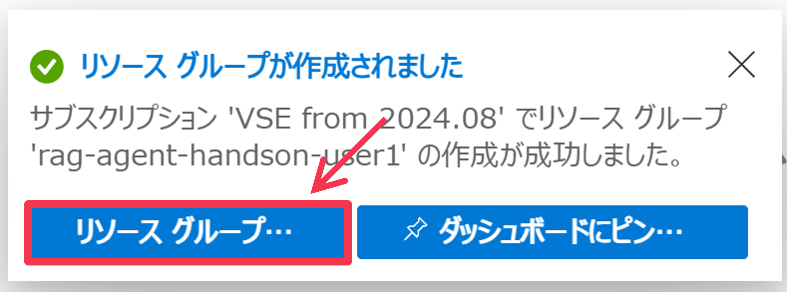

作成したリソースグループのページが表示されます。ここでは、リソースグループ内の Azure リソースの一覧を閲覧することができます。サイドメニューの```[アクセス制御(IAM)]```をクリックすると、リソースグループに対するアクセス権限付与に関するページが表示されます。このページの上部メニューの```[＋追加]```をクリックし、```[ロールの割り当ての追加]```をクリックします。

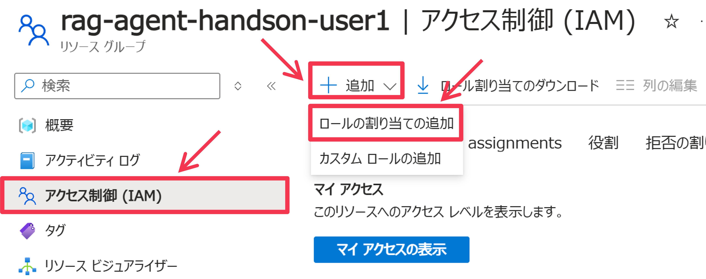

ロールの割り当て追加の画面が表示されます。まず付与するロールを選択します。タブ```[特権管理者ロール]```をクリック、```[所有者]```をクリックして、```[次へ]```ボタンをクリックします。

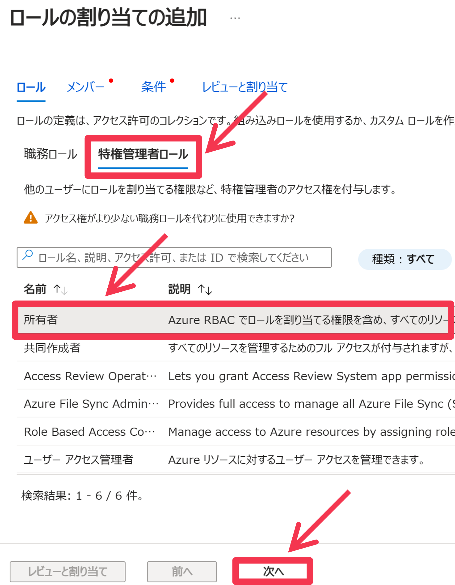

次に、ロールの付与先を選択します。```[ユーザ、グループ、またはサービスプリンシパル]```をチェックし、[＋メンバーを選択]をクリックします。右側に表示されたウィンドウにて、付与対象の Entra アカウントを選択します。複数人を同時に選択することもできます。アカウントを選択したら、```[選択]```ボタンをクリックします。

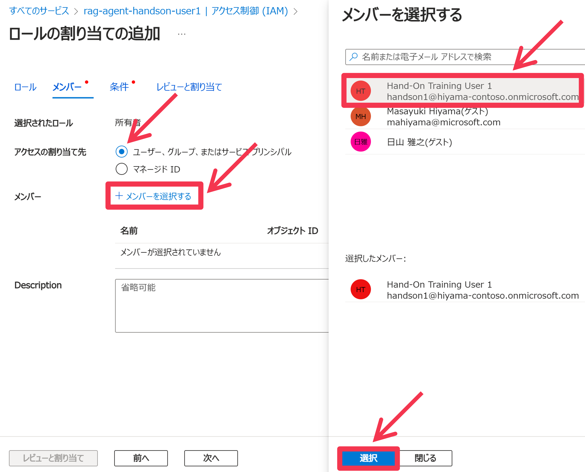

ロールの付与先の確認を行い、```[次へ]```ボタンをクリックします。

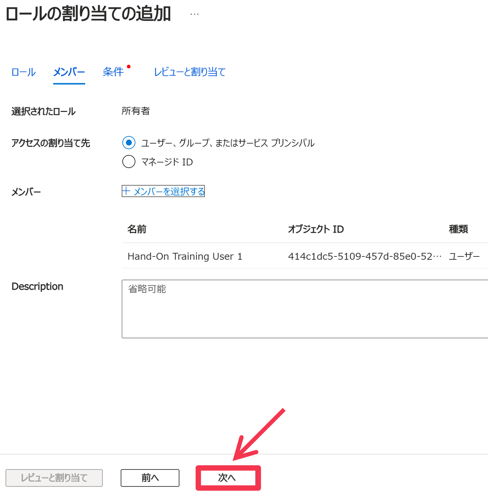

ロール割り当ての条件を設定します。所有者ロールは非常に強い権限を持つロールであるため、権限を限定的するため、[ユーザができること]として```[特権管理者ロールである所有者、UAA、RBAC　を覗くすべてのロールを割り当てることをユーザに許可します (おすすめ)]``` をチェックし、```[レビューと割り当て]```ボタンをクリックします。これは、対象アカウントが作成した Azure リソースに対するロール付与はできるけど、他のアカウントに対してリソースグループに対する権限付与はできなくするための制御です。

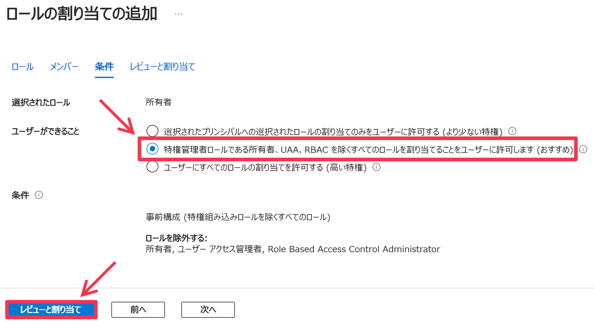

ロールの割り当て内容の確認を行い、```[レビューと割り当て]```ボタンをクリックします。これで、割り当て対象の Entra ユーザは、このリソースグループにアクセスすることができ、かつこのリソースグループにデプロイした Azure リソースに対するロールの割り当てを自由に行えるようになりました。

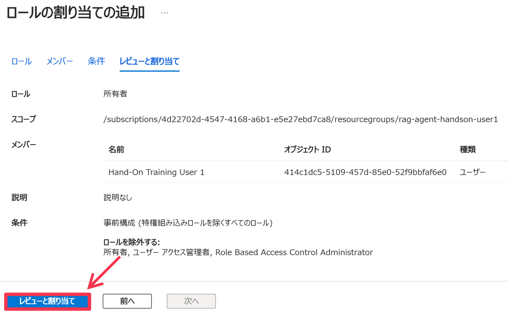
