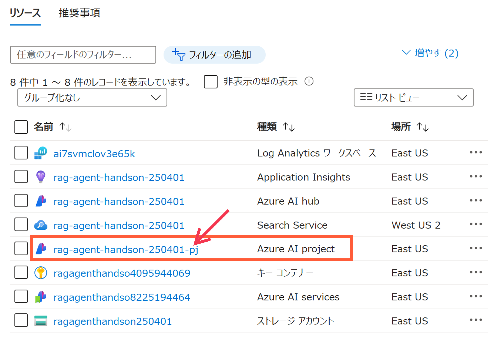
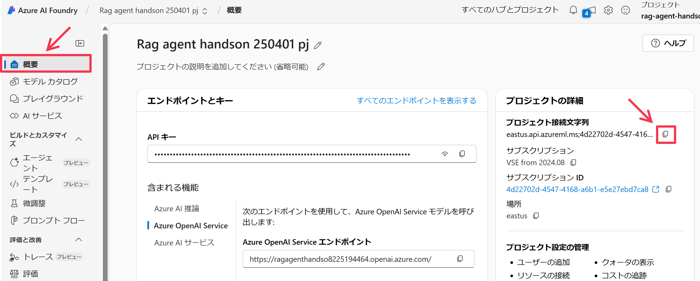
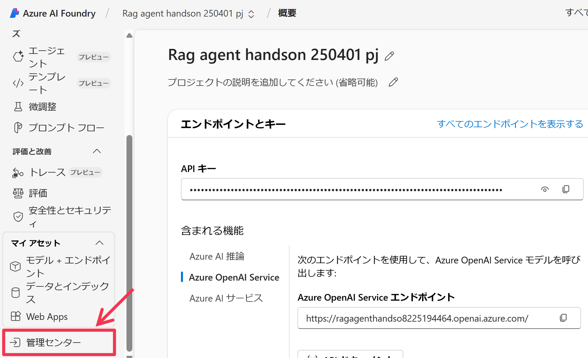
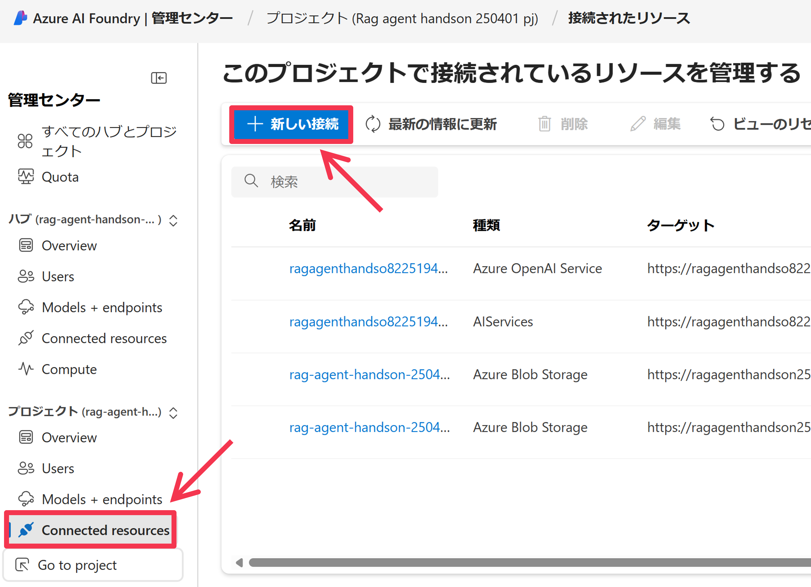
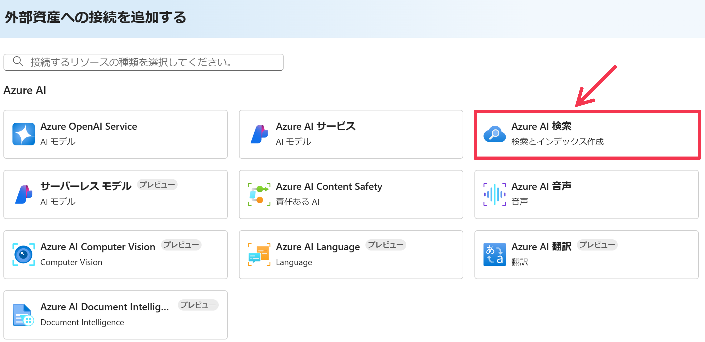
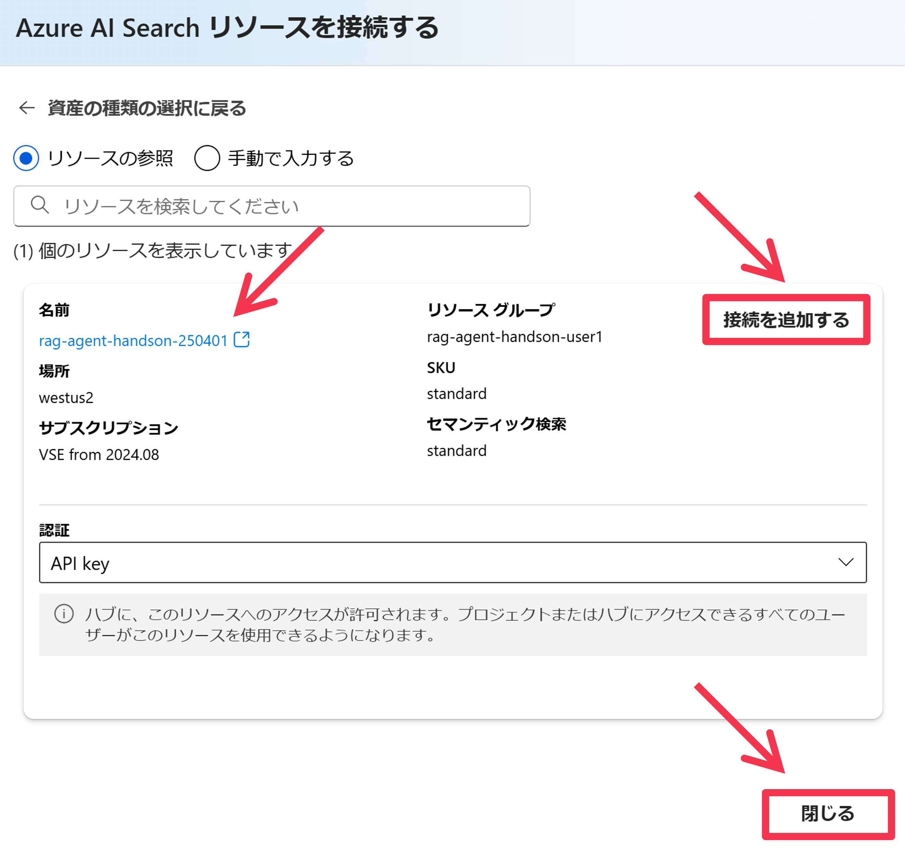
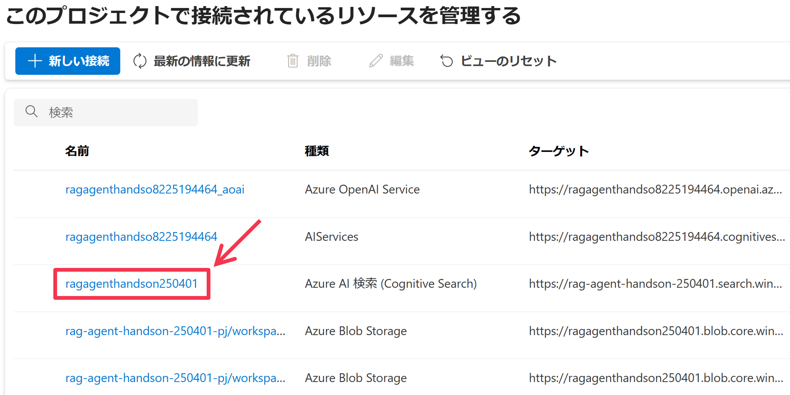

# Azure AI Agent Service での AI エージェントの開発
Azure AI Agent Service を使って、AI エージェントを開発します。まず事前準備を行い、その後、用意された Python プログラムをベースに、AI Agent Service を呼び出す処理の実装を行います。最後には、チャットアプリの実装を行い、Azure Web Apps へデプロイします。

## 事前準備

### AI Project 接続文字列の取得
リソースグループのページを表示して、Azure リソース一覧の中にある、先ほど作成した AI Project (```種類``` が ```Azure AI project``` のリソース)の名前をクリックします。


クリックした AI Project のページが表示されるので、Azure AI Foundry Portal へ移動するため、```[Launch Studio]``` ボタンをクリックします。


AI Foundry Portal での AI Project のページが表示されます。サイドメニューの ```[概要]``` をクリックし、画面右の ```[プロジェクトの詳細]>[プロジェクト接続文字列]``` の右側にあるクリップボードにコピーするための ```[四角アイコン]``` をクリックして、AI Project の接続文字列を、クリップボードへコピーします。


以下の通りにコマンドを実行して、ファイル [src/.env_template](../src/.env_template) をコピーして、```src/.env``` を作成します。
```bash
cp src/.env_template src/.env
```

そして、.env 内の以下の ```PROJECT_CONNECTION_STRING``` の値として、先ほどクリップボードにコピーした AI Project の接続文字列を貼り付けます。
```bash
# Azure AI Project Settings
PROJECT_CONNECTION_STRING="{REGION}.api.azureml.ms;{SUBSCRIPTION_ID};{RESOURCE_GROUP_NAME};{AI_PROJECT_NAME}"
AI_SEARCH_CONNECTION_NAME="{Input your AI Search Connection Name in AI Project}"
OPENAI_CHAT_DEPLOY_NAME="gpt-4o" # gpt-4o or gpt-4o-mini
```

### AI Project へ接続リソースの追加
続いて、AI Project に先ほど用意した Azure AI Search アカウントへの接続を設定します。  
サイドメニューの ```[管理センター]``` をクリックします。


AI Hub と Project の管理センターが表示されます。ここではユーザや接続リソースの管理を主に行います。サイドメニューの ```[Connected resources]``` をクリックすると、プロジェクトに接続されているリソース一覧が表示されます。```[＋新しい接続]``` をクリックします。


リソース接続の追加ウィンドウが表示されます。```[Azure AI 検索]``` をクリックします。


接続できる AI Search アカウントの一覧が表示されます。今回作成した AI Search アカウントの ```[接続を追加する]``` ボタンをクリックし、追加ができたら ```[閉じる]``` ボタンをクリックします。


先ほど選択した AI Search アカウントが追加されていることを確認します。この名前(リソース接続名)をコピーしておき(以下の例だと"ragagenthandson250401")、```src/.env``` ファイルの ```AI_SEARCH_CONNECTION_NAME``` の値として貼り付けます。また、```OPENAI_CHAT_DEPLOY_NAME``` の値も、今回使用する GPT モデルの名前に応じて修正してください。


```bash
# Azure AI Project Settings
PROJECT_CONNECTION_STRING="{REGION}.api.azureml.ms;{SUBSCRIPTION_ID};{RESOURCE_GROUP_NAME};{AI_PROJECT_NAME}"
AI_SEARCH_CONNECTION_NAME="{Input your AI Search Connection Name in AI Project}"
OPENAI_CHAT_DEPLOY_NAME="gpt-4o" # gpt-4o or gpt-4o-mini
```

### Azure CLI のセットアップ
これから Azure AI Agent Service を使用して AI エージェントを実装しますが、サービス認証に、参加者の Microsoft Entra アカウントを使用します。開発端末でアカウントの認証情報を設定する簡単な方法として Azure CLI が挙げられるので、これをインストールして、Entra テナントへのログイン、Azure サブスクリプションの選択を実施します (認証情報は Azure CLI や Azure Powershell, Visual Studio Code, そしてサービスに設定されているマネージドID から使用されます。詳しくはこの[ドキュメント](https://learn.microsoft.com/ja-jp/dotnet/api/azure.identity.defaultazurecredential?view=azure-dotnet)をご参照ください)。

```bash
# インストール
curl -sL https://aka.ms/InstallAzureCLIDeb | sudo bash

# インストールされていることの確認
az version

# Azure サブスクリプションへログイン
az login --use-device-code
## 以下のようなメッセージが表示されるので、Web ブラウザで "https://microsoft.com/devicelogin" へアクセスし、表示される画面にアクセス許可コードを入力(以下の例だと"IH4XXXXX")し、参加者の Entra アカウントでログインしてください
## > To sign in, use a web browser to open the page https://microsoft.com/devicelogin and enter the code IH4XXXXX to authenticate.

# 選択した Azure サブスクリプションとログインユーザ情報を表示
az account show

# もし表示されている Azure サブスクリプションが今回使用しているものと異なる場合は、以下で設定する
az account set -s "{YOUR_SUBSCRIPTION_ID}"
```

### Python 仮想環境の構築
以下のコマンドを実行して、Python の仮想環境の構築と、必要なパッケージをインストールしてください。
```bash
# src フォルダへ移動
cd src

# Python 仮想環境の構築 と有効化
python -m venv .venv
source .venv/bin/activate

# 必要な Python パッケージのインストール
python -m pip install -r requirements.txt
```

## AI Agent Service を利用するプログラムの実装 (Hello World)
[1.hello_world.py](../src/1.hello_world.py)

## AI Agent Service を利用するプログラムの実装 (AI Search での RAG)
[2.rag.py](../src/2.rag.py)

## AI Agent Service を利用するプログラムの実装 (Code Interpreter)
[3.code_interpreter.py](../src/3.code_interpreter.py)

## AI Agent Service を利用するプログラムの実装 (ストリーム形式のレスポンス)
[4.streaming.py](../src/4.streaming.py)

## Web アプリケーションの Azure Web Apps へのデプロイ
[app.py](../src/app.py)

### ローカル環境での Web アプリケーションの実行
```bash
python app.py
```

### Azure Web Apps へのデプロイ
```bash
RESOURCE_GROUP="sample-mahiya-217u8457"
APP_PLAN_NAME="sample-mahiya-217u8457"
WEB_APP_NAME="sample-mahiya-217u8457"
WEB_APP_REGION="japaneast"
WEB_APP_SKU="B1"
WEB_APP_RUNTIME="PYTHON:3.11"

az webapp up \
    --resource-group $RESOURCE_GROUP \
    --plan $APP_PLAN_NAME \
    --name $WEB_APP_NAME \
    --location $WEB_APP_REGION \
    --sku $WEB_APP_SKU \
    --runtime $WEB_APP_RUNTIME
```