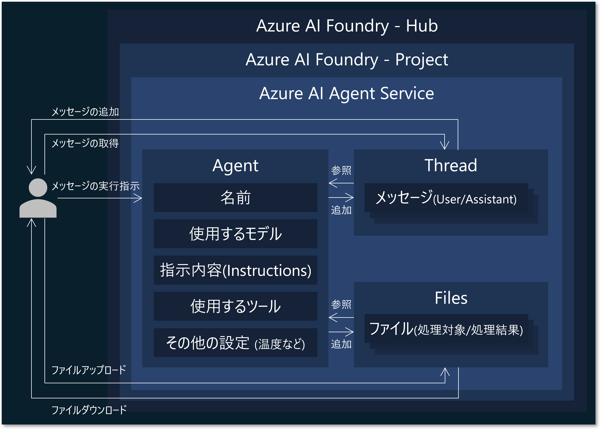

# Azure AI Agent Service での AI エージェントの開発
Azure AI Agent Service を使って、AI エージェントを開発します。まず事前準備を行い、その後、用意された Python プログラムをベースに、AI Agent Service を呼び出す処理の実装を行います。最後には、チャットアプリの実装を行い、Azure Web Apps へデプロイします。

## 事前準備

### AI Project 接続文字列の取得
リソースグループのページを表示して、Azure リソース一覧の中にある、先ほど作成した AI Project (```種類``` が ```Azure AI project``` のリソース)の名前をクリックします。


クリックした AI Project のページが表示されるので、Azure AI Foundry Portal へ移動するため、```[Launch Studio]``` ボタンをクリックします。


AI Foundry Portal での AI Project のページが表示されます。サイドメニューの ```[概要]``` をクリックし、画面右の ```[プロジェクトの詳細]>[プロジェクト接続文字列]``` の右側にあるクリップボードにコピーするための ```[四角アイコン]``` をクリックして、AI Project の接続文字列を、クリップボードへコピーします。


以下の通りにコマンドを実行して、ファイル [src/.env_template](../src/.env_template) をコピーして、```src/.env``` を作成します。
```bash
cp src/.env_template src/.env
```

そして、.env 内の以下の ```PROJECT_CONNECTION_STRING``` の値として、先ほどクリップボードにコピーした AI Project の接続文字列を貼り付けます。
```bash
# Azure AI Project Settings
PROJECT_CONNECTION_STRING="{REGION}.api.azureml.ms;{SUBSCRIPTION_ID};{RESOURCE_GROUP_NAME};{AI_PROJECT_NAME}"
AI_SEARCH_CONNECTION_NAME="{Input your AI Search Connection Name in AI Project}"
OPENAI_CHAT_DEPLOY_NAME="gpt-4o" # gpt-4o or gpt-4o-mini
```

### AI Project へ接続リソースの追加
続いて、AI Project に先ほど用意した Azure AI Search アカウントへの接続を設定します。  
サイドメニューの ```[管理センター]``` をクリックします。


AI Hub と Project の管理センターが表示されます。ここではユーザや接続リソースの管理を主に行います。サイドメニューの ```[Connected resources]``` をクリックすると、プロジェクトに接続されているリソース一覧が表示されます。```[＋新しい接続]``` をクリックします。


リソース接続の追加ウィンドウが表示されます。```[Azure AI 検索]``` をクリックします。


接続できる AI Search アカウントの一覧が表示されます。今回作成した AI Search アカウントの ```[接続を追加する]``` ボタンをクリックし、追加ができたら ```[閉じる]``` ボタンをクリックします。


先ほど選択した AI Search アカウントが追加されていることを確認します。この名前(リソース接続名)をコピーしておき(以下の例だと"ragagenthandson250401")、```src/.env``` ファイルの ```AI_SEARCH_CONNECTION_NAME``` の値として貼り付けます。また、```OPENAI_CHAT_DEPLOY_NAME``` の値も、今回使用する GPT モデルの名前に応じて修正してください。


```bash
# Azure AI Project Settings
PROJECT_CONNECTION_STRING="{REGION}.api.azureml.ms;{SUBSCRIPTION_ID};{RESOURCE_GROUP_NAME};{AI_PROJECT_NAME}"
AI_SEARCH_CONNECTION_NAME="{Input your AI Search Connection Name in AI Project}"
OPENAI_CHAT_DEPLOY_NAME="gpt-4o" # gpt-4o or gpt-4o-mini
```

### Azure CLI のセットアップ
これから Azure AI Agent Service を使用して AI エージェントを実装しますが、サービス認証に、参加者の Microsoft Entra アカウントを使用します。開発端末でアカウントの認証情報を設定する簡単な方法として Azure CLI が挙げられるので、これをインストールして、Entra テナントへのログイン、Azure サブスクリプションの選択を実施します (認証情報は Azure CLI や Azure Powershell, Visual Studio Code, そしてサービスに設定されているマネージドID から使用されます。詳しくはこの[ドキュメント](https://learn.microsoft.com/ja-jp/dotnet/api/azure.identity.defaultazurecredential?view=azure-dotnet)をご参照ください)。

```bash
# インストール
curl -sL https://aka.ms/InstallAzureCLIDeb | sudo bash

# インストールされていることの確認
az version

# Azure サブスクリプションへログイン
az login --use-device-code
## 以下のようなメッセージが表示されるので、Web ブラウザで "https://microsoft.com/devicelogin" へアクセスし、表示される画面にアクセス許可コードを入力(以下の例だと"IH4XXXXX")し、参加者の Entra アカウントでログインしてください
## > To sign in, use a web browser to open the page https://microsoft.com/devicelogin and enter the code IH4XXXXX to authenticate.

# 選択した Azure サブスクリプションとログインユーザ情報を表示
az account show

# もし表示されている Azure サブスクリプションが今回使用しているものと異なる場合は、以下で設定する
az account set -s "{YOUR_SUBSCRIPTION_ID}"
```

### Python 仮想環境の構築
以下のコマンドを実行して、Python の仮想環境の構築と、必要なパッケージをインストールしてください。
```bash
# src フォルダへ移動
cd src

# Python 仮想環境の構築 と有効化
python -m venv .venv
source .venv/bin/activate

# 必要な Python パッケージのインストール
python -m pip install -r requirements.txt
```

## AI Agent Service を利用するプログラムの実装 (Hello World)
まず、Azure AI Agent Service を利用するための基本的なコードを実装します。   
コードは、既に [1.hello_world.py](../src/1.hello_world.py) で実装されているので、以下のコマンドでプログラム実行します。

```bash
python 1.hello_world.py
```

コードを実行すると、```.output/1.hello_world``` 配下に、メッセージの処理単位である ```run``` の中身を出力した ```run.json```、また全メッセージと最新のアシスタントからのメッセージを出力した ```messages.json``` と ```message.json``` が出力されているので、興味がありましたらご参照ください。  
　　
コードの説明をします。　　
以下のコードでは、Azure AI Project へのアクセスクライアントを接続文字列とその認証情報(Entra 認証である ```DefaultAzureCredential``` のみをサポート)を指定することで作成します。接続文字列には、接続先の AI Project を特定する情報(サブスクリプションID, リソースグループ名, リソース名)が含まれます。```AIProjectClient``` クラスは、[azure-ai-projects](https://pypi.org/project/azure-ai-projects/) パッケージで提供されています。
```py
# Create Azure AI Agent Service client
project = AIProjectClient.from_connection_string(
    conn_str=PROJECT_CONNECTION_STRING,
    credential=DefaultAzureCredential(),
)
```

次に、エージェントとスレッドを作成します。エージェントを作成する際に、使用するモデル(具体的にはデプロイ名)、エージェントの名前、指示(instructions)を指定します。```instructions``` でエージェントの動作の具体的な指示を出します。またスレッドを作成します。スレッドではメッセージを管理し、エージェントはスレッドのメッセージ内容をモデル(やツール)を用いて、instructions で指示された内容に従って処理を行います。
```py
# Create an agent
agent = project.agents.create_agent(
    model=OPENAI_CHAT_DEPLOY_NAME,
    name="hello-world-agent",
    instructions="You are a helpful assistant.",
)

# Create a thread
thread = project.agents.create_thread()
```

エージェントとスレッド、またファイルの構成関係は以下の通りです。


以下の処理では、スレッドにユーザメッセージを追加して、エージェント上でスレッドを実行しています。今回は、実行を開始して終了まで待機する ```create_and_process_run``` メソッドを使用しています。
```py
# Add a message to the thread
user_message = "Hello my AI agent."
project.agents.create_message(thread_id=thread.id, role="user", content=user_message)

# Process the thread with the agent (wait until the agent finishes processing)
run = project.agents.create_and_process_run(agent_id=agent.id, thread_id=thread.id)
```

エージェントからのユーザメッセージに対する返答がスレッドに格納されているため、スレッドのメッセージ一覧(```messages```)を取得して、かつエージェントからの最新メッセージ(```message```)を取得し、エージェントからの返答内容をコンソール出力しています。
```py
# List messages
messages = project.agents.list_messages(thread_id=thread.id)

# Get and display a latest message from an assistant
message = messages.get_last_text_message_by_role(role="assistant")
print(message.text.value)
```

[1.hello_world.py](../src/1.hello_world.py) のコードにより、Azure AI Agent Service で AI エージェントを作成して、挨拶のやり取りを行うプログラムを実現できました。

## AI Agent Service を利用するプログラムの実装 (AI Search での RAG)
[2.rag.py](../src/2.rag.py)
> [TODO] コードの説明と、```.output/2.rag``` フォルダに出力される JSON ファイル(run_steps)の解説を追加

```bash
python 2.rag.py
```

```py
# Define tools for the agent
ai_search_connection_id = project.connections.get(connection_name=AI_SEARCH_CONNECTION_NAME).id
ai_search = AzureAISearchTool(index_connection_id=ai_search_connection_id, index_name=AI_SEARCH_INDEX_NAME)
toolset = ToolSet()
toolset.add(ai_search)

# Create an agent
agent = project.agents.create_agent(
    model=OPENAI_CHAT_DEPLOY_NAME,
    name="rag-agent",
    instructions="""
    - Please respond to user inquiries.
    - For questions related to Azure AI Search, search the connected Azure AI Search index for relevant documents and provide answers based on those documents.
    """,
    toolset=toolset,
)
```

```py
# List run steps
run_steps = project.agents.list_run_steps(thread_id=thread.id, run_id=run.id)
write_json(f"{OUTPUT_DIR}/run_steps.json", run_steps.as_dict())
for i, run_step in enumerate(reversed(run_steps.data)):
    run_step = run_step.as_dict()
    message = f"[Step {i}] {run_step['type']}"
    step_details = run_step["step_details"]
    if step_details["type"] == "tool_calls":
        used_queries = ", ".join([f'Query: {d["azure_ai_search"]["input"]}' for d in step_details["tool_calls"] if d["type"] == "azure_ai_search"])
        message += f" ({used_queries})"
    print(message)
```

## AI Agent Service を利用するプログラムの実装 (Code Interpreter)
[3.code_interpreter.py](../src/3.code_interpreter.py)
> [TODO] コードの説明、[materials/sample.csv](../src/materials/sample.csv)の説明、.output/3.code_interpreter``` フォルダに出力される画像ファイルを表示させる説明を追加

```bash
python 3.code_interpreter.py
```

```py
# Define tools for the agent
code_interpreter = CodeInterpreterTool()
toolset = ToolSet()
toolset.add(code_interpreter)
```

```py
# Upload a file to the AI project
file = project.agents.upload_file_and_poll(file_path="materials/sample.csv", purpose=FilePurpose.AGENTS)
attachment = MessageAttachment(file_id=file.id, tools=CodeInterpreterTool().definitions)

# Add a message to the thread
user_message = """
The uploaded file is a CSV file that represents the vector sizes of a specific search document when compressed using various “vector compression methods,” “dimensions,” and “data type bit sizes” of Azure AI Search.
From this file, please create a horizontal bar graph to make it easier to understand the vector sizes for each method.
"""
project.agents.create_message(thread_id=thread.id, role="user", content=user_message, attachments=[attachment])
```

```py
# Output generated images
for image_content in messages.image_contents:
    project.agents.save_file(
        file_id=image_content.image_file.file_id,
        target_dir=OUTPUT_DIR,
        file_name=f"{os.path.basename(image_content.image_file.file_id)}.png",
    )
```

## AI Agent Service を利用するプログラムの実装 (ストリーム形式のレスポンス)
[4.streaming.py](../src/4.streaming.py)
> [TODO] コードの説明、と ```.output/4.streaming``` フォルダに出力される JSON ファイル (event_types, stream_events.json) の解説を追加

```bash
python 4.streaming.py
```

```py
# Process the thread with the agent (receive messages as they are generated)
stream = project.agents.create_stream(thread_id=thread.id, agent_id=agent.id)

# Display the messages as they are generated
event_types = []
stream_events = []
for event_type, data, func_rt in stream.event_handler:
    # Show streaming responses
    if event_type == "thread.message.delta":
        for c in data.delta.content:
            print(c.text.value, end="")
    # Show annotations in the final message
    elif event_type == "thread.message.completed":
        for c in data.content:
            print(c.text.annotations)
    event_types.append(event_type)
    stream_events.append({"event_type": event_type, "data": data.as_dict() if type(data) is not str else None})
```

## Web アプリケーションの Azure Web Apps へのデプロイ
[app.py](../src/app.py)

### ローカル環境での Web アプリケーションの実行
```bash
python app.py
```

### Azure Web Apps へのデプロイ
```bash
RESOURCE_GROUP="sample-webapp-20250403"
APP_PLAN_NAME="sample-webapp-20250403"
WEB_APP_NAME="sample-webapp-20250403"
WEB_APP_REGION="japaneast"
WEB_APP_SKU="B1"
WEB_APP_RUNTIME="PYTHON:3.11"

az webapp up \
    --resource-group $RESOURCE_GROUP \
    --plan $APP_PLAN_NAME \
    --name $WEB_APP_NAME \
    --location $WEB_APP_REGION \
    --sku $WEB_APP_SKU \
    --runtime $WEB_APP_RUNTIME

echo "Please access to: " https://$WEB_APP_NAME.azurewebsites.net/
```

デプロイが完了するまで、以下のようなメッセージが表示されます。
```bash
The webapp 'sample-webapp-20250403' doesn't exist
Creating AppServicePlan 'sample-webapp-20250403' or Updating if already exists
Readonly attribute name will be ignored in class <class 'azure.mgmt.web.v2023_01_01.models._models_py3.AppServicePlan'>
Resource provider 'Microsoft.Web' used by this operation is not registered. We are registering for you.
Registration succeeded.
Creating webapp 'sample-webapp-20250403' ...
Configuring default logging for the app, if not already enabled
Creating zip with contents of dir C:\Codes\GitHub\az-ai-agent-handson-training\src ...
Getting scm site credentials for zip deployment
Starting zip deployment. This operation can take a while to complete ...
Deployment endpoint responded with status code 202
You can launch the app at http://sample-webapp-20250403.azurewebsites.net
Setting 'az webapp up' default arguments for current directory. Manage defaults with 'az configure --scope local'
--resource-group/-g default: sample-webapp-20250403
--sku default: B1
--plan/-p default: sample-webapp-20250403
--location/-l default: japaneast
--name/-n default: sample-webapp-20250403
{
  "URL": "http://sample-webapp-20250403.azurewebsites.net",
  "appserviceplan": "sample-webapp-20250403",
  "location": "japaneast",
  "name": "sample-webapp-20250403",
  "os": "Linux",
  "resourcegroup": "sample-webapp-20250403",
  "runtime_version": "PYTHON|3.11",
  "runtime_version_detected": "-",
  "sku": "BASIC",
  "src_path": ""
}
Please access to:  https://sample-webapp-20250403.azurewebsites.net/
```

表示される URL へアクセスして、アプリケーションが動作することを確認する。