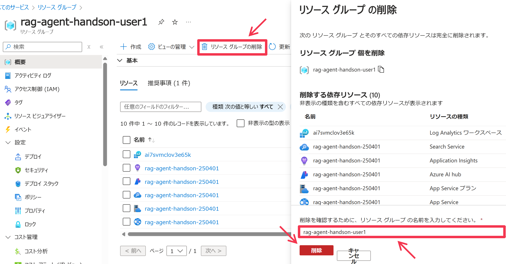
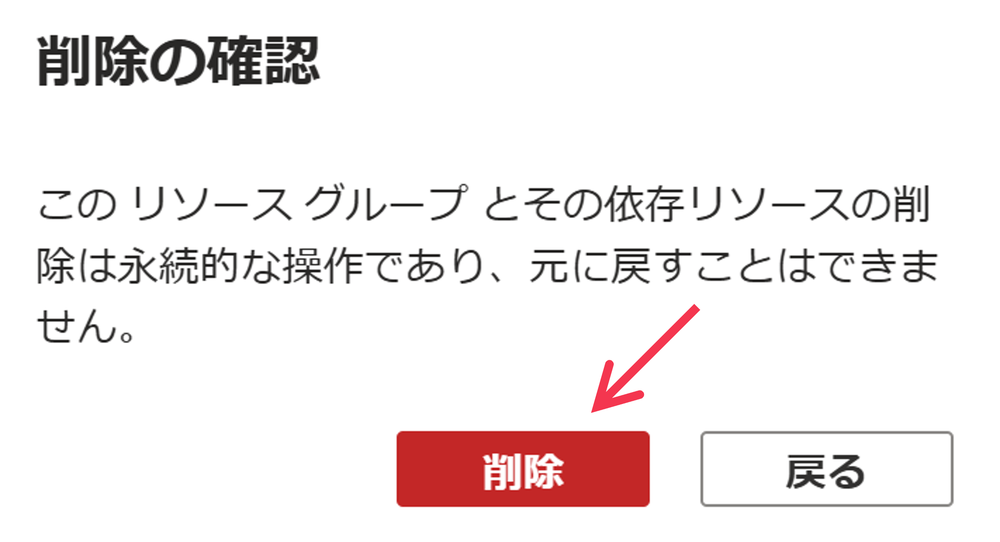

# 後片付け

## Codespace の削除
[https://github.com/codespaces](https://github.com/codespaces) へアクセスし、作成した Codespace を削除します

## Azure リソースの削除
今回使用した Azure リソースを削除する場合、リソースグループを削除すると、その配下のAzure リソースは全て削除されます。リソースグループを削除する場合、まず Azure Portal でリソースグループのページを表示し、上部メニューの ```[リソースグループの削除]``` をクリックし、右側に表示された削除ウィンドウの下部にあるテキストボックスに ```[ソースグループの名前``` を入力し、```[削除]``` ボタンをクリックします。


再確認のため、```[削除]``` ボタンをクリックして、リソースグループおよび配下の全リソースの削除を確定させます。

