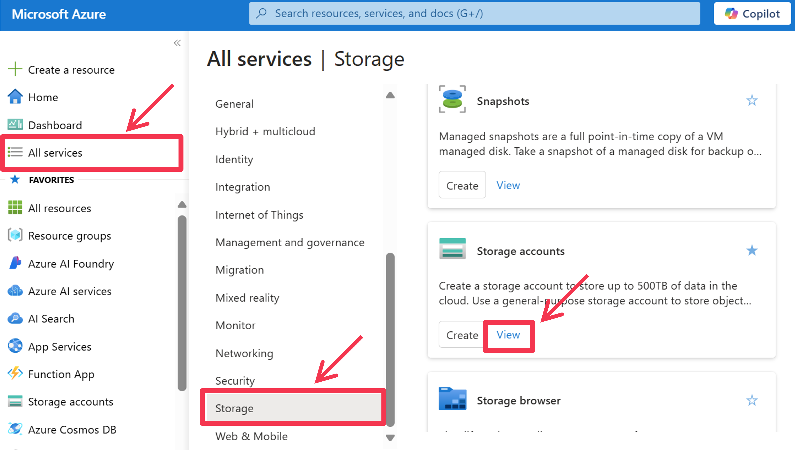

# 1. Deploying Azure Resources
In this training, you will ultimately deploy and utilize the following Azure resources.

| Azure Service                                | Purpose |
|----------------------------------------------|---------|
| Azure Storage                                | For storing the PDF files that serve as the source for the Azure AI Search index and for use in Azure AI Foundry. |
| Azure AI Search                              | Acts as the retriever in the RAG (Retrieval-Augmented Generation) process for the implemented AI agent. |
| Azure AI Foundry - Hub                       | Serves as the hub (group) for AI Projects. |
| Azure AI Foundry - Project                   | Development of AI agents using the Azure AI Agent Service. |
| Azure Application Insights                   | For tracing the usage of the Azure AI Agent Service. |
| Azure Key Vault                              | Stores the credentials for the service connections registered in AI Hub and Project. |
| Azure App Service                            | Hosts the web application used to interact with the AI agent. |

By deploying Azure Storage, Azure AI Search, and Azure AI Foundry (Hub/Project), you will have most of the necessary resources. Azure App Service will be created later via the Azure CLI.

This time, to help you get accustomed to operating in the Azure Portal, you will create each Azure resource primarily through the GUI. However, Azure offers services such as [Azure Resource Manager](https://learn.microsoft.com/en-us/azure/azure-resource-manager/management/overview) and [Azure Bicep](https://learn.microsoft.com/en-us/azure/azure-resource-manager/bicep/overview?tabs=bicep) to implement IaC (Infrastructure as Code). Of course, deploying Azure resources using [Terraform](https://learn.microsoft.com/en-us/azure/developer/terraform/overview) is also common.

## 1.1 Deploying an Azure Storage Account

First, create an Azure Storage account to store data that will be processed by Azure AI Search. Azure Storage includes four services: an object storage service called ```Blob```, a message queuing service called ```Queue```, a simple key‑value store table service called ```Table```, and a file storage service with SMB/NFS protocol compatibility called ```File```. In this case, we will use the ```Blob``` service (also known as Azure Blob Storage). Blob storage is a core Azure service that integrates with a large number of other Azure services.

First, access the [Azure Portal](https://portal.azure.com/) and click on ```[All Services]``` in the side menu. Then, within the category in the side menu of the window that appears, click on ```[Storage]``` and click ```[View]``` in ```Storage accounts``` area from the displayed Azure services.



A page displaying the list of Azure Storage accounts that the logged‑in user can view in the current Entra tenant is displayed. To create a new storage account, click the ```[+ Create]``` button in the top menu of this page.


The screen for creating a storage account is now displayed. First, ensure that the resource group to be used is selected under ```[Resource Group]```. Then, enter a ```[Storage Account Name]```. Please note that you cannot use symbols such as hyphens in the name, and it must be globally unique. It is preferable to choose a region near the Azure AI Search account that will use the data (one of "East US", "West US 2", "North Central US", or "West Euro"), although any region will work. After finishing the various settings, click the ```[Review + Create]``` button.


A review screen for creating the storage account is displayed. After verifying the details, click the ```[Create]``` button to begin the creation process.


## 1.2 Deploying an Azure AI Search Account

Next, create an Azure AI Search account to be used as a search index for the retriever when performing text generation with RAG in the AI agent you are implementing.


Click on ```[All Services]``` in the side menu. Then, in the side menu of the window that appears, click on ```[AI + Machine Learning]``` and select ```[AI Search]``` from the displayed Azure services.


A page showing the list of Azure AI Search accounts available to the logged‑in user in the current Entra tenant is displayed. You can similarly view lists of other Azure AI services via the side menu. To create a new AI Search account, click the ```[+ Create]``` button in the top menu of this page.


The screen for creating an AI Search account is now displayed. First, ensure that the resource group to be used is selected under ```[Resource Group]```. Then, enter a ```[Service Name]```. Although you can use characters such as hyphens, please note that the name must be globally unique. For the ```[Region]```, select one of "East US", "West US 2", "North Central US", or "West Euro". As of 2025/4/14, the Document Layout Skill for Azure AI Search to be used in this training is in preview and is only available in some regions. After finishing the settings, click the ```[Change Pricing Tier]``` link to see the available pricing tiers.


Review the available pricing tiers. The pricing level (SKU) categories include "Free", "Basic", "Standard", and "Storage Optimized". Each SKU has different limits for "Storage Size (documents/vectors)", "Number of Indexes that can be created", "Number of Indexers that can be created", "Maximum Scale Units/Replicas/Partitions", and "Price". The scale unit is calculated as [number of replicas] × [number of partitions]. The price displayed on the screen is the monthly cost per scale unit, so the monthly expense for this account will be [scale units] × [cost]. The following is an example calculation:


Increasing the number of partitions increases both the storage capacity and QPS (queries per second). Increasing the number of replicas boosts the QPS; with 2 or more replicas, a 99.9% SLA for read availability is applied, and with 3 or more replicas, a 99.9% SLA for write availability is applied (note that with only one replica, even read operations do not have an SLA).

The "Free" tier is for trial purposes, "Basic" is for development environments, "Standard" is suitable for most development or production scenarios, and "Storage Optimized" is used when you have an extremely large number of documents (on the order of a billion or more). One important note is that, after the account is created, you can scale out within the same SKU, but you cannot change the SKU (scale up). In other words, you can increase the storage capacity and QPS by increasing the number of replicas and partitions in the S1 plan, but you cannot switch to an S2 or L1 plan. Also, note that if your skillset calls external services via a private endpoint, you will need to use the S2 or S3 plan.

In this case, we will use the ```S1``` plan. Once you have reviewed the available pricing tiers, click the ```[Select]``` button.


Return to the previous screen and click the ```[Next: Scaling]``` button. The configuration screen for setting the number of replicas and partitions for the AI Search account is displayed. As mentioned above, if the number of replicas remains at the default value of "1", the 99.9% SLA for read availability will not be applied. Therefore, if you intend to use it in production, it is recommended to set the number of replicas to at least 2. Click the ```[Review + Create]``` button.


Review the details of the AI Search account to be created. After you have confirmed them, click the ```[Create]``` button to begin the creation process.


## 1.3 Deploying the Azure AI Foundry Hub

This time, we will create an Azure AI Foundry Hub and Project because we will be developing AI agents using the foundational models of the Azure OpenAI Service and the Azure AI Agent Service. When using services such as OpenAI Service or AI Search from the AI Agent Service, the connection information registered in the AI Hub or AI Project is used (with the credentials stored in Azure Key Vault). This allows you to register connection information in the AI Hub and have multiple AI Projects use it. Hence, the AI Hub can be considered a group for AI Projects. AI Projects are units for managing the AI Agent Service, tracing information, and LLM evaluation, and are intended to be created on a per-project basis in the real world.

Click on ```[All Services]``` in the side menu. Then, in the side menu of the window that appears, click on ```[AI + Machine Learning]``` and select ```[Azure AI Foundry]``` from the displayed Azure services.


A page displaying the list of Azure AI Hubs or Projects that the logged‑in user can view in the current Entra tenant is displayed. To create a new AI Hub, click the ```[+ Create]``` button in the top menu of this page, and then click ```[Hub]```.


The screen for creating an AI Hub is now displayed. First, ensure that the resource group to be used is selected under ```[Resource Group]```. For the ```[Region]```, choose ```East US``` since many AI models are more readily available there. Then, enter a ```[Name]```. Also, check the option ```[Same as hub resource group]``` in the default project resource group section. This setting determines which resource group the Azure resources required for the AI Hub will be deployed in; in this case, we have chosen to use the same resource group as the AI Hub. After finishing the various settings, click the ```[Next: Storage]``` button.


Under ```[Storage Account]```, select the storage account you created earlier. Then, click the ```[Create New]``` link next to ```Application Insights```.


Enter a preferred ```[Name]``` for the Azure Application Insights instance to be created, and click the ```[Save]``` button. This will be used to monitor (log) the operation of the AI agent.


Return to the previous screen and click the ```[Review + Create]``` button.


Review the details of the AI Hub to be created. After verifying them, click the ```[Create]``` button.


Wait until the AI Hub creation (deployment) is complete. When the completion screen is displayed, click the ```[Go to Resource]``` button.


## 1.4 Deploying an Azure AI Foundry Project

### 1.4.1 Deploying an Azure AI Project

The page for the created AI Hub is now displayed. Click the ```[+ Create project]``` button in the top menu of the page.


A screen for adding an AI Project to the AI Hub is displayed. First, enter a ```[Name]```. The ```Hub``` should already be set to the AI Hub you created earlier. Click the ```[Review + Create]``` button.


Review the details of the AI Project to be created. Once you have confirmed them, click the ```[Create]``` button.


Wait until the AI Project creation (deployment) is complete. When the completion screen is displayed, click the ```[Go to Resource]``` button.


The page for the created AI Project is now displayed. Click the [Launch Studio] button to navigate to the Azure AI Foundry Portal.


### 1.4.2 Deploying an Azure OpenAI Service Model

The Azure AI Foundry Portal is displayed, showing the project screen for the AI Project you just created. To deploy the OpenAI Service model that will be used in this training, click on ```[Models + Endpoints]``` in the side menu.


A list of models deployed within this AI Project is displayed. Click the ```[+ Deploy Model]``` button at the top of the screen, then click ```[Deploy a Basic Model]```.


A window for selecting the model to deploy appears. Here, you can choose from the Azure AI Foundry model catalog, which includes models available via the Azure OpenAI Service. Because many models are displayed, type `gpt-4o` in the search box to filter the results. Then, either `gpt-4o` or `gpt-4o-mini` will appear; select one and click the ```[Review]``` button.


The model deployment settings screen is displayed. Keep the [Deployment Name] as the default (either gpt-4o or gpt-4o-mini), verify that the ```[Deployment Type]``` is set to ```Global Standard```, and click the ```[Customize]``` button.


Here, you can configure the model version and rate limits. It is very important to configure the rate limits appropriately; if they are too low, you will quickly hit the rate limit when using the service. On the other hand, the aggregate token rate limit is capped per Azure subscription (quota), so setting the maximum rate on a single deployment may prevent other developers using that subscription from setting any rate limits at all. For this deployment, set the ```[Tokens per Minute Rate Limit]``` to ```40K```. Then, click the ```[Deploy]``` button to complete the deployment of the GPT model.


Similarly, deploy the text embedding model "text-embedding-3-large". Select `text-embedding-3-large` and click the ```[Review]``` button.


Again, set the ```[Tokens per Minute Rate Limit]``` to ```40K```. Then, click the ```[Deploy]``` button to complete the deployment of the GPT model.


### Appendix: Using an Existing Azure OpenAI Service Account

In section `1.4.2`, we deployed two types of models to the OpenAI Service account that was created during the AI Hub deployment. However, if you already have an account in use, you can use that instead. To use an existing account, you need to register it as a connected resource in the AI Hub or AI Project. Below is an example of how to register it.

First, open the Azure AI Foundry Portal, and if the AI Project page is displayed, click on ```[Administration Center]``` in the side menu to navigate to the AI Project's Administration Center.


Once the AI Project Administration Center is displayed, click on ```[Connected resources]``` in the project menu in the side menu. This will display a list of resources connected to the AI Project. You should see the OpenAI Service account (for example, named "ragagenthandso8225194..." with the resource type "Azure OpenAI Service") that was created during the AI Hub deployment. To connect an existing OpenAI Service account, click the ```[+ New Connection]``` button at the top of the screen.


A window for adding a connection to an external resource will appear. To add an OpenAI Service account, click on ```[Azure OpenAI Service]```.


Next, you can choose the method of selection: either [Reference Resource] or [Enter Manually]. [Reference Resource] allows you to select an OpenAI Service account within the same Azure subscription that the logged‑in user has access to, while [Enter Manually] lets you add a connection by specifying the endpoint and authentication details (either Entra authentication or API key authentication) of the OpenAI Service account. In this case, you can even add an OpenAI Service account from an external Azure subscription. For this example, select ```[Enter Manually]```. 

Then, enter the OpenAI Service account's ```[Endpoint]``` and ```[Key]```, and provide a ```[Connection Name]``` (in this example, "external-aoai-resource"). The endpoint and API key can be found on the Azure Portal page for that OpenAI Service account. After entering the details, click the ```[Add Connection]``` button in the bottom right corner of the window.


Confirm that the newly added OpenAI Service resource has been added. As of April 13, 2025, the Azure AI Agent Service does not support AI Projects with multiple connected OpenAI Service accounts, so delete the connection for the OpenAI Service account that was created during the AI Hub deployment. Select that OpenAI Service account and click the ```[Delete]``` option in the top menu of the screen.


A confirmation dialog for deletion will appear; click ```[Delete]```.


To confirm that you can use the models deployed on the newly added OpenAI Service account, click on ```[Models + Endpoints]``` in the project menu in the side menu. This will display a list of models and services available for the project. You should see the list of models deployed on the added OpenAI Service account, which will be available for use in this AI Project.

