# Azure Resource Configuration
Here, we will configure the created Azure resources as follows:
- **Azure AI Search:** Enable the system-assigned managed identity and enable semantic search
- **Azure Storage:** Create a container and upload the PDF files to be registered with AI Search. In addition, assign the "Storage Blob Data Reader" role to AI Search
- **Azure AI Services:** Assign the "Azure AI Developer" role to AI Search

For Azure AI Search to utilize Azure Blob Storage and Azure OpenAI Service, it is necessary to specify the endpoint and authentication information. There are two primary methods for authenticating Azure services: Microsoft Entra authentication (managed identity authentication) and key authentication (password authentication). While key authentication is easier to use, it does not support any access control (anyone with the key has full control). Therefore, from a security perspective, we recommend implementing service-to-service authentication using Entra authentication (managed identity authentication). Accordingly, in this training, we will essentially use Entra authentication.

In this training, since AI Search needs to retrieve PDF files from Blob Storage, it is necessary to assign a role to AI Search for this purpose. Also, because AI Search uses the [integrated vectorization](https://learn.microsoft.com/en-us/azure/search/vector-search-integrated-vectorization) process to obtain embeddings of chunk texts during indexing of search documents, as well as to obtain query embeddings during search query execution using Azure OpenAI Service's text-embedding-3-large model, it is required to assign an appropriate role to AI Search. At the time of creation, the AI Search account does not have a managed identity assigned, so after enabling it, two roles will be assigned to that managed identity. In summary, for the three interactions illustrated in the architecture diagram below, two roles will be assigned to AI Search.

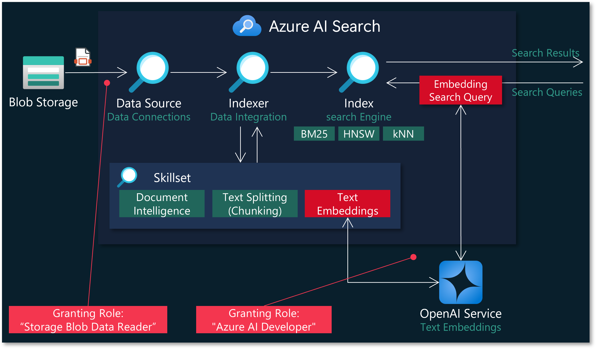

## Configuration of Azure AI Search

### Enable System-assigned Managed Identity
First, enable the system-assigned managed identity for AI Search.  
Click on ```[Resource Group]``` (Resource Groups) in the side menu (if it is not visible, click on [All services] > [General] > [Resource Groups]).

The resource group page will be displayed, showing a list of Azure resources that belong to the resource group. The region in which these Azure resources reside does not matter. Resource groups are used when you want to organize Azure resources by a unit such as a project, and they serve as a unit for granting access permissions or for deleting resources all at once (deleting the resource group will delete all Azure resources contained within it).

In the list of Azure resources, click on the name of the AI Search account (the resource with a type of ```Search Service```) that you created earlier.

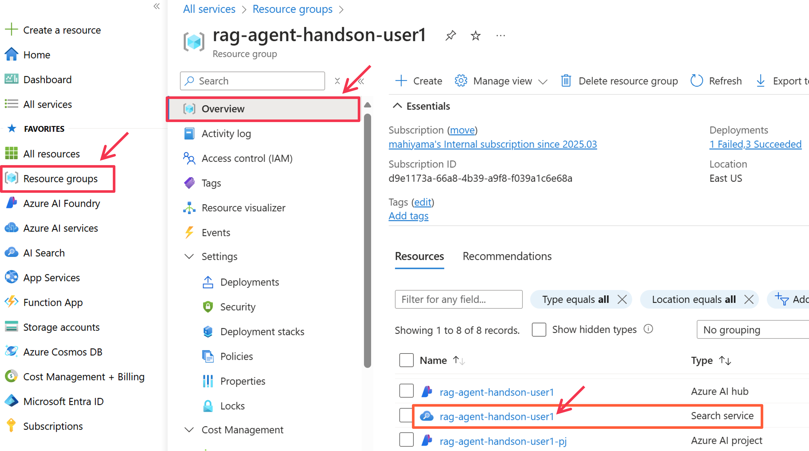

The AI Search account page is displayed. In the settings category of the side menu, click on ```[ID]```, set ```[状態]``` (Status) to ```[オン]``` (On), and then click the ```[Save]``` (Save) button.

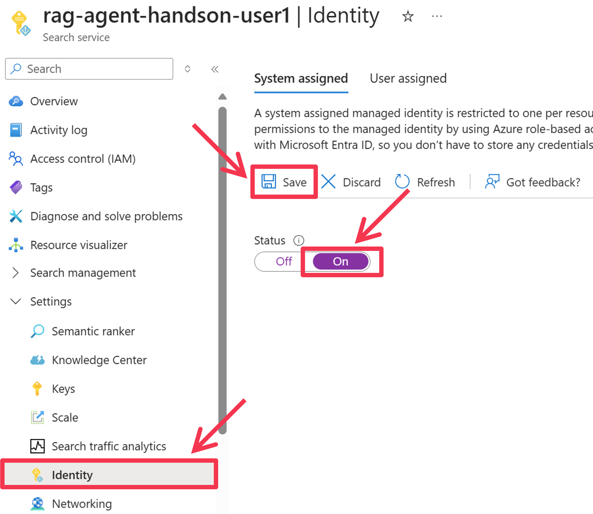

A confirmation window for enabling the system-assigned managed identity for the AI Search account will appear, so click ```[はい]``` (Yes) to enable it.

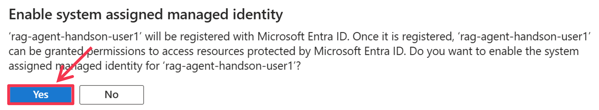

### Enable Semantic Ranker
Next, enable the semantic ranker for AI Search. Even if you do not perform this step, up to 1,000 ranking operations (search requests) per month will be processed for free; however, exceeding that limit will result in errors. As a precaution, click the ```[プランの選択]``` (Select Plan) button for the ```Standardプラン``` (Standard plan) to enable the Standard plan (the Standard plan also allows up to 1,000 operations per month free of charge).

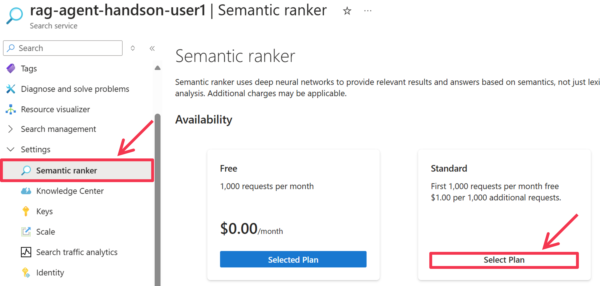

A confirmation window for updating the semantic ranker plan will be displayed. Click ```[はい]``` (Yes) to confirm the update.

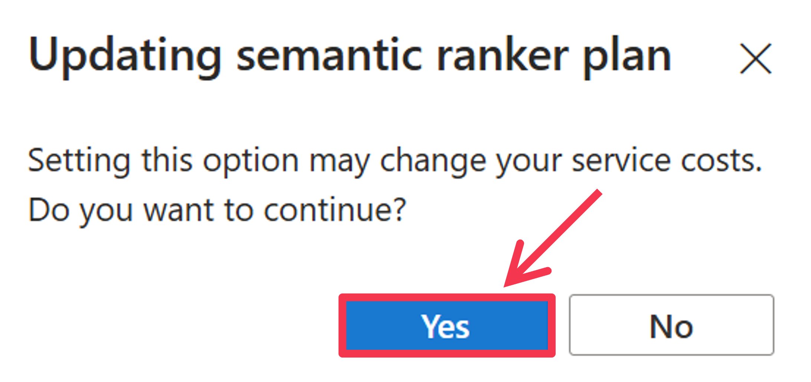

## Configuration of Azure Storage

Next, create a container in Blob Storage (which is much like a folder/directory in a file system) and upload the PDF files to be registered with AI Search. Then, assign the "Storage Blob Data Reader" role to AI Search to grant it read-only access to Blob data.

### Uploading PDF Files
As before, display the resource group page and, in the list of Azure resources, click on the name of the Storage account (the resource with a type of ```ストレージアカウント``` or Storage Account) that you created earlier.

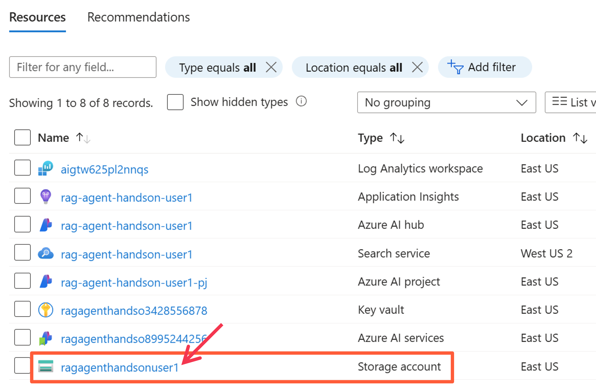

The Storage account page is displayed. Click on ```[コンテナー]``` (Containers) in the data storage category in the side menu. A list of containers is then displayed; click on the ```[＋コンテナ]``` ( + Container) button in the top menu of that screen. Then, enter `search-docs` in the ```[名前]``` (Name) field and click the ```[作成]``` (Create) button.

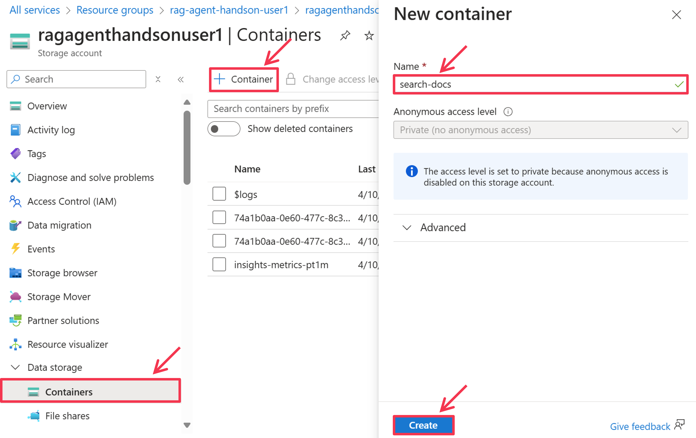

The container "search-docs" has been created. Clicking on "search-docs" will display a list of Blobs contained within it (files in Azure Blob Storage are referred to as Blobs).

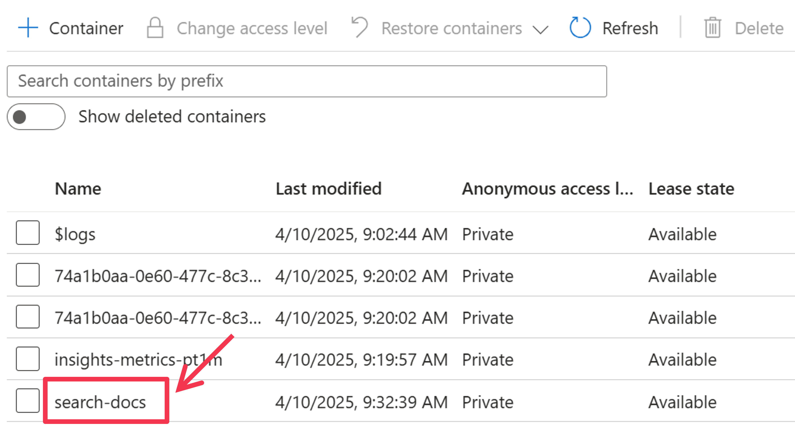

Upload the PDF files to be processed by Azure AI Search into this container. Download the following three PDF files and upload them to the container:
1. [index-add-custom-analyzers.pdf](https://raw.githubusercontent.com/mahiya/az-ai-agent-handson-training/refs/heads/main/ai-search/pdfs/index-add-custom-analyzers.pdf)
2. [index-add-scoring-profiles.pdf](https://raw.githubusercontent.com/mahiya/az-ai-agent-handson-training/refs/heads/main/ai-search/pdfs/index-add-scoring-profiles.pdf)
3. [index-ranking-similarity.pdf](https://raw.githubusercontent.com/mahiya/az-ai-agent-handson-training/refs/heads/main/ai-search/pdfs/index-ranking-similarity.pdf)

After downloading the three PDF files, click on the ```[アップロード]``` (Upload) button in the top menu to open the Blob upload window. Select the three PDF files you just downloaded and then click the ```[アップロード]``` (Upload) button.

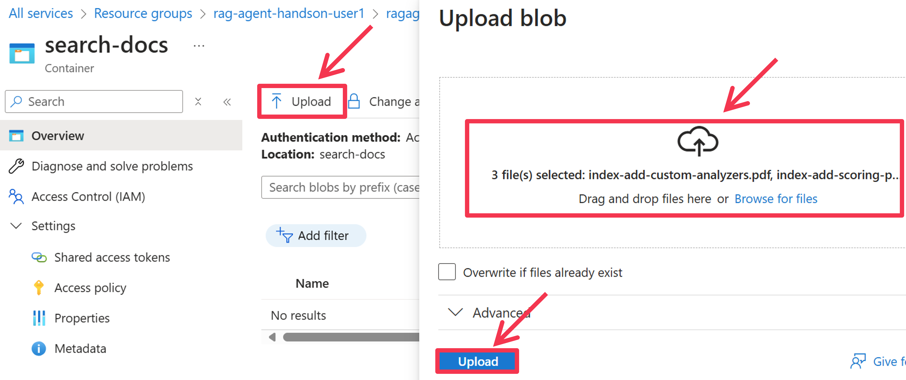

Once the upload is complete, a completion notification message appears in the top right corner, and the Blobs are displayed in the container’s list.

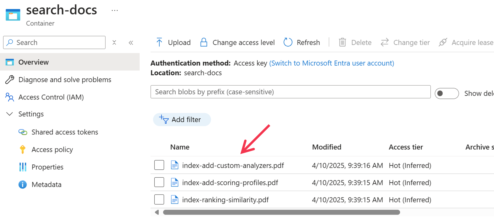

### Assigning a Role to AI Search

Next, in the side menu of the Storage account page, click on ```[アクセス制御(IAM)]``` (Access Control (IAM)). This will display a screen showing the current role (permission) assignments for this Storage account. Click the ```[＋追加]``` ( + Add) button in the top menu, and then click on ```[ロ－ルの割り当ての追加]``` (Add role assignment).

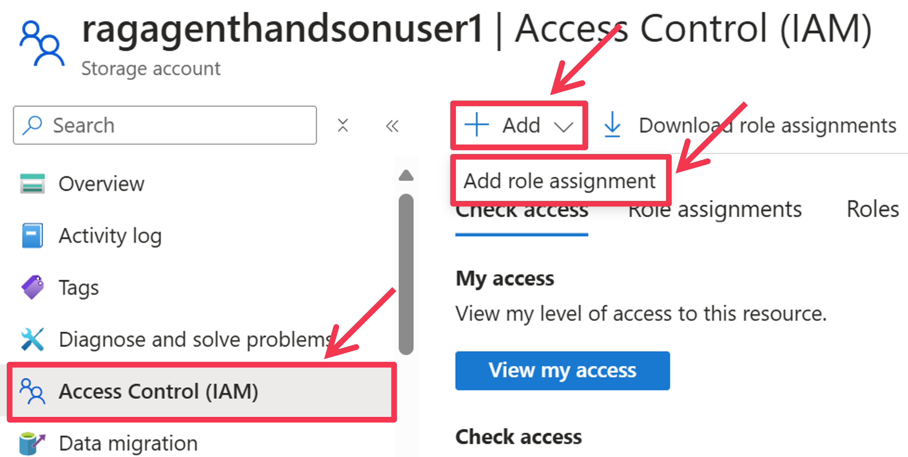

A window for assigning a role to the Storage account is displayed. First, select the role to assign. Since there are many roles available, type "blob" in the search box to filter them. The ```[ストレージ BLOB データ閲覧者]``` (Storage Blob Data Reader) role should appear in the list; click on it and then click the ```[次へ]``` (Next) button.

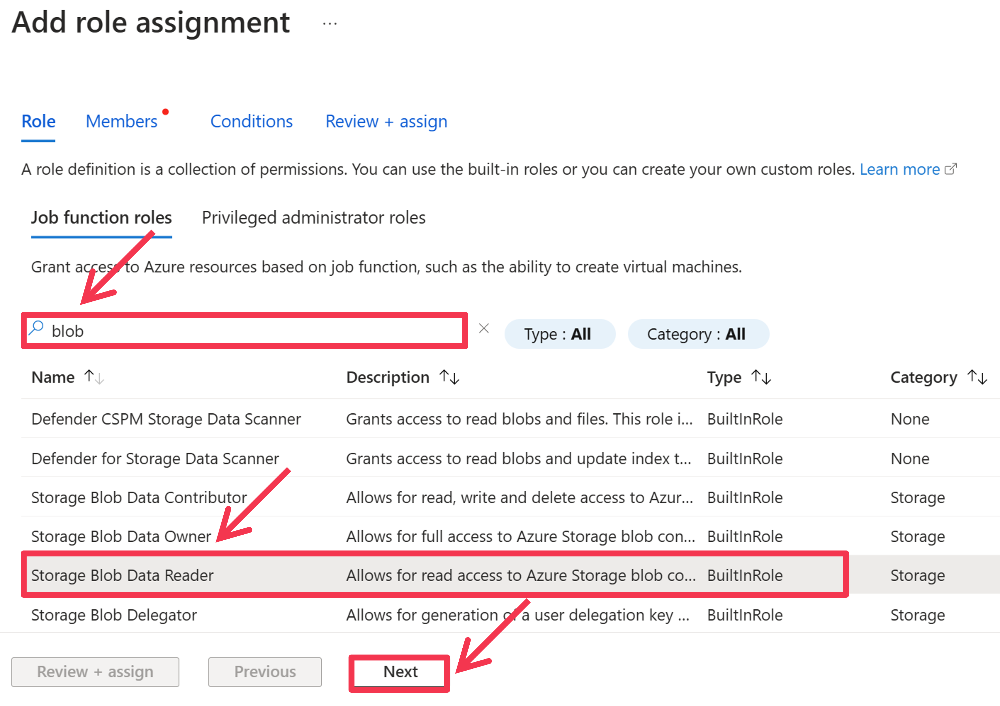

Next, select the target for the role assignment. First, check the ```[マネージドID]``` (Managed identity) option under "アクセスの割当先" (Assign access to) and click on ```[＋メンバーを選択する]``` (Select members). A window will appear on the right where you can choose the managed identity to assign the role to. Under "マネージド ID" (Managed identity), select ```[Search Service]```, then choose the name of the AI Search account you created earlier, and click the ```[選択]``` (Select) button.

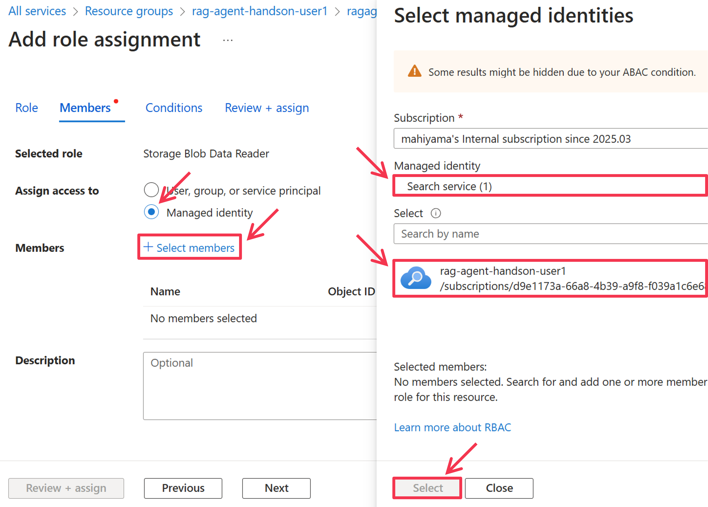

Review the role assignment target, and click the ```[レビューと割り当て]``` (Review + assign) button.

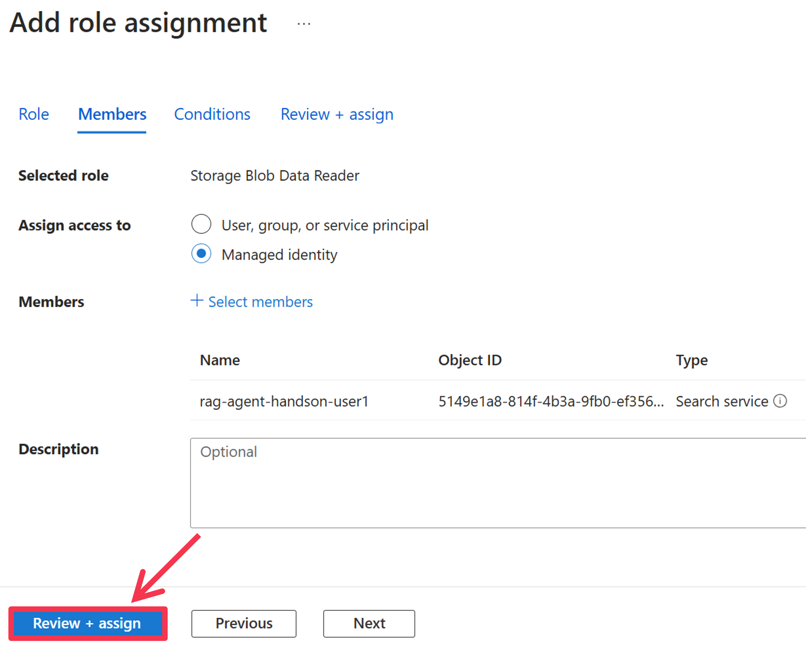

After reviewing the role assignment details, click the ```[レビューと割り当て]``` (Review + assign) button to complete assigning Blob read permission on the Storage account to AI Search.

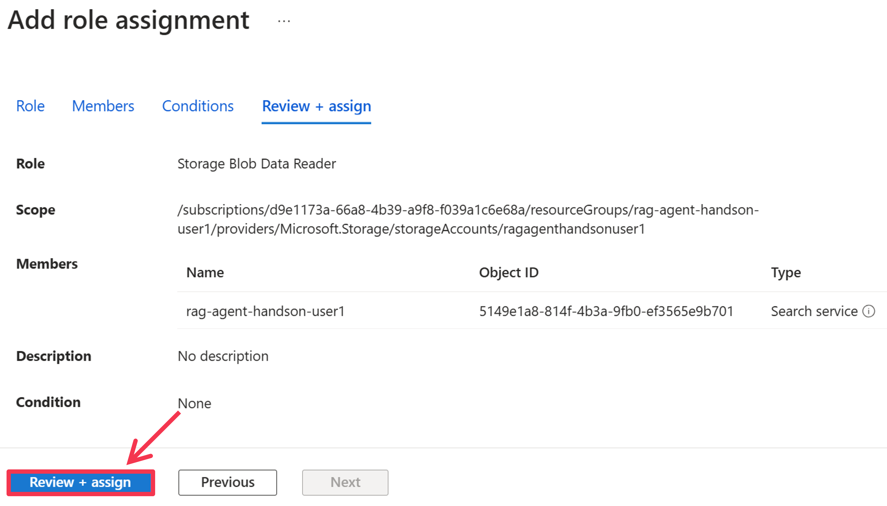

## Configuration of Azure AI Service

Finally, assign the "Azure AI Developer" role to AI Search for the AI Service account (the account used for Azure OpenAI Service) to grant access to AI model usage (gpt-4o/gpt-4o-mini and text-embedding-3-large).

As before, display the resource group page and, in the list of Azure resources, click on the name of the AI Service account (the resource with a type of ```Azure AI services```) that was created when setting up Azure AI Hub.

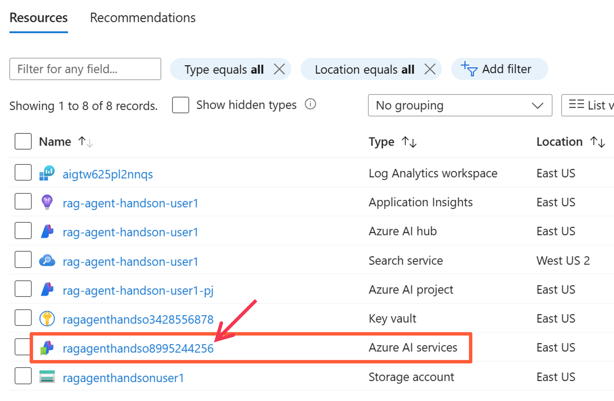

The AI Service account page is displayed. Click on ```[アクセス制御(IAM)]``` (Access Control (IAM)) in the side menu to view the role (permission) assignments for this account. Then, click the ```[＋追加]``` ( + Add) button in the top menu, followed by clicking ```[ロ－ルの割り当ての追加]``` (Add role assignment).

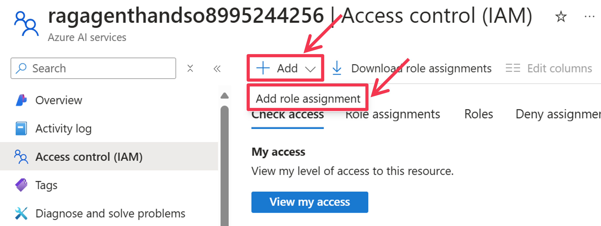

A window for assigning a role to the account is displayed, similar to before. First, select the role to assign. Type "Azure AI Developer" in the search box to filter the roles. Click on the displayed ```[Azure AI Developer]``` role, and then click the ```[次へ]``` (Next) button.


Next, select the target for the role assignment. First, check the ```[マネージドID]``` (Managed identity) option under "アクセスの割当先" (Assign access to) and click on ```[＋メンバーを選択する]``` (Select members). A window will appear on the right where you can choose the managed identity to assign the role to. Under "マネージド ID" (Managed identity), select ```[Search Service]```, then choose the name of the AI Search account you created earlier, and click the ```[選択]``` (Select) button.

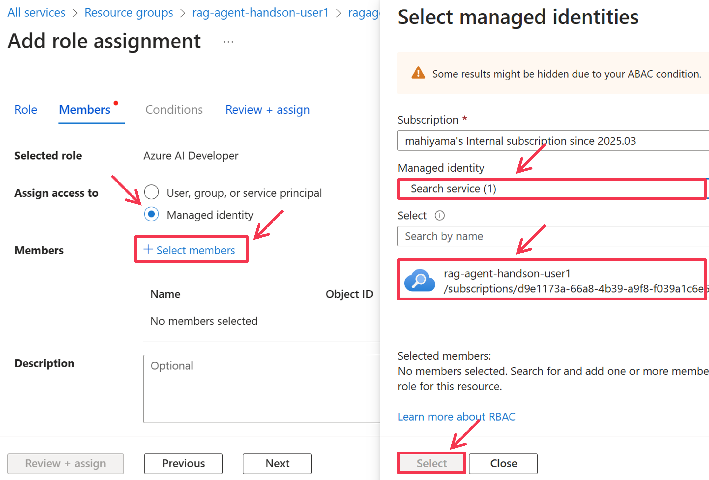

Review the role assignment target, and click the ```[レビューと割り当て]``` (Review + assign) button.

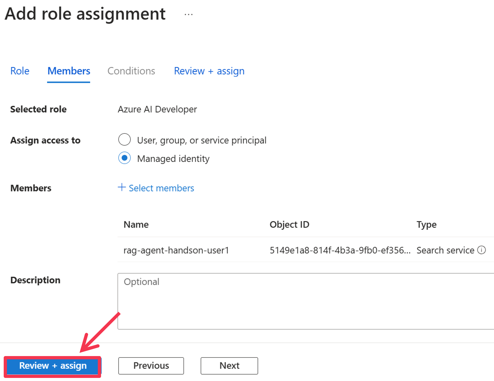

After reviewing the role assignment details, click the ```[レビューと割り当て]``` (Review + assign) button to complete assigning model access permissions from the AI Service account to AI Search.

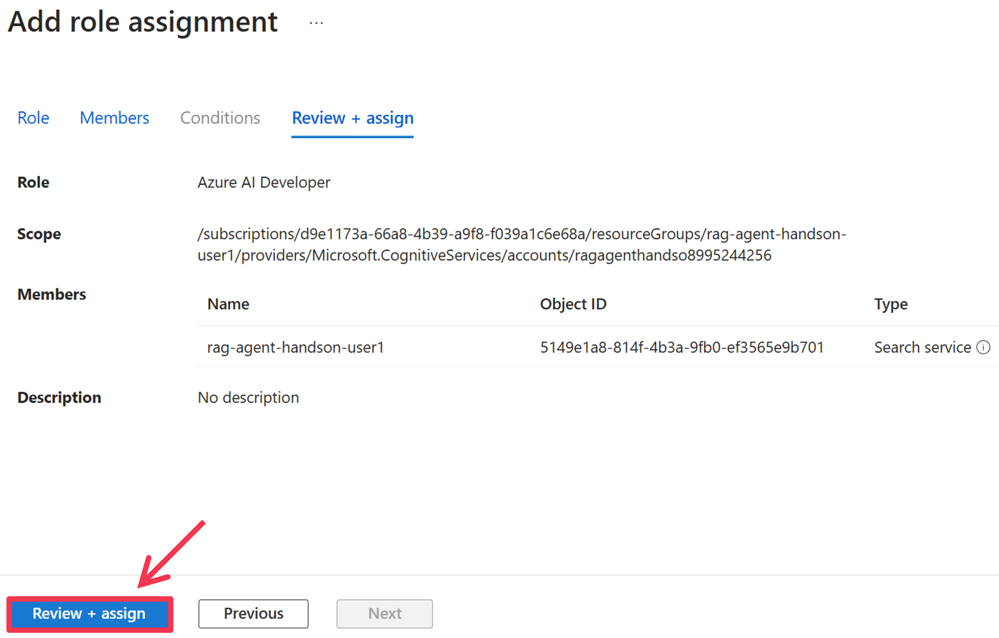