# 3. Azure AI Search Index Creation
For the AI agents developed with the Azure AI Agent Service, we will create an index in Azure AI Search and populate it with search documents so that they can be searched. There are two main approaches to inserting search documents into the index: the pull model and the push model.

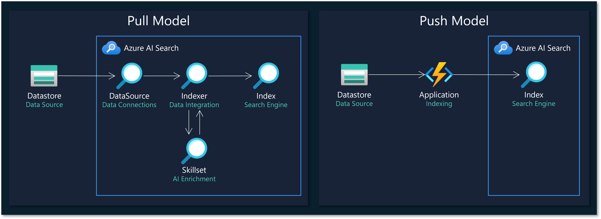

In the pull model, Azure AI Search uses its features—such as *Data Source*, *Indexer*, and *Skillset*—to periodically access the data store, collect and process data, and store it in the index. Because these processes can be implemented using only JSON definitions (low-code), data ingestion can be achieved with minimal effort. 

On the other hand, the push model inserts search documents into the index via the [AI Search REST API](https://learn.microsoft.com/en-us/rest/api/searchservice/documents/?view=rest-searchservice-2024-07-01&tabs=HTTP). Implementing this approach typically requires writing code, which offers the advantage of flexible search document creation.

In this walkthrough, we will prepare an index using the pull model. To set up the index, we will create the following elements either via JSON definitions or using the GUI:
- Index
- Data Source
- Skillset
- Indexer

## 3.1 Preparing the Index

As before, click on the AI Search account you will be using from the Azure resources list on your resource group page to open the AI Search account page.
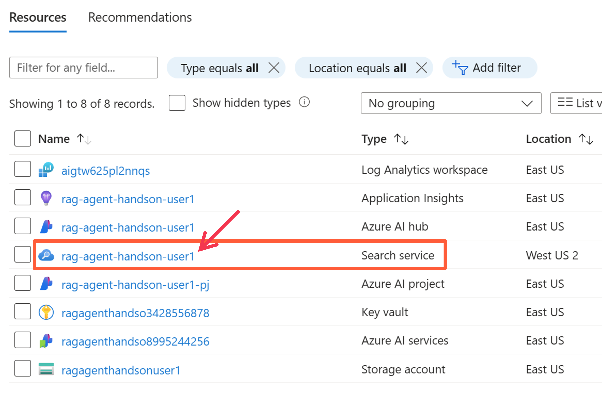

### 3.1.1 Creating the Index

On the AI Search account page, click on the ```[Index]``` option under the Search Management category in the sidebar. This will display the list of indexes created in this account. Click the ```[+ Add Index]``` button in the top menu, and then click on ```[Add Index (JSON)]```.
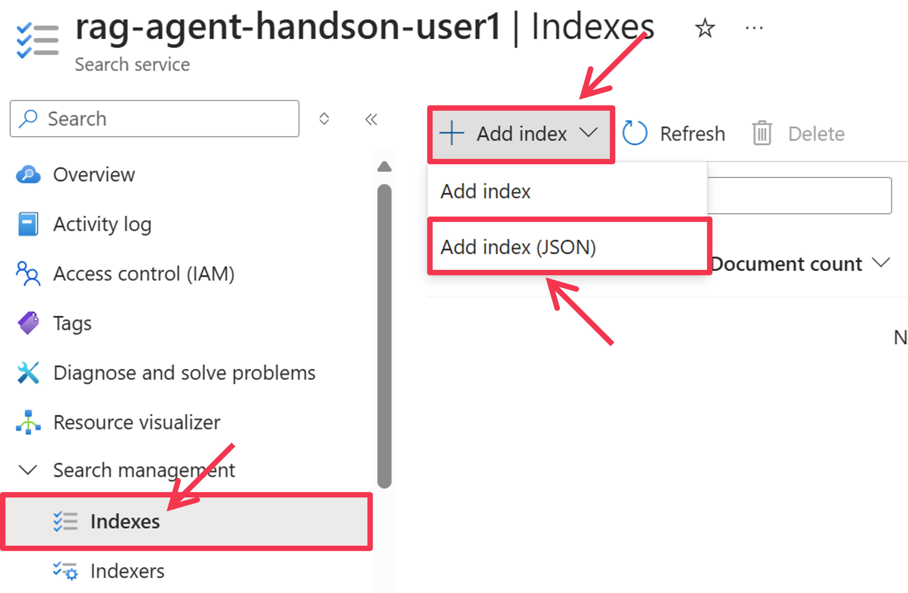

The JSON editor for adding an index will appear. Basically, you should input the JSON definition from [index.json](../../ai-search/index.json#L117), but be sure to replace `{OPENAI_SERVICE_NAME}` on line 117 with the name of the AI Service account that was granted a role on Azure AI Search.

```json
"vectorizers": [
    {
        "name": "vectorizer",
        "kind": "azureOpenAI",
        "azureOpenAIParameters": {
            "resourceUri": "https://{OPENAI_SERVICE_NAME}.openai.azure.com",
            "deploymentId": "text-embedding-3-large",
            "modelName": "text-embedding-3-large"
        }
    }
],
```

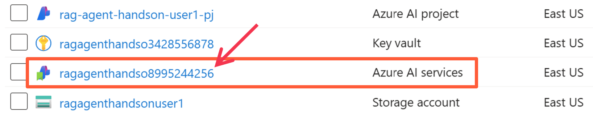

After modifying the JSON definition, replace the originally entered JSON and click the ```[Save]``` button.
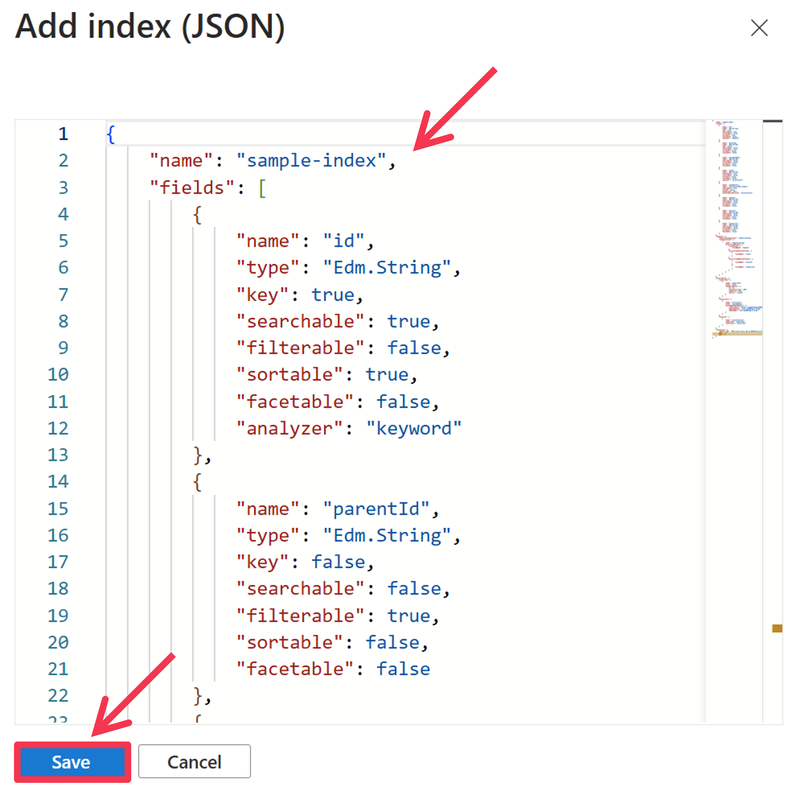

### 3.1.2 Creating the Data Source

Next, click on ```[Data Source]``` under the Search Management category in the sidebar. This will display the list of data sources created in this account. Click the ```[+ Add Data Source]``` button in the top menu, and then click on ```[Add Data Source]```.

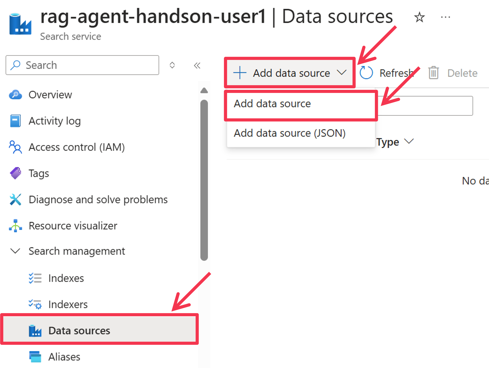

The GUI-based data source creation screen will appear. First, enter `"sample-datasource"` into the ```[Name]``` field. Next, specify the Azure Storage account you created earlier in the ```[Storage Account]``` field. Also, choose the container named ```[search-docs]``` for the ```[Blob Container]```. Check the option ```[Authenticate using managed identity]``` and then click the ```[Create]``` button.

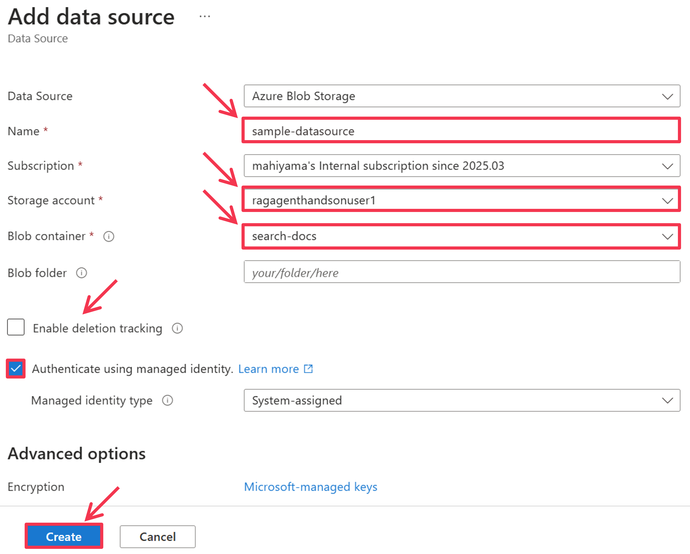

### 3.1.3 Creating the Skillset

Next, click on ```[Skillset]``` under the Search Management category in the sidebar. This will display the list of skillsets created in this account. Click the ```[+ Add Skillset]``` (Add Skillset) button in the top menu.

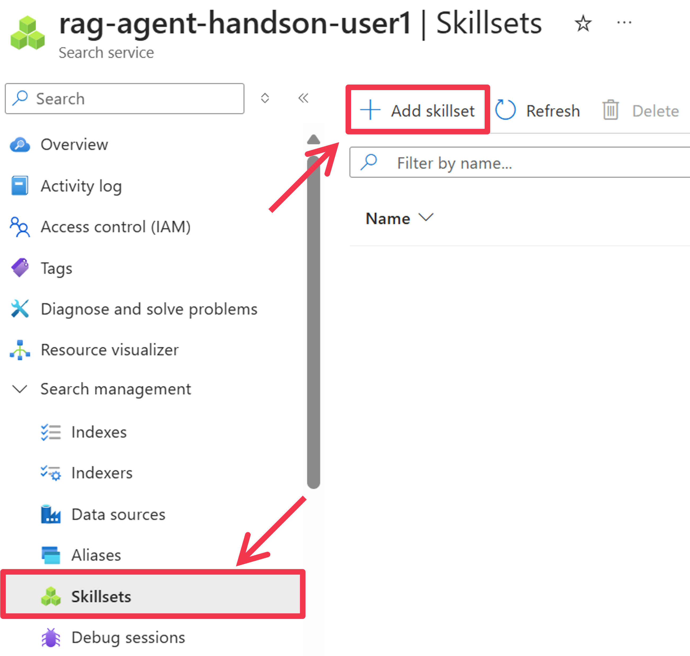

The skillset creation screen will appear. Skillsets can only be defined in JSON (GUI-based configuration is not available).

Similar to the index creation process, enter the JSON definition from [skillset.json](../../ai-search/skillset.json#L49) in the editor, but replace `{OPENAI_SERVICE_NAME}` on line 49 with the name of the AI Service account that was granted a role on Azure AI Search.

```json
{
    "@odata.type": "#Microsoft.Skills.Text.AzureOpenAIEmbeddingSkill",
    "context": "/document/markdown_document/*/pages/*",
    "resourceUri": "https://{OPENAI_SERVICE_NAME}.openai.azure.com",
    "deploymentId": "text-embedding-3-large",
    "modelName": "text-embedding-3-large",
    "dimensions": 3072,
    "inputs": [
        {
            "name": "text",
            "source": "/document/markdown_document/*/pages/*"
        }
    ],
    "outputs": [
        {
            "name": "embedding",
            "targetName": "text_vector"
        }
    ]
}
```

Replace the originally provided JSON with the modified JSON definition and click the ```[Save]``` button.
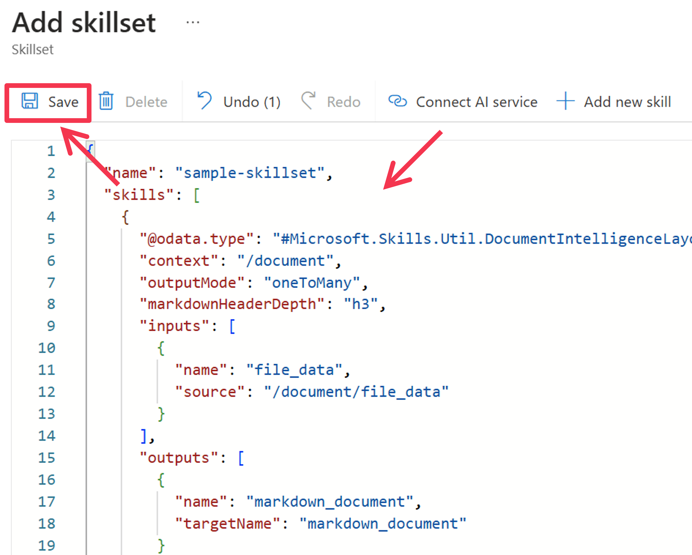

### 3.1.4 Creating and Running the Indexer

Next, click on ```[Indexer]``` under the Search Management category in the sidebar. This will display a list of indexers created in this account. Click the ```[+ Add Indexer]``` button in the top menu, then click on ```[Add Indexer (JSON)]```.

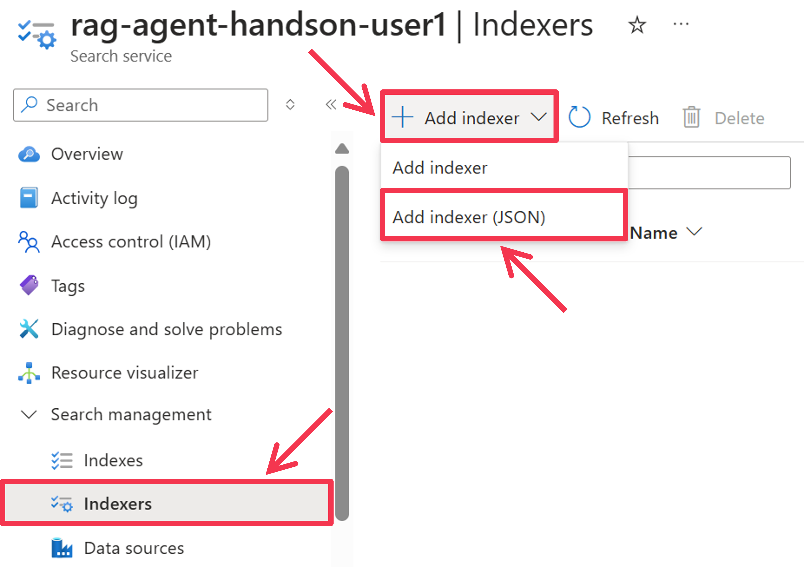

Replace the existing JSON content with the JSON definition from [indexer.json](../../ai-search/indexer.json) and then click the ```[Save]``` button.

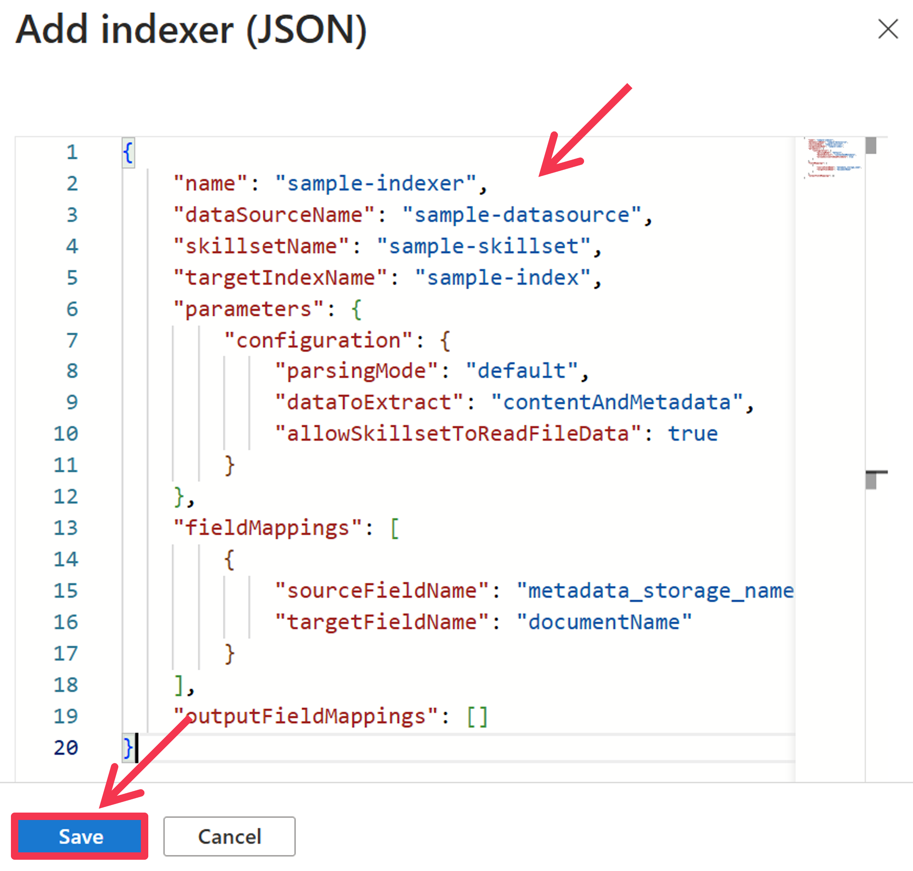

The newly created indexer will appear in the list. You should see that its status is set to `Running`. Click on the indexer named `sample-indexer` to view its details.

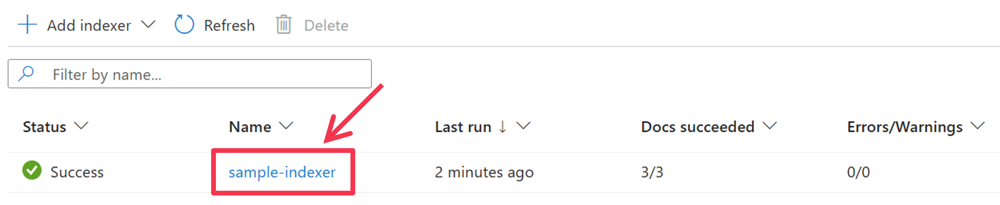

On this page, you can run the indexer, reset the record of which files have been processed (to prevent files from being processed twice), and check the execution history and status of past runs. On the right-hand side, you can see the results of the recent run. Verify that the `[Status]` is `"Success"` and the `[Number of Successful Documents]` is `"3"`.

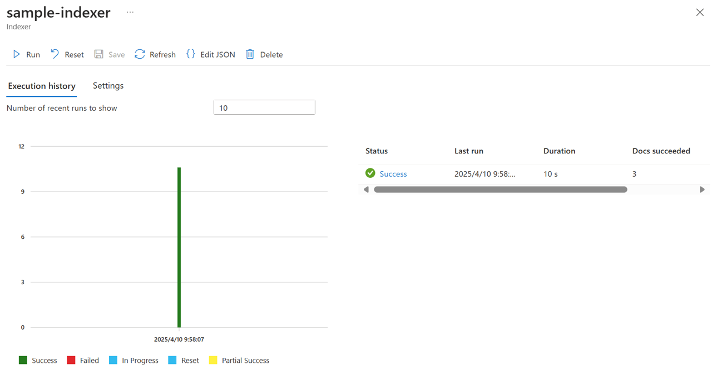

## 3.2 Explanation of the Index JSON Definition

### 3.2.1 Overall Structure: Root Fields

The overall structure of the index JSON definition is as follows:
```json
{
    "name": "sample-index",
    "fields": [],
    "semantic": {},
    "vectorSearch": {},
    "similarity": {}
}
```
Within the `fields` array, you specify fields such as `id`, `text`, etc., and you also designate which fields should be searchable.

The `semantic` field defines settings for semantic search.

The `vectorSearch` field defines settings for vector search.

The `similarity` field defines settings for BM25-based text search.

Additionally, there are root-level fields such as `corsOptions` for CORS settings, `scoringProfiles` for configuring field weighting in text search, and `suggesters` for query auto-completion. Refer to the documentation below for more details.

> [Search index overview - Azure AI Search | Microsoft Learn](https://learn.microsoft.com/en-us/azure/search/search-what-is-an-index)  
> [Indexes - Create Or Update - REST API (Azure Search Service) | Microsoft Learn](https://learn.microsoft.com/en-us/rest/api/searchservice/indexes/create-or-update?view=rest-searchservice-2024-07-01&tabs=HTTP)

### 3.2.2 Defining Fields (fields)

The `fields` property is an array where you define each field. For example:
```json
{
    "fields": [
        {
            "name": "id",
            "type": "Edm.String",
            "key": true,
            "searchable": true,
            "filterable": false,
            "sortable": true,
            "facetable": false,
            "analyzer": "keyword"
        },
        {
            "name": "chunk",
            "type": "Edm.String",
            "searchable": true,
            "filterable": false,
            "sortable": false,
            "facetable": false,
            "analyzer": "en.microsoft"
        },
        {
            "name": "chunkVector",
            "type": "Collection(Edm.Single)",
            "searchable": true,
            "stored": false,
            "dimensions": 3072,
            "vectorSearchProfile": "vectorProfile"
        },
        ...
    ]
}
```

First, specify the field name (`name`) and its data type (`type`). Supported data types include string (e.g., `Edm.String`), 32-bit integers (`Edm.Int32`), and 32-bit floating-point arrays (commonly used for vector storage) such as `Collection(Edm.Single)`. For a list of supported types, refer to [this document](https://learn.microsoft.com/en-us/rest/api/searchservice/supported-data-types).

For the field that represents the ID, set `key` to true. The default is false.

For fields that should be targeted for text search, set `searchable` to true. (This does not apply to fields used for vector search.) For searchable fields, you can specify an analyzer via the `analyzer` property. Analyzers are used to split text into tokens (these tokens are different from those used by LLMs). English text is usually easy to tokenize by splitting on spaces, but for languages like Japanese, morphological analysis is required; therefore, choosing an appropriate analyzer is critical. You can choose from Lucene analyzers, Microsoft-provided language analyzers, or even custom analyzers created from a combination of tokenizers and filters. If no analyzer is specified, a default analyzer (which may not work well for Japanese) is used, so be sure to set an appropriate language analyzer. For documents that mix Japanese and English, the Japanese Lucene analyzer "ja.lucene" is recommended. For a list of supported analyzers, see [this document](https://learn.microsoft.com/en-us/azure/search/search-analyzers).

For fields used in vector search, first specify a vector data type such as `Collection(Edm.Single)` or `Collection(Edm.Byte)`, then set the number of dimensions with `dimensions`, and specify the vector search profile with `vectorSearchProfile` (as explained later). The `stored` property determines whether the vector value is included in the search document; setting it to false means the vector is used only for search, which can substantially reduce storage size.

The `filterable` property is important since it allows you to filter search results based on the field’s value (similar to the WHERE clause in SQL).

The `facetable` property determines whether the field is targetted for faceted navigation (a feature that simplifies configuring filters on the client side).

> [Supported data types - Azure AI Search | Microsoft Learn](https://learn.microsoft.com/en-us/rest/api/searchservice/supported-data-types)  
> [Analyzers for linguistic and text processing - Azure AI Search | Microsoft Learn](https://learn.microsoft.com/en-us/azure/search/search-analyzers)  
> [Add a faceted navigation category hierarchy - Azure AI Search | Microsoft Learn](https://learn.microsoft.com/en-us/azure/search/search-faceted-navigation)

### 3.2.3 Semantic Search Settings (semantic)

Azure AI Search’s [semantic search](https://learn.microsoft.com/en-us/azure/search/semantic-search-overview) applies Bing’s search technology-based L2 ranking to improve search result relevance. In Azure AI Search, this process is called semantic reranking, where a small language model (SLM) recalculates the search score (i.e., relevance to the search query) for N retrieved search documents (which have been initially ranked) obtained via text search, vector search, or hybrid search. Essentially, the idea is to use an SLM to re-rank a small number of documents identified via hybrid search.

Below is a diagram that illustrates the flow from query submission through hybrid search, Reciprocal Rank Fusion (RRF), and semantic reranking.
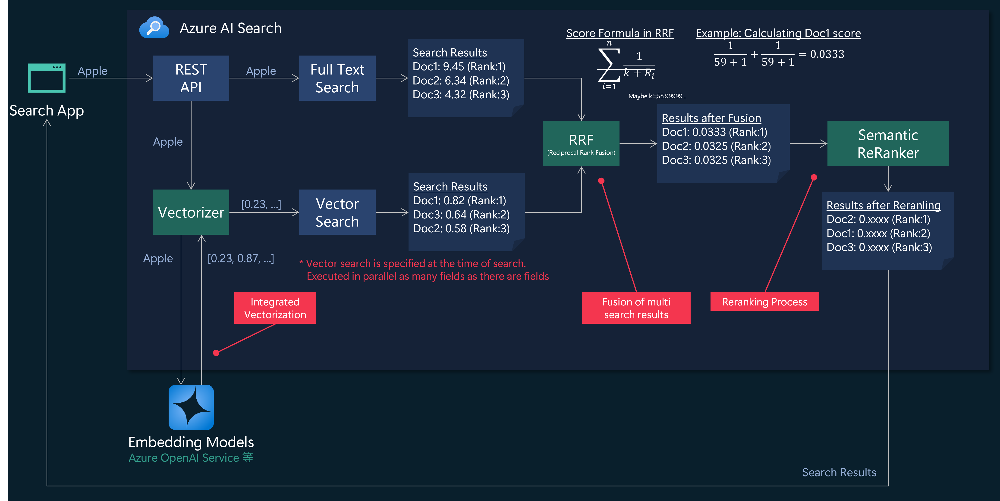

The semantic search settings are defined in the `semantic` field. You can define multiple configurations under the `configurations` property, each with a name (`name`) and fields used for reranking (`prioritizedFields`). The fields you can specify include the document’s title (via `titleField`), the main content (via `prioritizedContentFields`), and keywords (via `prioritizedKeywordsFields`). Based on these fields, an SLM generates a summary and computes similarity to the search query, which then adjusts the search score accordingly.

In the `defaultConfiguration` field, you can specify which configuration is used by default when the application sends a search request to AI Search without specifying a configuration name.

```json
"semantic": {
    "defaultConfiguration": "semanticConfig",
    "configurations": [
        {
            "name": "semanticConfig",
            "prioritizedFields": {
                "titleField": {
                    "fieldName": "chapter"
                },
                "prioritizedContentFields": [
                    {
                        "fieldName": "chunk"
                    }
                ],
                "prioritizedKeywordsFields": [
                    {
                        "fieldName": "section"
                    },
                    {
                        "fieldName": "subsection"
                    }
                ]
            }
        }
    ]
}
```

> [Semantic ranking - Azure AI Search | Microsoft Learn](https://learn.microsoft.com/en-us/azure/search/semantic-search-overview)

### 3.2.3 Vector Search Settings (vectorSearch)

In the `vectorSearch` field, you configure settings related to vector search. Specifically, you define the search algorithms (`algorithms`), query vectorization settings (`vectorizers`), and profiles (which combine the algorithm and vectorizer settings) under `profiles`. Additionally, the `compressions` field allows you to configure vector quantization to reduce storage size when many search documents are stored. If you are interested in this feature, please refer to [this document](https://learn.microsoft.com/en-us/azure/search/vector-search-how-to-configure-compression-storage).

The goal is to define a profile for vector search, which is referenced by the vector field’s `vectorSearchProfile` property. To do this, you configure the search algorithm and query vectorization settings.

In the `algorithms` field, you can specify multiple vector search algorithms. The available algorithms (specified by the `kind` property) are kNN (exhaustiveKnn) or [HNSW](https://arxiv.org/abs/1603.09320) (hnsw). kNN performs an exhaustive search, which might be suitable for small-scale searches with fewer than 10,000 documents due to fewer constraints on query processing time. In general, HNSW is recommended. When using HNSW, you can specify algorithm parameters (`hnswParameters`). The details for each parameter are provided in the Appendix, but the key point is that increasing these values improves search accuracy (by broadening the search scope) at the cost of search speed.

In addition, you can specify the similarity metric between vectors using the `metric` property. If no particular metric is needed, using `cosine` (cosine similarity) is usually sufficient.

The `vectorizers` field allows you to configure how the search query is vectorized. Multiple configurations can be defined, each specifying how the query should be transformed into a vector. In the example below, the Azure OpenAI Service's *text-embedding-3-large* model is used for vectorization. You can also deploy models via the [Azure AI Foundry Model Catalog](https://learn.microsoft.com/en-us/azure/search/vector-search-integrated-vectorization-ai-studio?tabs=inference-image), use web API-based vectorization, or even vectorize images. In this example, Microsoft Entra authentication is used for accessing the OpenAI Service, though you can alternatively specify an API key using the `apiKey` field for simpler testing during development.

Finally, under the `profiles` field, you define profiles that combine the specified algorithms (from `algorithms`) and vectorizer settings (from `vectorizers`). You can define multiple profiles, and each profile is given a name via the `name` field. This name is then referenced in a vector field's `vectorSearchProfile` property. Consequently, that field's vector search will use the algorithm and vectorizer associated with the profile.

```json
"vectorSearch": {
    "algorithms": [
        {
            "name": "algorithm",
            "kind": "hnsw",
            "hnswParameters": {
                "m": 10,
                "efConstruction": 1000,
                "efSearch": 1000,
                "metric": "cosine"
            }
        }
    ],
    "vectorizers": [
        {
            "name": "vectorizer",
            "kind": "azureOpenAI",
            "azureOpenAIParameters": {
                "resourceUri": "https://{OPENAI_SERVICE_NAME}.openai.azure.com",
                "deploymentId": "text-embedding-3-large",
                "modelName": "text-embedding-3-large"
            }
        }
    ],
    "profiles": [
        {
            "name": "vectorProfile",
            "algorithm": "algorithm",
            "vectorizer": "vectorizer"
        }
    ]
}
```

#### Appendix: HNSW (Hierarchical Navigable Small World)
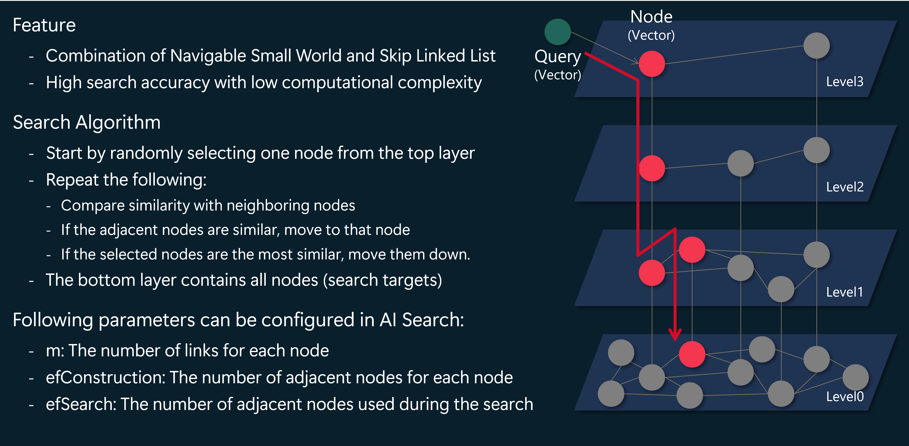

#### Appendix: Vector Similarity Metrics Supported by Azure AI Search
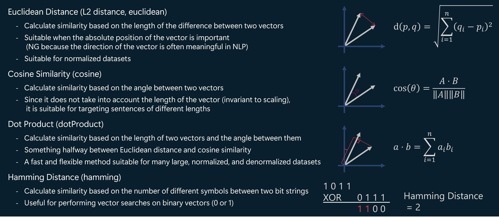

#### Appendix: Vector Field Compression
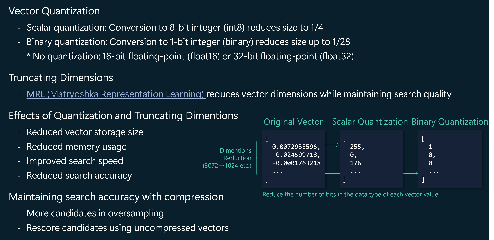

> [Vector search - Azure AI Search | Microsoft Learn](https://learn.microsoft.com/en-us/azure/search/vector-search-overview)

### 3.2.4 Text Search Settings (similarity)

Azure AI Search uses [Okapi BM25](https://en.wikipedia.org/wiki/Okapi_BM25) for text search. In simple terms, BM25 is akin to TF-IDF (Term Frequency-Inverse Document Frequency), where words that occur less frequently across all documents contribute more to the search score, combined with adjustments for document length.

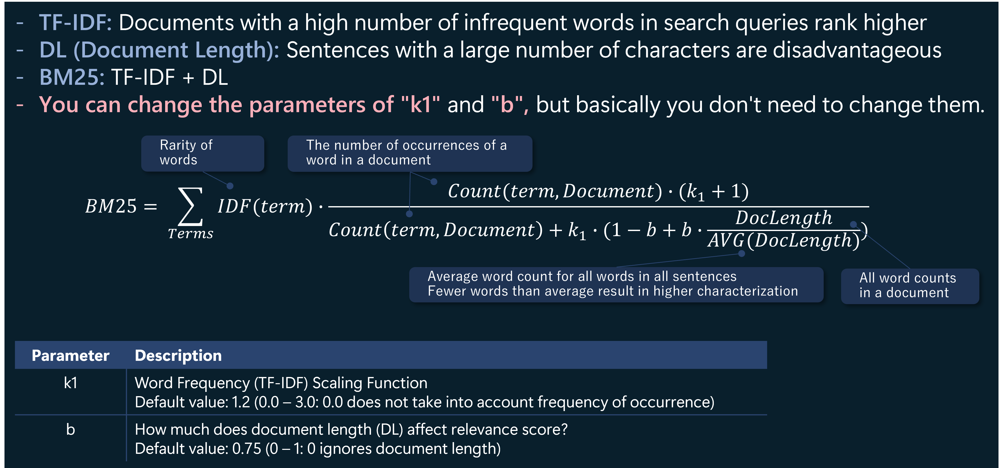

In Azure AI Search, you can set the parameters `k1 (0.0~3.0)` and `b (0~1)`. The parameter k1 controls the influence of a word’s rarity (its frequency across all documents); a higher value increases the impact of rare words (with 0 meaning they are not considered at all). The parameter b controls the impact of document length, with 0 meaning length is not factored at all. In most cases, the default values of k1=1.2 and b=0.75 work well; however, setting k1=3.0 may be beneficial for more keyword-focused searches in certain scenarios.

```json
"similarity": {
    "@odata.type": "#Microsoft.Azure.Search.BM25Similarity",
    "k1": 1.2,
    "b": 0.75
}
```

> [Configure BM25 relevance scoring - Azure AI Search | Microsoft Learn](https://learn.microsoft.com/en-us/azure/search/index-ranking-similarity)

## 3.3 Explanation of the Data Source JSON Definition

In this example, the data source was configured via the GUI, but the underlying JSON definition looks as follows. Since the data source is Azure Blob Storage, the `type` is set to `azureblob`. For other supported data sources in Azure AI Search, refer to [this document](https://learn.microsoft.com/en-us/azure/search/search-data-sources-gallery). Additionally, the data source definition includes authentication information (`credentials`) and container details (`container`). In this case, Microsoft Entra authentication is used for accessing Blob Storage, so a resource ID is provided. Alternatively, you can use a connection string (which includes the storage endpoint and authentication key) for key-based authentication.

```json
{
    "name": "sample-datasource",
    "type": "azureblob",
    "credentials": {
        "connectionString": "ResourceId=/subscriptions/{SUBSCRIPTION_ID}/resourceGroups/{RESOURCE_GROUP}/providers/Microsoft.Storage/storageAccounts/{STORAGE_ACCOUNT}/;"
    },
    "container": {
        "name": "search-docs"
    }
}
```

## 3.4 Explanation of the Indexer JSON Definition

In this example, the indexer is defined as follows. The essential parts of the definition include the data source name (`dataSourceName`), the skillset name (`skillsetName`), and the target index name (`targetIndexName`). In addition, you can specify how much of the document data should be passed to the skillset by configuring `dataToExtract` and `allowSkillsetToReadFileData` within `parameters.configuration`. You can also set up file type filters for this indexer (for example, to process only PDF files).

Furthermore, you can map the outputs from the skillset and metadata to specific fields here. In the `fieldMappings` section, the `metadata_storage_name` (which is automatically attached when using Blob Storage as the data source, containing the blob name and content type) is mapped to the index's `documentName` field. For more details, please refer to [this document](https://learn.microsoft.com/en-us/azure/search/search-howto-indexing-azure-blob-storage).

```json
{
    "name": "sample-indexer",
    "dataSourceName": "sample-datasource",
    "skillsetName": "sample-skillset",
    "targetIndexName": "sample-index",
    "parameters": {
        "configuration": {
            "parsingMode": "default",
            "dataToExtract": "contentAndMetadata",
            "allowSkillsetToReadFileData": true
        }
    },
    "fieldMappings": [
        {
            "sourceFieldName": "metadata_storage_name",
            "targetFieldName": "documentName"
        }
    ],
    "outputFieldMappings": []
}
```

## 3.5 Explanation of the Skillset JSON Definition

### 3.5.1 Overall Structure: Root Fields

The overall structure of the skillset JSON definition is as follows, where you mainly define `name` and `skills`. Additionally, if you need to output multiple search documents from a single file (such as a PDF), you must define index projections using `indexProjections`.

```json
{
    "name": "sample-skillset",
    "skills": [],
    "indexProjections": {}
}
```

Other settings such as the connection to Azure AI Services (`cognitiveServices`), the configuration for using the [knowledge store](https://learn.microsoft.com/en-us/azure/search/knowledge-store-concept-intro?tabs=portal), and encryption settings (`encryptionKey`) can also be specified. For more details, please see [this document](https://learn.microsoft.com/en-us/azure/search/cognitive-search-defining-skillset).

> [Skillset concepts - Azure AI Search | Microsoft Learn](https://learn.microsoft.com/en-us/azure/search/cognitive-search-working-with-skillsets)  
> [Create a skillset - Azure AI Search | Microsoft Learn](https://learn.microsoft.com/en-us/azure/search/cognitive-search-defining-skillset)
> [Define index projections - Azure AI Search | Microsoft Learn](https://learn.microsoft.com/en-us/azure/search/search-how-to-define-index-projections?tabs=rest-create-index%2Crest-create-index-projection)

### 3.5.2 Adding a Skill: Document Analysis

The `skills` array is where you add individual skills. 

First, to extract text from an input PDF file, add the [Document Intelligence Layout Skill](https://learn.microsoft.com/en-us/azure/search/cognitive-search-skill-document-intelligence-layout). It is recommended to follow the Microsoft official documentation (Microsoft Learn) when adding skills. The document intelligence layout skill that we add here is detailed on [this page](https://learn.microsoft.com/en-us/azure/search/cognitive-search-skill-document-intelligence-layout).

First, verify the `@odata.type`; according to the official documentation, it should be set to [Microsoft.Skills.Util.DocumentIntelligenceLayoutSkill](https://learn.microsoft.com/en-us/azure/search/cognitive-search-skill-document-intelligence-layout#section).


Next, specify the `context`. This acts as the root path for the input and output data processed by the skillset; for the initial skillset, setting it to `/document` is sufficient.

Then, specify the parameters for the skill. According to the official documentation, the document intelligence layout skill accepts two parameters: `outputMode` and `markdownHeaderDepth`, which you should set accordingly.

Also review the skill’s inputs (`inputs`) and outputs (`outputs`). The input named `file_data` is provided, and the output will be available as `markdown_document`.

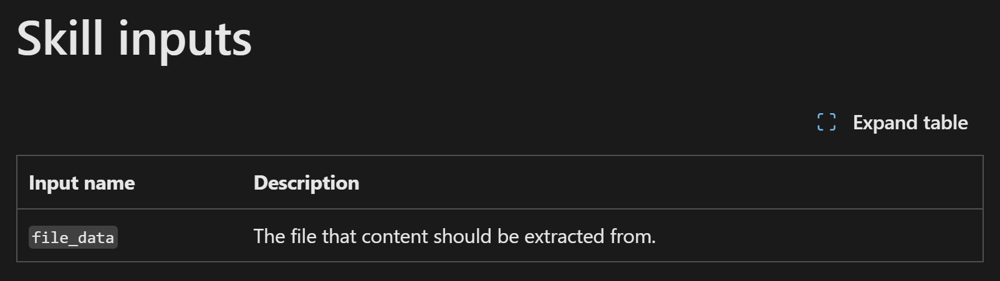

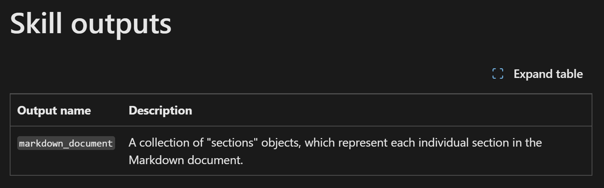

Additionally, the official documentation provides sample definitions and sample outputs. Using those as a reference, add the following skill definition. The data provided as `/document/file_data` (such as a PDF file) is expected to have a structure like the following (shown in JSON for clarity):

```json
{
    "document": {
        "file_data": {
            "$type": "file",
            "contentType": "application/pdf",
            "data": "JVBERi0xLjQKJdPr6eEKMSAwIG9iago8PC9...",
            "url": "https://xxxxx.blob.core.windows.net/...."
        }
    }
}
```

For the `inputs`, set the value for `text` (source) to `/document/file_data`. For the outputs, produce `markdown_document`.

```json
{
    "@odata.type": "#Microsoft.Skills.Util.DocumentIntelligenceLayoutSkill",
    "context": "/document",
    "outputMode": "oneToMany",
    "markdownHeaderDepth": "h3",
    "inputs": [
        {
            "name": "file_data",
            "source": "/document/file_data"
        }
    ],
    "outputs": [
        {
            "name": "markdown_document",
            "targetName": "markdown_document"
        }
    ]
}
```

The output `markdown_document` will have a structure similar to the following (expressed in JSON for clarity):
```json
{
    "document": {
        "file_data": {},
        "markdown_document": [
            { 
                "content": "Interpolations set the shape of the slope...", 
                "sections": { 
                    "h1": "Character filters add processing before a string reaches the tokenizer...", 
                    "h2": "Character filters", 
                    "h3": "" 
                },
                "ordinal_position": 0
            }, 
            {},
            {},
            ...
        ]
    }
}
```

> [Document Layout Skill - Azure AI Search | Microsoft Learn](https://learn.microsoft.com/en-us/azure/search/cognitive-search-skill-document-intelligence-layout)

### 3.5.3 Adding a Skill: Chunk Splitting

Next, to split the text extracted by the document layout skill into chunks, add the [Text Split Skill](https://learn.microsoft.com/en-us/azure/search/cognitive-search-skill-textsplit). Although the document layout skill may already divide the content into chapters or sections, this skill helps manage very long chapters or sections. As before, refer to the [skillset reference](https://learn.microsoft.com/en-us/azure/search/cognitive-search-skill-textsplit) while constructing your JSON definition.

It is important to note that since `/document/markdown_document` is an array, you should append an asterisk (*) to its context to process all its elements (see [reference](https://learn.microsoft.com/en-us/azure/search/cognitive-search-skill-annotation-language)).

Then, define the parameters for this skill as well as its inputs and outputs. In this example, the text is split into chunks of 1024 tokens with an overlap of 256 tokens. For the input named `text`, use `/document/markdown_document/*/content` so that the `content` from each element is processed.

```json
{
    "@odata.type": "#Microsoft.Skills.Text.SplitSkill",
    "context": "/document/markdown_document/*",
    "textSplitMode": "pages",
    "maximumPageLength": 1024,
    "pageOverlapLength": 256,
    "defaultLanguageCode": "en",
    "unit": "azureOpenAITokens",
    "azureOpenAITokenizerParameters": {
        "encoderModelName": "cl100k_base"
    },
    "inputs": [
        {
            "name": "text",
            "source": "/document/markdown_document/*/content"
        }
    ],
    "outputs": [
        {
            "name": "textItems",
            "targetName": "pages"
        }
    ]
}
```

The split chunks (an array of strings) will be output as `textItems`, in this case under the name `pages`. After this step, the data structure will look similar to the following (expressed in JSON for clarity). Because the `context` is set to `/document/markdown_document/*`, the output will appear under `/document/markdown_document/*/pages`:
```json
{
    "document": {
        "file_data": {},
        "markdown_document": [
            { 
                "content": "Interpolations set the shape of the slope...", 
                "sections": { 
                    "h1": "Character filters add processing before a string reaches the tokenizer...", 
                    "h2": "Character filters", 
                    "h3": "" 
                },
                "pages": [
                    "Interpolations set the shape of the slope..."
                ],
                "ordinal_position": 0
            }, 
            {},
            {},
            ...
        ]
    }
}
```

> [Text Split Skill - Azure AI Search | Microsoft Learn](https://learn.microsoft.com/en-us/azure/search/cognitive-search-skill-textsplit)  
> - [Skill Context and Input Annotation Reference Language - Azure AI Search | Microsoft Learn](https://learn.microsoft.com/en-us/azure/search/cognitive-search-skill-annotation-language)

### 3.5.4 Adding a Skill: Text Embedding

Finally, to generate embeddings (vector representations) for the split text chunks using Azure OpenAI Service, add the [Azure OpenAI Embedding Skill](https://learn.microsoft.com/en-us/azure/search/cognitive-search-skill-azure-openai-embedding). Similar to before, refer to the [reference](https://learn.microsoft.com/en-us/azure/search/cognitive-search-skill-azure-openai-embedding) to complete the JSON definition.

Set the `context` to target the array of strings `pages` by specifying `/document/markdown_document/*/pages/*`. This will process all elements in the `pages` array within each element of `markdown_document`. Then, define the skill’s parameters, inputs, and outputs. Mainly, you specify the embedding model to use. In this example, Microsoft Entra authentication is used to access the Azure OpenAI Service; alternatively, you can provide an API key via the `apiKey` property for key-based authentication.

```json
{
    "@odata.type": "#Microsoft.Skills.Text.AzureOpenAIEmbeddingSkill",
    "context": "/document/markdown_document/*/pages/*",
    "resourceUri": "https://{OPENAI_SERVICE_NAME}.openai.azure.com",
    "deploymentId": "text-embedding-3-large",
    "modelName": "text-embedding-3-large",
    "dimensions": 3072,
    "inputs": [
        {
            "name": "text",
            "source": "/document/markdown_document/*/pages/*"
        }
    ],
    "outputs": [
        {
            "name": "embedding",
            "targetName": "text_vector"
        }
    ]
}
```

If you wish to use API key authentication instead, specify it as follows:

```json
{
    "@odata.type": "#Microsoft.Skills.Text.AzureOpenAIEmbeddingSkill",
    "context": "/document/markdown_document/*/pages/*",
    "resourceUri": "https://{OPENAI_SERVICE_NAME}.openai.azure.com",
    "apiKey": "xxxxxxxxxxxxxxxxxxxxxxxxxxxxxxxxxxxxxxxx",
    "deploymentId": "text-embedding-3-large",
    "modelName": "text-embedding-3-large",
    ...
}
```

After executing this skill, the data structure will appear similar to the following (expressed in JSON for clarity). Since the `context` is set to `/document/markdown_document/*/pages/*`, the output will be nested under `/document/markdown_document/*/pages/*/text_vector` (resulting in a somewhat unique structure):
```json
{
    "document": {
        "file_data": {},
        "markdown_document": [
            { 
                "content": "Interpolations set the shape of the slope...", 
                "sections": { 
                    "h1": "Character filters add processing before a string reaches the tokenizer...", 
                    "h2": "Character filters", 
                    "h3": "" 
                },
                "pages": [
                    {
                        "Interpolations set the shape of the slope...",
                        { "text_vector": [0.321780, 0.745397, ...] }
                    }
                ],
                "ordinal_position": 0
            }, 
            {},
            {},
            ...
        ]
    }
}
```

> [Azure OpenAI Embedding Skill - Azure AI Search | Microsoft Learn](https://learn.microsoft.com/en-us/azure/search/cognitive-search-skill-azure-openai-embedding)

### 3.5.5 Index Projections

When using Azure Blob Storage as the data source for Azure AI Search, the default behavior (unless you use [index projections](https://learn.microsoft.com/en-us/azure/search/search-how-to-define-index-projections?tabs=rest-create-index%2Crest-create-index-projection)) is to treat one file as one search document. In this case, however, multiple search documents (i.e., the split text chunks along with their metadata) are generated from a single file. Therefore, you must define index projections so that these are registered in the index as multiple search documents.

Define selectors under the `selectors` property. Selectors can be defined per target index (which makes it possible to output to multiple indexes).

```json
"indexProjections": {
    "selectors": [
        {
            "targetIndexName": "sample-index",
            "parentKeyFieldName": "parentId",
            "sourceContext": "/document/markdown_document/*/pages/*",
            "mappings": [
                {
                    "name": "documentName",
                    "source": "/document/metadata_storage_name"
                },
                {
                    "name": "chunk",
                    "source": "/document/markdown_document/*/pages/*"
                },
                {
                    "name": "chunkVector",
                    "source": "/document/markdown_document/*/pages/*/text_vector"
                },
                {
                    "name": "chapter",
                    "source": "/document/markdown_document/*/sections/h1"
                },
                {
                    "name": "section",
                    "source": "/document/markdown_document/*/sections/h2"
                },
                {
                    "name": "subsection",
                    "source": "/document/markdown_document/*/sections/h3"
                }
            ]
        }
    ],
    "parameters": {
        "projectionMode": "skipIndexingParentDocuments"
    }
}
```

In the selector, you define the target index name (`targetIndexName`), the index field where the parent document ID is stored (`parentKeyFieldName`), the root from which to split the document into multiple search documents (`sourceContext`), and the field mappings that map the data produced by the skillset (under `/document`) to the index fields. In this example, the index’s key field is defined in [the index JSON](../../ai-search/index.json#L15). When using index projections, the key field must be marked as searchable (`searchable=true`) and must use the keyword analyzer (`analyzer=keyword`).

```json
{
    "fields": [
        {
            "name": "id",
            "type": "Edm.String",
            "key": true,
            "searchable": true,
            "filterable": false,
            "sortable": true,
            "facetable": false,
            "analyzer": "keyword"
        },
        {
            "name": "parentId",
            "type": "Edm.String",
            "key": false,
            "searchable": false,
            "filterable": true,
            "sortable": false,
            "facetable": false
        },
        ....
    ]
}
```

The `mappings` array defines how the data produced by the skillset (variables under `/document`) maps to the index fields. For example, in the following mapping, the index field `chunkVector` receives the embedding values generated for the chunk. Note that `/document/metadata_storage_name` is metadata automatically attached when using Blob Storage as a data source (containing the blob name and content type). For further details, refer to [this document](https://learn.microsoft.com/en-us/azure/search/search-howto-indexing-azure-blob-storage).

```json
"mappings": [
    {
        "name": "documentName",
        "source": "/document/metadata_storage_name"
    },
    {
        "name": "chunk",
        "source": "/document/markdown_document/*/pages/*"
    },
    {
        "name": "chunkVector",
        "source": "/document/markdown_document/*/pages/*/text_vector"
    },
    ...
]
```

> [Define index projections - Azure AI Search | Microsoft Learn](https://learn.microsoft.com/en-us/azure/search/search-how-to-define-index-projections?tabs=rest-create-index%2Crest-create-index-projection)  
> [Azure blob indexer - Azure AI Search | Microsoft Learn](https://learn.microsoft.com/en-us/azure/search/search-howto-indexing-azure-blob-storage)

## 3.6 Verifying Operation Using Debug Features

Using the [Debug Sessions](https://learn.microsoft.com/en-us/azure/search/cognitive-search-debug-session) feature in Azure AI Search, you can inspect the operation of the skillset in detail, and if any issues arise, modify the skillset and re-test its operation.

From the AI Search account page, click on ```[Debug Sessions]``` under the Search Management category. This displays a list of debug sessions for the account. Click on the ```[+ Add Debug Session]``` button in the top menu. A panel on the right will appear for creating a debug session. Enter `"sample-debug"` as the ```[Debug Session Name]```, select `"sample-indexer"` for the ```[Indexer Template]```, check the option ```[Select the First Document]```, and specify the storage account you created earlier in the ```[Storage Account]``` field. Then, click the ```[Save]``` button.

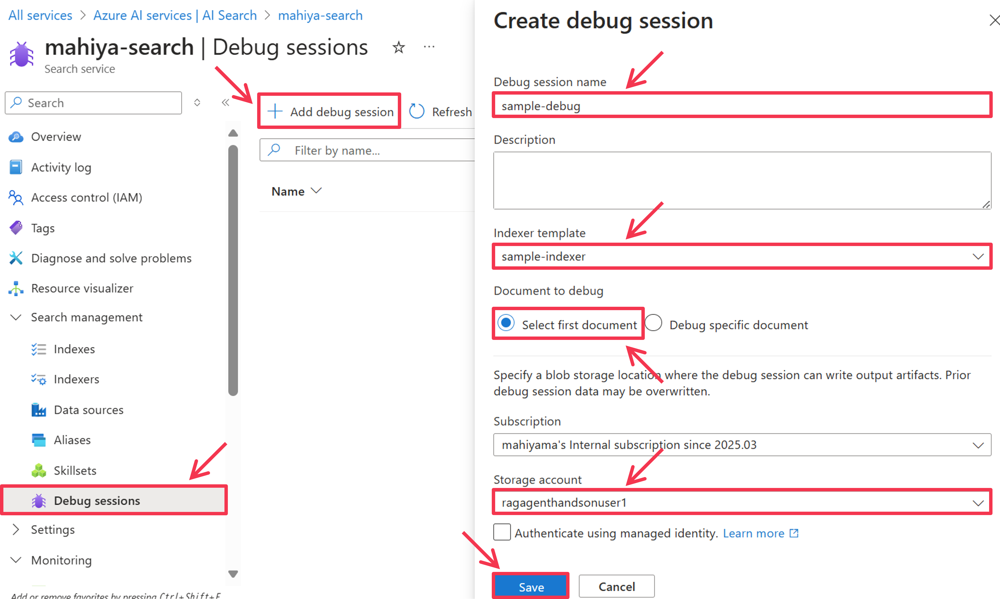

The indexer will then begin executing. Once the indexer finishes, you will see a diagram along with the generated data structure. The diagram on the left helps you understand the relationship between the skillset and index mappings, and the window on the right shows the input/output values for each skill in the skillset.

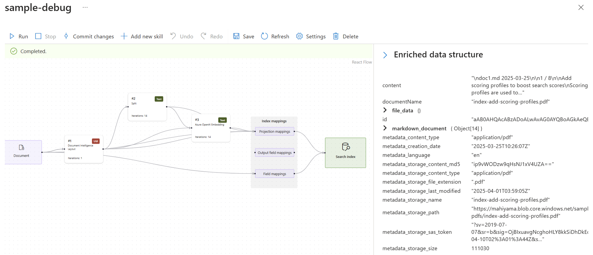

> [Debug Sessions Concepts - Azure AI Search | Microsoft Learn](https://learn.microsoft.com/en-us/azure/search/cognitive-search-debug-session)

## Appendix: Creating an Index via REST API

Azure AI Search allows you to create, delete, and manage various elements such as the [index](https://learn.microsoft.com/en-us/rest/api/searchservice/operation-groups?view=rest-searchservice-2024-07-01), [data source](https://learn.microsoft.com/en-us/rest/api/searchservice/data-sources/create?view=rest-searchservice-2024-07-01&tabs=HTTP), [skillset](https://learn.microsoft.com/en-us/rest/api/searchservice/skillsets/create?view=rest-searchservice-2024-07-01&tabs=HTTP), and [indexer](https://learn.microsoft.com/en-us/rest/api/searchservice/indexers/create?view=rest-searchservice-2024-07-01&tabs=HTTP) via the [REST API](https://learn.microsoft.com/en-us/rest/api/searchservice/operation-groups?view=rest-searchservice-2024-07-01).

For example, to create an index using `curl`, execute a command like the following, which creates the index according to the definition in the `ai-search/index.json` file:

```bash
AI_SEARCH_NAME="" # Azure AI Search account name
AI_SEARCH_ADMIN_KEY="" # Azure AI Search admin key
curl -X POST https://$AI_SEARCH_NAME.search.windows.net/indexes?api-version=2024-07-01 \
    -H 'Content-Type: application/json' \
    -H 'api-key: '$AI_SEARCH_ADMIN_KEY \
    -d @ai-search/index.json
```

Of course, if you can use the REST API, any method is acceptable. Here is an example of creating an index using a Python script:

```python
import json
import requests

AI_SEARCH_NAME = ""
AI_SEARCH_ADMIN_KEY = ""

with open("ai-search/index.json", "r") as f:
    index_definition = json.load(f)

url = f"https://{AI_SEARCH_NAME}.search.windows.net/indexes?api-version=2024-07-01"
headers = {"Content-Type": "application/json", "api-key": AI_SEARCH_ADMIN_KEY}
requests.post(url, json=index_definition, headers=headers)
```

Additionally, client libraries for Azure AI Search are available for various programming languages ([.NET](https://learn.microsoft.com/en-us/dotnet/api/overview/azure/search.documents-readme), [Python](https://learn.microsoft.com/en-us/python/api/overview/azure/search-documents-readme), [Java](https://learn.microsoft.com/en-us/java/api/overview/azure/search-documents-readme), [JavaScript](https://learn.microsoft.com/en-us/javascript/api/overview/azure/search-documents-readme?view=azure-node-latest)). These libraries simplify managing indexes and other resources.

```python
import json
from azure.core.credentials import AzureKeyCredential
from azure.search.documents.indexes import SearchIndexClient
from azure.search.documents.indexes.models import SearchIndex

AI_SEARCH_NAME = ""
AI_SEARCH_ADMIN_KEY = ""

with open("ai-search/index.json", "r") as f:
    index_json = json.load(f)
    index = SearchIndex.from_dict(index_json)

index_client = SearchIndexClient(
    endpoint=f"https://{AI_SEARCH_NAME}.search.windows.net",
    credential=AzureKeyCredential(AI_SEARCH_ADMIN_KEY),
    api_version="2024-07-01",
)
index_client.create_or_update_index(index=index)
```
