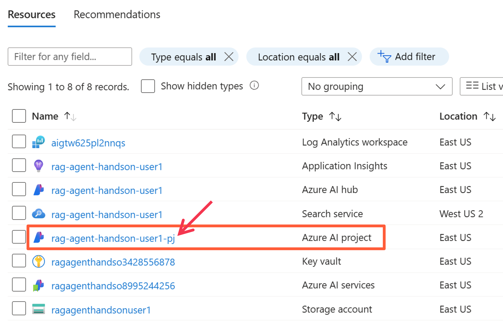
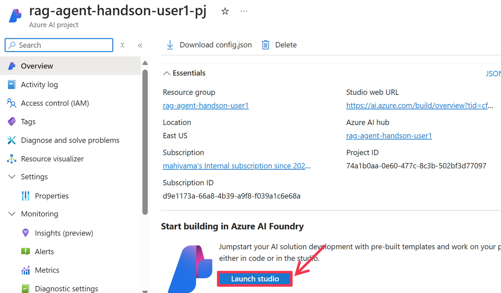
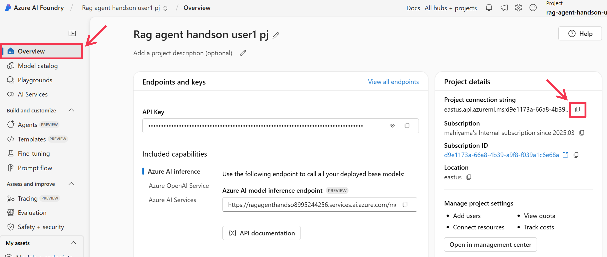
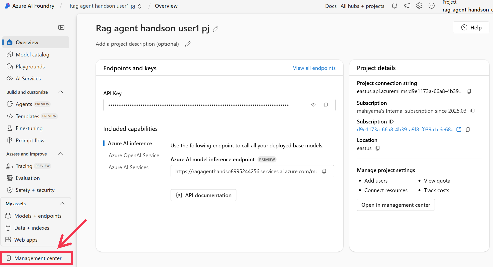
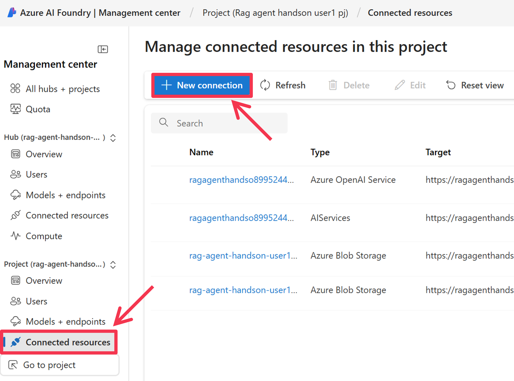
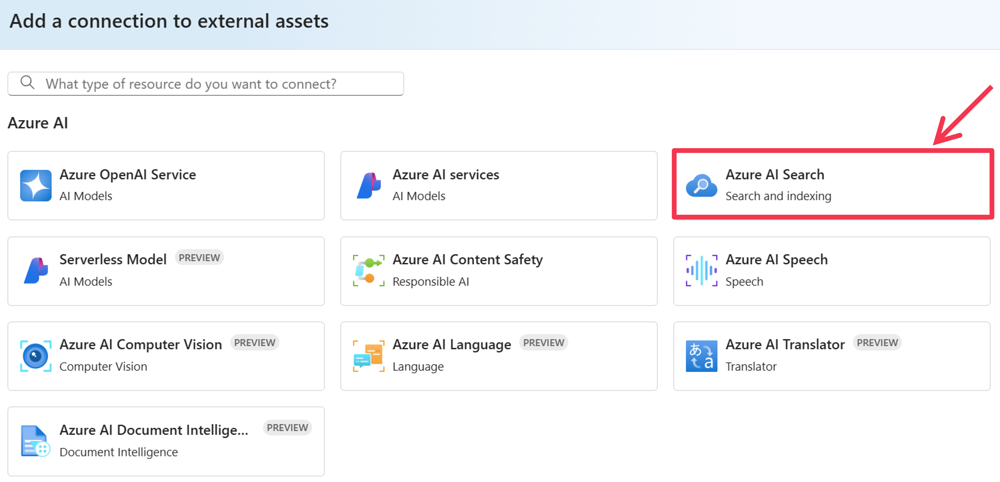
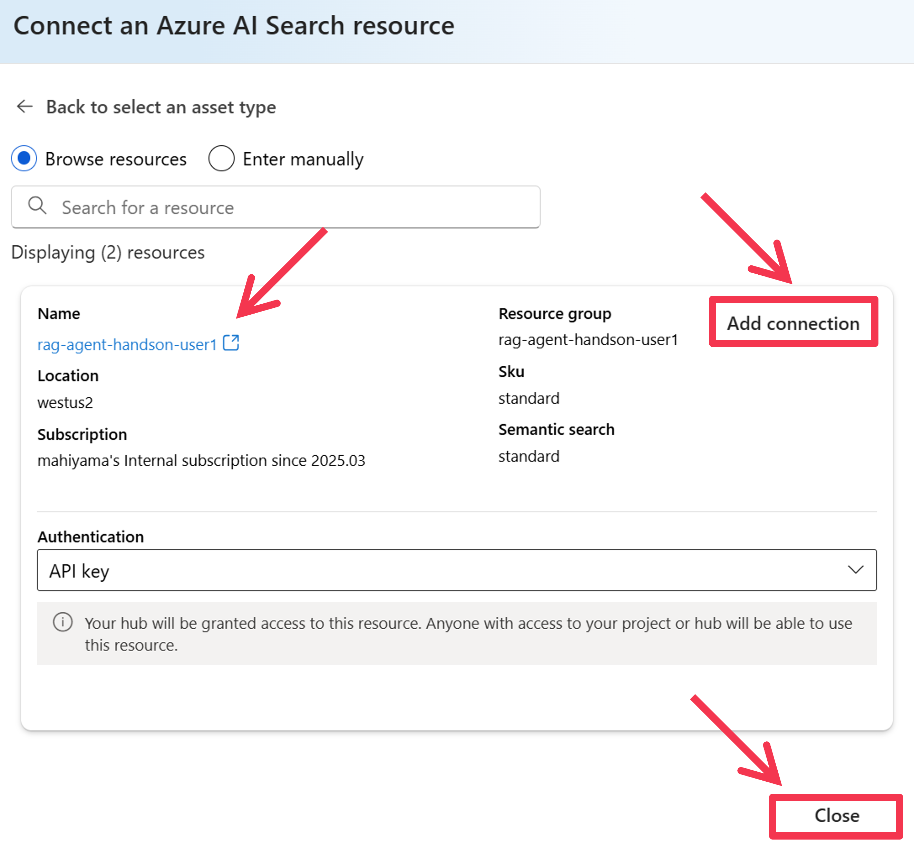
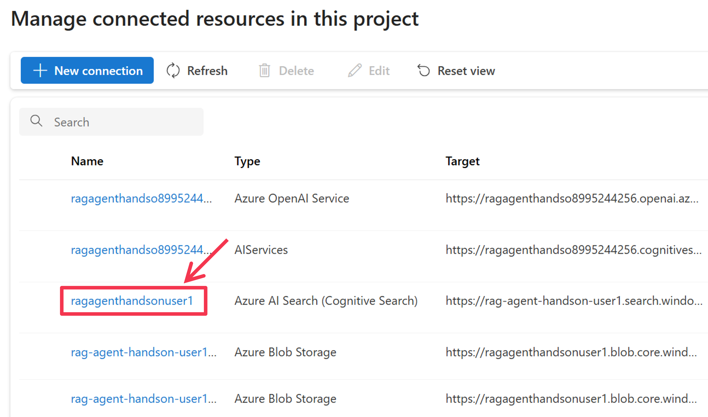
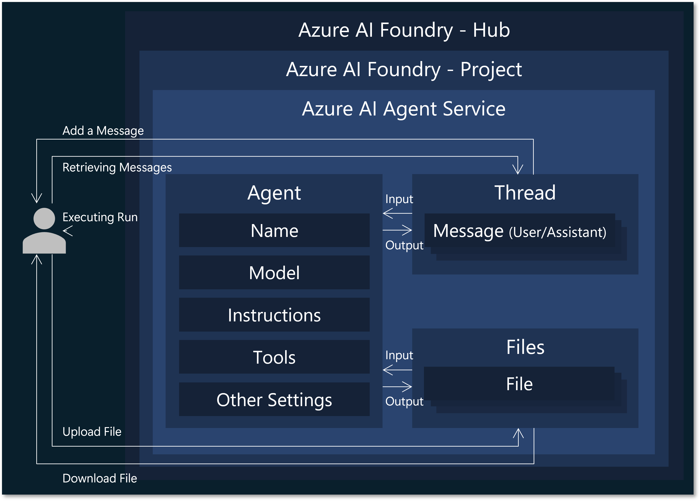

# 4. Development of AI Agents with Azure AI Agent Service

We will develop an AI agent using the Azure AI Agent Service. First, we perform some preparations; then, based on the provided Python program, we implement the process to call the AI Agent Service. Finally, we implement a chat application and deploy it to Azure Web Apps.

## 4.1 Preparation

### 4.1.1 Obtaining the AI Project Connection String

Display the resource group page and click on the name of the AI Project (the resource whose `type` is `Azure AI project`) that you created earlier, which appears in the list of Azure resources.



When the AI Project page appears, click the `[Launch Studio]` button to navigate to the Azure AI Foundry Portal.



In the AI Foundry Portal, the AI Project page is displayed. Click `[Overview]` in the side menu and then click the clipboard icon (the `[square icon]`) located to the right of `[Project Details] > [Project Connection String]` to copy the AI Project connection string to your clipboard.



Execute the following command to copy the file [src/.env_template](../../src/.env_template) and create `src/.env`:

```bash
cp src/.env_template src/.env
```

Then, in the `.env` file, paste the AI Project connection string you just copied into the value for `AZURE_AI_AGENT_PROJECT_CONNECTION_STRING`.

```bash
# Azure AI Project Settings
AZURE_AI_AGENT_PROJECT_CONNECTION_STRING="{REGION}.api.azureml.ms;{SUBSCRIPTION_ID};{RESOURCE_GROUP_NAME};{AI_PROJECT_NAME}"
AI_SEARCH_CONNECTION_NAME="{Input your AI Search Connection Name in AI Project}"
AZURE_AI_AGENT_MODEL_DEPLOYMENT_NAME="gpt-4o-mini" # gpt-4o or gpt-4o-mini
```

### 4.1.2 Adding a Connection Resource to the AI Project

Next, configure the connection to the Azure AI Search account you prepared earlier in the AI Project. Click `[Admin Center]` in the side menu.



The AI Hub and Project Admin Center are displayed. This is where you mainly manage users and connection resources. Click `[Connected resources]` in the side menu to view the list of connected resources, then click `[＋ Add new connection]`.



A window for adding a resource connection is displayed. Click `[Azure AI Search]`.



A list of Azure AI Search accounts available for connection is shown. Click the `[Add Connection]` button for the AI Search account you created this time, and once added, click the `[Close]` button.



Verify that the AI Search account you selected has been added. Copy this name (the resource connection name) (in the example below, it is "ragagenthandson250401") and paste it as the value for `AI_SEARCH_CONNECTION_NAME` in the `src/.env` file. Also, modify the value of `AZURE_AI_AGENT_MODEL_DEPLOYMENT_NAME` according to the GPT model you will be using this time.



```bash
# Azure AI Project Settings
AZURE_AI_AGENT_PROJECT_CONNECTION_STRING="{REGION}.api.azureml.ms;{SUBSCRIPTION_ID};{RESOURCE_GROUP_NAME};{AI_PROJECT_NAME}"
AI_SEARCH_CONNECTION_NAME="{Input your AI Search Connection Name in AI Project}"
AZURE_AI_AGENT_MODEL_DEPLOYMENT_NAME="gpt-4o" # gpt-4o or gpt-4o-mini
```

### 4.1.3 Setting Up the Azure CLI

We will now implement the AI agent using Azure AI Agent Service. For service authentication, your Microsoft Entra account will be used. A simple way to set up credentials on your development machine is to install the [Azure CLI](https://learn.microsoft.com/en-us/cli/azure/what-is-azure-cli). Install the Azure CLI, then log in to your Entra tenant and select your Azure subscription (credentials may be used by Azure CLI, Azure PowerShell, Visual Studio Code, and the Managed Identity configured on the service; please see this [documentation](https://learn.microsoft.com/ja-jp/dotnet/api/azure.identity.defaultazurecredential?view=azure-dotnet) for further details).

Refer to the following documentation for installation on your environment (for GitHub Codespaces, refer to [Installing on a Linux environment](https://learn.microsoft.com/ja-jp/cli/azure/install-azure-cli-linux?pivots=apt)):
- [Installing on Windows](https://learn.microsoft.com/ja-jp/cli/azure/install-azure-cli-windows?pivots=msi)
- [Installing on Mac OS](https://learn.microsoft.com/ja-jp/cli/azure/install-azure-cli-macos)
- [Installing on Linux](https://learn.microsoft.com/ja-jp/cli/azure/install-azure-cli-linux?pivots=apt)

After installation, complete the Azure CLI setup using the following commands:

```bash
# Confirm installation
az version

# Log in to the Azure subscription
az login --use-device-code
## A message similar to the following will be displayed. Open "https://microsoft.com/devicelogin" in your web browser, enter the code (for example, "IH4XXXXX") shown on the screen, and log in using your Entra account.
## > To sign in, use a web browser to open the page https://microsoft.com/devicelogin and enter the code IH4XXXXX to authenticate.

# Display the selected Azure subscription and login user information
az account show

# If the displayed Azure subscription is different from the one you are using, set it with the following command:
az account set -s "{YOUR_SUBSCRIPTION_ID}"
```

### 4.1.4 Creating a Python Virtual Environment

Execute the following commands to create a Python virtual environment and install the required packages:

```bash
# Move to the src folder
cd src

# Create and activate the Python virtual environment
python -m venv .venv
source .venv/bin/activate

# Install the required Python packages
python -m pip install -r requirements.txt
```

## 4.2 Implementing a Program that Uses the Azure AI Agent Service (Hello World)

First, implement the basic code for using the Azure AI Agent Service. Since the code has already been implemented in [1.hello_world.py](../../src/1.hello_world.py), run the program with the following command:

```bash
python 1.hello_world.py
```

When the code is executed, the following files will be generated under the ```.output/1.hello_world``` directory:
- `run.json`, which contains the content of each processing unit called a `run`
- `messages.json` and `message.json`, which respectively include all messages and the latest message from the assistant. Please refer to these if you are interested.

Below is an explanation of the code. In the following code, an access client for the Azure AI Project is created by specifying the connection string along with its credentials (only the `DefaultAzureCredential` using Entra authentication is supported). The connection string contains information that identifies the target AI Project (subscription ID, resource group name, resource name). The `AIProjectClient` class is provided by the [azure-ai-projects](https://pypi.org/project/azure-ai-projects/) package.

```py
# Create Azure AI Agent Service client
project = AIProjectClient.from_connection_string(
    conn_str=AZURE_AI_AGENT_PROJECT_CONNECTION_STRING,
    credential=DefaultAzureCredential(),
)
```

Next, an agent and a thread are created. When creating the agent, you specify the model to be used (more specifically, the deployment name), the name of the agent, and the instructions. The `instructions` parameter provides detailed directives for the agent's behavior. A thread is also created to manage messages; the agent processes the messages within the thread according to the provided instructions using either a model or tools.

```py
# Create an agent
agent = project.agents.create_agent(
    model=AZURE_AI_AGENT_MODEL_DEPLOYMENT_NAME,
    name="hello-world-agent",
    instructions="You are a helpful assistant.",
)

# Create a thread
thread = project.agents.create_thread()
```

The composition of the agent, thread, and file structure is as follows:


In the following process, a user message is added to the thread, and the thread is then processed by the agent. In this example, the `create_and_process_run` method is used, which starts execution and waits for the process to complete.

```py
# Add a message to the thread
user_message = "Hello my AI agent."
project.agents.create_message(thread_id=thread.id, role="user", content=user_message)

# Process the thread with the agent (wait until the agent finishes processing)
run = project.agents.create_and_process_run(agent_id=agent.id, thread_id=thread.id)
```

Since the agent's response to the user message is stored in the thread, the list of messages (`messages`) is retrieved, and then the latest message from the assistant (`message`) is obtained and printed to the console.

```py
# List messages
messages = project.agents.list_messages(thread_id=thread.id)

# Get and display the latest message from the assistant
message = messages.get_last_text_message_by_role(role="assistant")
print(message.text.value)
```

Using the code in [1.hello_world.py](../../src/1.hello_world.py), you have successfully implemented a program that creates an AI agent with the Azure AI Agent Service and exchanges greetings.

## 4.3 Implementing a Program that Uses the Azure AI Agent Service (RAG with AI Search)

Next, we will implement an AI agent that retrieves necessary information for an answer from an Azure AI Search index and provides answers based on that information, demonstrating RAG (Retrieval-Augmented Generation).
Since the code has already been implemented in [2.rag.py](../../src/2.rag.py), run the program with the following command:

```bash
python 2.rag.py
```

The key point to note in the code is the following section, where a tool is specified when creating the agent. This time, the Azure AI Search tool (`AzureAISearchTool`) is added. When defining the tool, the connection resource ID is obtained from the connection resource name in the AI Project and is specified accordingly. The AI Search tool is added to a ToolSet instance, which is provided when creating the agent. This instance can include multiple tools (for example, a combination of the AI Search tool and the Code Interpreter tool).

```py
# Define tools for the agent
ai_search_connection_id = project.connections.get(connection_name=AI_SEARCH_CONNECTION_NAME).id
ai_search = AzureAISearchTool(index_connection_id=ai_search_connection_id, index_name=AI_SEARCH_INDEX_NAME)
toolset = ToolSet()
toolset.add(ai_search)

# Create an agent
agent = project.agents.create_agent(
    model=AZURE_AI_AGENT_MODEL_DEPLOYMENT_NAME,
    name="rag-agent",
    instructions="""
    - Please respond to user inquiries.
    - For questions related to Azure AI Search, search the connected Azure AI Search index for relevant documents and provide answers based on those documents.
    """,
    toolset=toolset,
)
```

In this case, the execution process is output as a JSON file (located at `.output/3.code_interpreter/run_steps.json`) and also printed to the console. This allows you to check the steps and processes the agent went through to generate the latest assistant message.

```py
# List run steps
run_steps = project.agents.list_run_steps(thread_id=thread.id, run_id=run.id)
write_json(f"{OUTPUT_DIR}/run_steps.json", run_steps.as_dict())
for i, run_step in enumerate(reversed(run_steps.data)):
    run_step = run_step.as_dict()
    message = f"[Step {i}] {run_step['type']}"
    step_details = run_step["step_details"]
    if step_details["type"] == "tool_calls":
        used_queries = ", ".join([f'Query: {d["azure_ai_search"]["input"]}' for d in step_details["tool_calls"] if d["type"] == "azure_ai_search"])
        message += f" ({used_queries})"
    print(message)
```

## 4.4 Implementing a Program that Uses the Azure AI Agent Service (Code Interpreter)

Now, we will implement an AI agent that uses the [Code Interpreter](https://learn.microsoft.com/en-us/azure/ai-services/agents/how-to/tools/code-interpreter?tabs=python&pivots=overview), a tool that can generate Python code for answering questions and execute it in a sandbox environment.
Since the code has already been implemented in [3.code_interpreter.py](../../src/3.code_interpreter.py), run the program with the command below:

```bash
python 3.code_interpreter.py
```

As before, define the tool used by the agent. This time, we specify the tool that uses the Code Interpreter (`CodeInterpreterTool`).

```py
# Define tools for the agent
code_interpreter = CodeInterpreterTool()
toolset = ToolSet()
toolset.add(code_interpreter)
```

In the code below, a file ([sample.csv](../../src/materials/sample.csv)) is attached to the message and added to the thread. The file can also be specified at the time of tool definition as shown above.

```py
# Upload a file to the AI project
file = project.agents.upload_file_and_poll(file_path="materials/sample.csv", purpose=FilePurpose.AGENTS)
attachment = MessageAttachment(file_id=file.id, tools=CodeInterpreterTool().definitions)

# Add a message to the thread
user_message = """
The uploaded file is a CSV file that represents the vector sizes of a specific search document when compressed using various “vector compression methods,” “dimensions,” and “data type bit sizes” of Azure AI Search.
From this file, please create a horizontal bar graph to make it easier to understand the vector sizes for each method.
"""
project.agents.create_message(thread_id=thread.id, role="user", content=user_message, attachments=[attachment])
```

Since the user message requests, "please visualize the contents of the CSV file as a graph," the agent will likely generate an image file. Therefore, the following process retrieves the generated image file from the AI Agent Service and saves it locally. The saved image is output in the `.output/3.code_interpreter` folder.

```py
# Output generated images
for image_content in messages.image_contents:
    project.agents.save_file(
        file_id=image_content.image_file.file_id,
        target_dir=OUTPUT_DIR,
        file_name=f"{os.path.basename(image_content.image_file.file_id)}.png",
    )
```

## 4.5 Implementing a Program that Uses the Azure AI Agent Service (Streaming Responses)

When interacting with an AI agent in a web application, it is sometimes desirable for better user experience to display the agent's response on the screen as soon as it is generated. The code to achieve this is implemented in [4.streaming.py](../../src/4.streaming.py). Run the program with the following command:

```bash
python 4.streaming.py
```

This time, when starting to process messages in the thread with the agent, instead of the `create_and_process_run` method that we used previously, the `create_stream` method is called. This allows responses from the AI Agent Service to be received in a streaming format, enabling progressive display of intermediate step information and the answer as it is generated. For details on the events received in the streaming format, please refer to the JSON files (event_types.json, stream_events.json) output in the `.output/4.streaming` folder.

```py
# Process the thread with the agent (receive messages as they are generated)
stream = project.agents.create_stream(thread_id=thread.id, agent_id=agent.id)

# Display the messages as they are generated
event_types = []
stream_events = []
for event_type, data, func_rt in stream.event_handler:
    # Show streaming responses
    if event_type == "thread.message.delta":
        for c in data.delta.content:
            print(c.text.value, end="")
    # Show annotations in the final message
    elif event_type == "thread.message.completed":
        for c in data.content:
            print(c.text.annotations)
    event_types.append(event_type)
    stream_events.append({"event_type": event_type, "data": data.as_dict() if type(data) is not str else None})
```

## 4.6 Deploying the Web Application to Azure Web Apps

Let’s deploy the chat web application that uses the Azure AI Agent Service to interact with an AI agent onto Azure Web Apps, a fully managed service for hosting web applications.

### 4.6.1 Running the Web Application Locally

The web application has already been implemented in [app.py](../../src/app.py). First, run the web application locally with the following command:

```bash
python app.py
```

Once the web application starts successfully, access [http://127.0.0.1:5000](http://127.0.0.1:5000) to try out the chat web application that allows you to interact with the AI Agent. You can send a message to the AI Agent by typing in the chat window at the bottom right of the screen and pressing the Enter key. The AI Agent's response will then be displayed on the screen.


### 4.6.2 Deploying to Azure Web Apps

Using the Azure CLI, deploy the web application to Azure Web Apps. This deployment includes the following steps:
- Creating an Azure App Service Plan resource and an Azure Web Apps resource
- Deploying the web application to the newly created Azure Web Apps
- Setting environment variables for the Azure Web Apps
- Enabling the system-assigned Managed Identity for the Azure Web Apps
- Granting the created Azure Web Apps access permissions to the AI Project

First, from the [src](../../src) directory, execute the following command to create an Azure App Service Plan resource and an Azure Web Apps resource, and deploy the web application. Replace variables such as `$RESOURCE_GROUP` with the appropriate values as indicated below:

| Variable Name   | Value to Enter                                                             |
|-----------------|----------------------------------------------------------------------------|
| $RESOURCE_GROUP | The name of the resource group for deployment                              |
| $APP_PLAN_NAME  | The name of the App Service Plan to create (must be unique within the subscription) |
| $WEB_APP_NAME   | The name of the Web App to create (must be globally unique)                |

```bash
az webapp up --resource-group $RESOURCE_GROUP --location "japaneast" --plan $APP_PLAN_NAME --sku "B1" --name $WEB_APP_NAME --runtime "PYTHON:3.11"
```

You will see messages like the following until deployment completes:

```bash
The webapp 'sample-webapp-20250403' doesn't exist
Creating AppServicePlan 'sample-webapp-20250403' or Updating if already exists
Readonly attribute name will be ignored in class <class 'azure.mgmt.web.v2023_01_01.models._models_py3.AppServicePlan'>
Resource provider 'Microsoft.Web' used by this operation is not registered. We are registering for you.
Registration succeeded.
Creating webapp 'sample-webapp-20250403' ...
Configuring default logging for the app, if not already enabled
Creating zip with contents of dir C:\Codes\GitHub\az-ai-agent-handson-training\src ...
Getting scm site credentials for zip deployment
Starting zip deployment. This operation can take a while to complete ...
Deployment endpoint responded with status code 202
You can launch the app at http://sample-webapp-20250403.azurewebsites.net
Setting 'az webapp up' default arguments for current directory. Manage defaults with 'az configure --scope local'
--resource-group/-g default: sample-webapp-20250403
--sku default: B1
--plan/-p default: sample-webapp-20250403
--location/-l default: japaneast
--name/-n default: sample-webapp-20250403
{
  "URL": "http://sample-webapp-20250403.azurewebsites.net",
  "appserviceplan": "sample-webapp-20250403",
  "location": "japaneast",
  "name": "sample-webapp-20250403",
  "os": "Linux",
  "resourcegroup": "sample-webapp-20250403",
  "runtime_version": "PYTHON|3.11",
  "runtime_version_detected": "-",
  "sku": "BASIC",
  "src_path": ""
}
Please access to:  https://sample-webapp-20250403.azurewebsites.net/
```

Next, execute the following command to set the environment variables for the Azure Web Apps resource. Replace variables such as `$RESOURCE_GROUP` with the appropriate values as indicated below:

| Variable Name                     | Value to Enter                                                       |
|-----------------------------------|----------------------------------------------------------------------|
| $RESOURCE_GROUP                   | The resource group that the created Web App belongs to               |
| $WEB_APP_NAME                     | The name of the created Web App                                      |
| $AZURE_AI_AGENT_PROJECT_CONNECTION_STRING | The value of AZURE_AI_AGENT_PROJECT_CONNECTION_STRING in .env          |
| $AI_SEARCH_CONNECTION_NAME        | The value of AI_SEARCH_CONNECTION_NAME in .env                        |
| $AZURE_AI_AGENT_MODEL_DEPLOYMENT_NAME | The value of AZURE_AI_AGENT_MODEL_DEPLOYMENT_NAME in .env             |
| $AI_SEARCH_INDEX_NAME             | The value of AI_SEARCH_INDEX_NAME in .env                             |

```bash
az webapp config appsettings set --resource-group $RESOURCE_GROUP --name $WEB_APP_NAME --settings SCM_DO_BUILD_DURING_DEPLOYMENT=true AZURE_AI_AGENT_PROJECT_CONNECTION_STRING=$AZURE_AI_AGENT_PROJECT_CONNECTION_STRING AI_SEARCH_CONNECTION_NAME=$AI_SEARCH_CONNECTION_NAME AZURE_AI_AGENT_MODEL_DEPLOYMENT_NAME=$AZURE_AI_AGENT_MODEL_DEPLOYMENT_NAME  AI_SEARCH_INDEX_NAME=$AI_SEARCH_INDEX_NAME
```

Also, execute the following command to enable the system-assigned Managed Identity for the Azure Web Apps:

| Variable Name   | Value to Enter                                                |
|-----------------|---------------------------------------------------------------|
| $RESOURCE_GROUP | The resource group that the created Web App belongs to        |
| $WEB_APP_NAME   | The name of the created Web App                               |

```bash
az webapp identity assign -g $RESOURCE_GROUP -n $WEB_APP_NAME
```

This command outputs a JSON similar to the following. The `principalId` shown here is the ID of the service principal assigned as the system-assigned Managed Identity for the Azure Web Apps. Note this down as it will be used later.

```json
{
  "principalId": "46b4d867-9d8b-4bd5-bd40-c3854db01a04",
  "tenantId": "cf2a3596-1d54-4fec-a7af-d8964955f052",
  "type": "SystemAssigned",
  "userAssignedIdentities": null
}
```

Since you need to specify the subscription ID in the next command, run the following command to confirm it:

```bash
az account show --query "id" --output tsv
```

Finally, execute the following command to grant the created Azure Web Apps access permissions to the AI Project. Replace variables such as `$RESOURCE_GROUP` with the appropriate values as indicated below:

| Variable Name      | Value to Enter                                                              |
|--------------------|-----------------------------------------------------------------------------|
| $SUBSCRIPTION_ID   | The subscription ID (UUID) you obtained earlier                           |
| $RESOURCE_GROUP    | The resource group that the created Web App belongs to                      |
| $AI_PROJECT_NAME   | The name of the AI Project created in this workshop                         |
| $WEB_APP_PRINCIPAL_ID | The service principal ID (principalId) of the Web App's Managed Identity   |

```bash
az role assignment create \
    --role "Azure AI Developer" \
    --scope subscriptions/$SUBSCRIPTION_ID/resourceGroups/$RESOURCE_GROUP/providers/Microsoft.MachineLearningServices/workspaces/$AI_PROJECT_NAME \
    --assignee-object-id $WEB_APP_PRINCIPAL_ID \
    --assignee-principal-type ServicePrincipal
```

Then, as a final step, execute the following command to restart the Web App. After restarting, access the Web App URL to try out the deployed web application:

```bash
# Restart the Azure Web Apps instance
az webapp restart --resource-group $RESOURCE_GROUP --name $WEB_APP_NAME

# Access the following URL
https://$WEB_APP_NAME.azurewebsites.net/
```