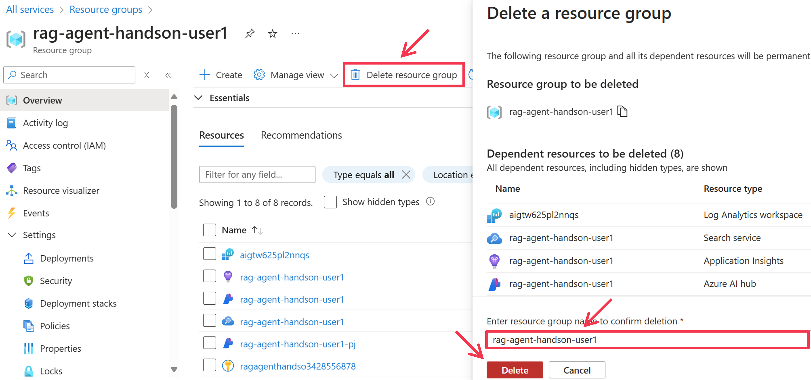
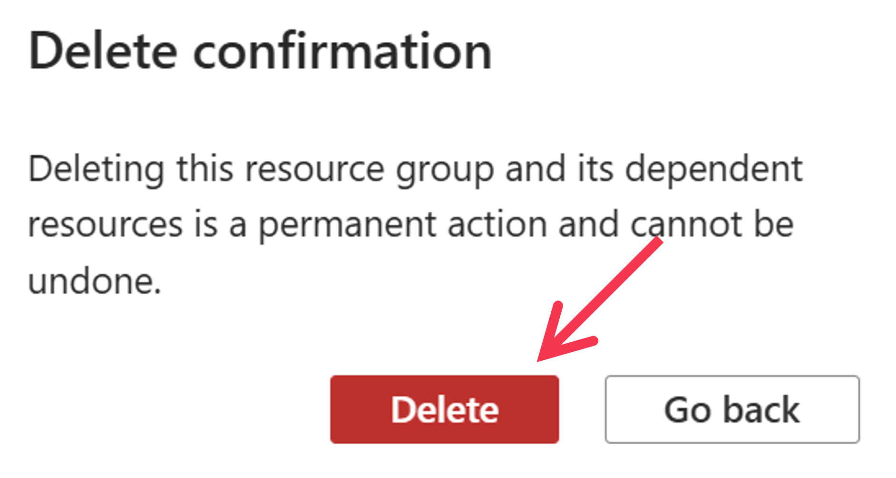

# Cleanup

## Deleting Codespace
Access [https://github.com/codespaces](https://github.com/codespaces) and delete the Codespace you created.

## Deleting Azure Resources
If you want to delete the Azure resources used this time, deleting the resource group will remove all Azure resources contained within it. To delete a resource group, first display the resource group's page in the Azure Portal, then click the ```[Delete Resource Group]``` option in the top menu. In the deletion window displayed on the right, enter the resource group's name into the text box at the bottom and click the ```[Delete]``` button.


For confirmation, click the ```[Delete]``` button to finalize the deletion of the resource group and all resources contained within it.
