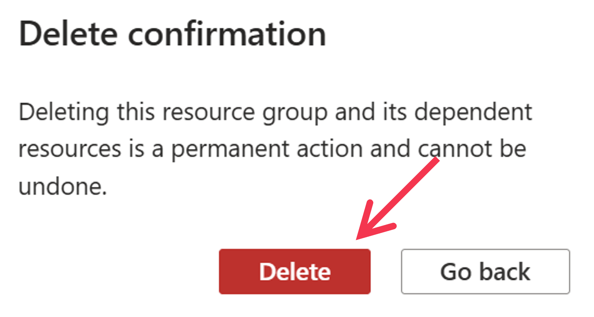

# 6. Clean Up

## 6.1 Deleting Codespace
If you used GitHub Codespaces, go to [https://github.com/codespaces](https://github.com/codespaces) and delete the created Codespace.

## 6.2 Deleting Azure Resources
If you want to delete the Azure resources created this time, deleting the resource group will remove all Azure resources under it. To delete a resource group, first open the resource group page in the Azure Portal, then click the ```[Delete Resource Group]``` button in the top menu. In the deletion window that appears on the right, enter ```[Resource Group Name]``` in the textbox at the bottom, and click the ```[Delete]``` button.


For confirmation, click the ```[Delete]``` button again to finalize the deletion of the resource group and all its resources.

