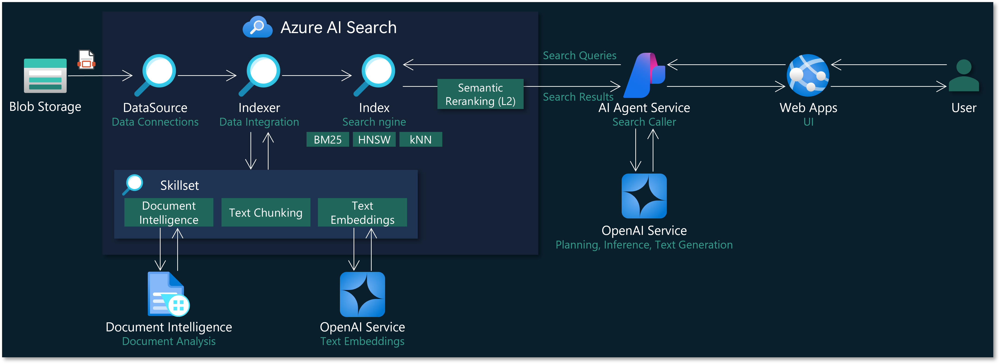

# Azure AI Agent Development Hands-on Training

## Architecture Diagram Achieved in This Hands-on Training

## What You Will Learn in This Hands-on Training

- Deployment of the following Azure resources on the Azure Portal
  - Azure Storage
  - Azure AI Search
  - Azure AI Foundry (AI Hub / AI Project)
- Index creation in Azure AI Search
  - Index creation in Pull mode using data sources, skill sets, and indexers
  - Implementation of PDF file processing for RAG using document analysis skills, chunk splitting skills, and text embedding skills
  - Specific methods for defining indexes and skill sets
  - How to use debug sessions
- Development of AI agents using Azure AI Agent Service
  - Using AI Agent Service from a Python program (AI Search tool, Code Interpreter tool)
  - Development of a web application that interacts with the AI agent
  - Deployment of the web application to Azure Web App

## Hands-on Training Documents

| Document | Training Part | Content |
|--|--|--|
| [1.deploy-resources.md](1.deploy-resources.md) | 1. Deployment of Azure Resources | Create the Azure resources used in this training, such as Storage account, AI Search account, and AI Foundry hub/project, on the Azure Portal. |
| [2.setting-resources.md](2.setting-resources.md) | 2. Configuration of Azure Resources | Configure the created Azure resources. This includes uploading files to Storage and granting access permissions (RBAC). |
| [3.prepare-index.md](3.prepare-index.md) | 3. Creation of Azure AI Search Index | Create an index, data source, skill set, and indexer in the created AI Search, and perform index creation in Pull mode. This index will be used as the response information for the AI agent. |
| [4.develop-agent.md](4.develop-agent.md) | 4. Development of AI Agent with Azure AI Agent Service | Develop an AI agent using the AI Agent Service. Implement a Python program for basic processing and streaming output. Then, implement a web application and deploy it to Azure Web Apps. |
| [5.extra-trainings.md](5.extra-trainings.md) | 5. Additional Training | Content to be done if time permits. Develop a multi-agent system using the Semantic Kernel Agent Framework. |
| [6.clean-up.md](6.clean-up.md) | 6. Cleanup | Delete the Azure resources created this time. If you are using GitHub Codespaces, delete the Codespace used this time as well. |

## Using This Repository with GitHub Codespaces
[Launch GitHub Codespaces](https://github.com/codespaces/new?hide_repo_select=true&ref=main&repo=959139172&skip_quickstart=true&ref=main)