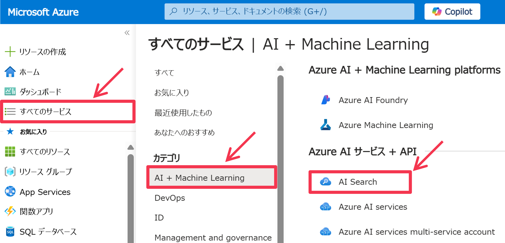

# 1. Azure リソースのデプロイ
本トレーニングでは、最終的に以下の Azure リソースをデプロイして利用することになります。

|Azure サービス|用途|
|--|--|
|Azure Storage|Azure AI Search のインデックスに格納する元となる PDF ファイルを格納するためと、Azure AI Foundry で使用するためのストレージ|
|Azure AI Search|実装する AI エージェントの RAG 処理における Retriever|
|Azure AI Foundry - Hub|AI Project のハブ(グループ)|
|Azure AI Foundry - Project|Azure AI Agent Service を用いた AI エージェント開発|
|Azure Application Insights|Azure AI Agent Service 利用のトレーシング|
|Azure Key Vault|AI Hub と Project で登録したサービス接続の認証情報格納|
|Azure App Service|AI エージェントとやり取りをするための Web アプリケーションのホスト|

Azure Storage, Azure AI Search, Azure AI Foundry (Hub/Project) をデプロイすることで、必要なリソースの大部分が揃います。Azure App Service は後ほど Azure CLI 経由で作成します。  
  
今回は、Azure Portal での操作に慣れていただくため、GUI 操作を基本として各 Azure リソースを作成していただきますが、Azure には IaC (Infrastructure as Code) を実現するためのサービスとして [Azure Resource Manager](https://learn.microsoft.com/en-us/azure/azure-resource-manager/management/overview) や [Azure Bicep](https://learn.microsoft.com/en-us/azure/azure-resource-manager/bicep/overview?tabs=bicep) が提供されています。また、もちろん [Terraform](https://learn.microsoft.com/en-us/azure/developer/terraform/overview) で Azure リソースをデプロイすることも一般的です。

## 1.1 Azure Storage アカウントのデプロイ
まず、Azure AI Search で処理するためのデータを格納するための Azure Storage アカウントを作成します。Azure Storage には、オブジェクトストレージサービスである ```Blob```、メッセージキューイングサービスである ```Queue```、シンプルなキーバリューストア型テーブルサービスである ```Table```、SMB/NFS プロトコル互換を持つファイルストレージサービスである ```File``` の4つのサービスが含まれています。今回は、```Blob``` のサービスを利用します(Blob は Azure Blob Storage と呼ばれたりします)。Blob ストレージは非常に多くの Azure サービスと連携することができ、Azure の中心的なサービスです。  
  
まず [Azure Portal](https://portal.azure.com/) へアクセスし、サイドメニューの```[全てのサービス]```をクリックします。そして、表示されたウィンドウのサイドメニューのカテゴリ内にある ```[ストレージ]``` をクリックし、表示された Azure サービスの中にある ```[ストレージアカウント]``` をクリックします。


現在選択中の Entra テナントで、ログインしているユーザが閲覧することができる Azure Storage アカウント一覧を確認するためのページが表示されます。新たにストレージアカウントを作成するため、このページの上部メニューになる ```[＋作成]``` をクリックします。


ストレージアカウントを作成するための画面が表示されます。まず ```[リソースグループ]``` に今回使用するグループが選択されていることを確認します。そして、```[ストレージアカウント名]``` を入力します。名前にはハイフン等の記号を使用できないこと、また全世界で一意である必要があることに気を付けてください。[リージョン]はデータを利用する Azure AI Search アカウントと近いリージョン("East US", "West US 2", "North Central US", "West Euro" のいずれか)であるのが好ましいですが、どこのリージョンでも問題ありません。各種設定を終えたら、```[レビューと作成]``` ボタンをクリックします。


ストレージアカウント作成のレビュー画面が表示されます。内容を確認し、```[作成]``` ボタンをクリックして、作成を開始します。


## 1.2 Azure AI Search アカウントのデプロイ
次に、実装する AI エージェントで RAG によるテキスト生成を行う際に Retriever として使用するための検索インデックスとして、Azure AI Search のアカウントを作成します。


サイドメニューの```[全てのサービス]```をクリックします。そして、表示されたウィンドウのサイドメニューのカテゴリ内にある ```[AI + Machine Learning]``` をクリックし、表示された Azure サービスの中にある ```[AI Search]``` をクリックします。


現在選択中の Entra テナントで、ログインしているユーザが閲覧することができる Azure AI Search アカウント一覧を確認するためのページが表示されます。サイドメニュー経由で、他の Azure AI サービスの一覧も同様に閲覧することができます。新たに AI Search アカウントを作成するため、このページの上部メニューになる ```[＋作成]``` をクリックします。


AI Search アカウントを作成するための画面が表示されます。まず ```[リソースグループ]``` に今回使用するグループが選択されていることを確認します。そして、```[サービス名]``` を入力します。名前にはハイフン等の記号が使用できますが、全世界で一意である必要があることに気を付けてください。```[リージョン]```には ```"East US"```, ```"West US 2"```, ```"North Central US"```, ```"West Euro"``` のいずれかを選択してください。これは 2025/4/14 時点で、今回使用する Azure AI Search の[ドキュメントレイアウトスキル](https://learn.microsoft.com/en-us/azure/search/cognitive-search-skill-document-intelligence-layout)がプレビュー状態であり、一部のリージョンでしか利用できないためです。各種設定を終えたら、価格レベルの ```[価格レベルの変更]``` リンクをクリックして、どういった価格レベルがあるかを確認します。


選択可能な価格レベルを確認します。まず価格レベル(SKU)のカテゴリとして「Free」「Basic」「Standard」「Storage Optimized」があります。各 SKU で「ストレージサイズ(ドキュメント/ベクトル)」「作成可能なインデックス数」「作成可能なインデクサー数」「最大スケールユニット/レプリカ数/パーティション数」「価格」が異なります。スケールユニットは、[レプリカ数]×[パーティション数]の値です。画面上で表示されている価格(コスト)は1スケールユニットあたりの月額であるため、[スケールユニット数]×[コスト]がこのアカウントがかかる月額になります。以下が計算の例です。


パーティション数を増やすと、ストレージサイズと QPS (処理可能な秒間クエリ数)が増えます。レプリカ数を増やすと QPS が増え、また2以上で読み込み可用率 99.9% の SLA が適用、3以上で書き込み可用率 99.9% が適用されます(1つだと読み込みすら SLA が適用されないことに注意してください)。

「Free」はお試し用、「Basic」は開発環境用、「Standard」はほとんどの用途での開発または本番環境用に用いることができます。「Storage Optimized」は格納ドキュメント量が極めて多い場合(10億個以上とかそれくらいのレベル)に利用できます。大きな注意点として、アカウント作成後に、SKU内でのスケールアウトはできるけど、SKUの変更(スケールアップ)はできないことが挙げられます。つまり、S1プランでレプリカ数やパーティション数を増やすことにより、ストレージサイズや QPS を増やすことができますが、S2 プランや L1 プランに変更することによる対応はできません。また、スキルセットでプライベートエンドポイントで外部サービスを呼び出す場合は、S2 または S3 プランにする必要があることにも注意です。  
  
今回は ```S1``` プランを使用します。選択できる価格レベルの確認を終えたら ```[Select]``` ボタンをクリックします。


元の画面に戻ったら ```[次: スケーリング]``` ボタンをクリックします。AI Search アカウントのレプリカ数とパーティション数の設定画面が表示されます。上記の通り、レプリカ数が既定の "1" のままだと、読み取り操作での 99.9% の可用性の SLA が適用されません。そのため、本番環境で使用する場合は、必ずレプリカ数を2つ以上にすることをお勧めします。```[確認して作成]```ボタンをクリックします。


作成する AI Search アカウントの確認を行います。確認を終えたら、```[作成]``` ボタンをクリックして、作成を開始してください。


## 1.3 Azure AI Foundry ハブのデプロイ
今回は Azure OpenAI Service の基盤モデルと Azure AI Agent Service を使って AI エージェント開発を行うため、Azure AI Foundry の Hub と Project を作成します。AI Agent Service から OpenAI Service や AI Search 等のサービスを利用する際には、AI Hub や AI Project に登録されている接続情報を使用するのですが(その認証情報が Azure Key Vault に格納される)、接続情報を AI Hub に登録しておいて、配下の複数の AI Project で利用させる、といった使い方ができます。そのため、AI Hub は AI Project のグループとも言えます。AI Project は AI Agent Service やトレース情報、LLM 評価管理の単位であるため、現実世界のプロジェクト単位で作成するのが想定されています。  
  
サイドメニューの```[全てのサービス]```をクリックします。そして、表示されたウィンドウのサイドメニューのカテゴリ内にある ```[AI + Machine Learning]``` をクリックし、表示された Azure サービスの中にある ```[Azure AI Foundry]``` をクリックします。


現在選択中の Entra テナントで、ログインしているユーザが閲覧することができる Azure AI Hub または Project の一覧を確認するためのページが表示されます。新たに AI Hub を作成するため、このページの上部メニューになる ```[＋Create]``` をクリックし、続けて ```[Hub]``` をクリックします。


AI Hub を作成するための画面が表示されます。まず ```[リソースグループ]``` に今回使用するグループが選択されていることを確認します。```[リージョン]```には、多くの AI モデルが利用しやすい ```East US``` を選択します。そして ```[名前]``` を入力します。また、既定のプロジェクトリソースグループの箇所の ```[Same as hub resource group]``` にチェックを入れておきます。これは、AI Hub に必要な Azure リソースをどこのリソースグループにデプロイするか？に関する設定で、今回は AI Hub リソースと同じリソースグループを利用することを設定しました。各種設定を終えたら、```[次へ: ストレージ]``` ボタンをクリックします。


```[ストレージアカウント]``` に、先ほど作成したストレージアカウントを選択します。そして ```Application Insights``` の箇所の```[新規作成]``` リンクをクリックします。


任意の作成する Azure Application Insights の ```[名前]``` を入力して、```[保存]``` ボタンをクリックします。これは AI Agent の動作をモニタリング(ロギング)するための使用します。


元の画面に戻ったら ```[確認および作成]``` ボタンをクリックします。


作成する AI Hub の確認を行います。確認を終えたら ```[作成]``` ボタンをクリックします。


AI Hub の作成(デプロイ)が完了するまで待ち、完了画面が表示されたら ```[リソースに移動]``` ボタンをクリックします。


## 1.4 Azure AI Foundry プロジェクトのデプロイ

### 1.4.1 Azure AI Project のデプロイ
作成した AI Hub のページが表示されます。ページの上部メニューの ```[＋ Create project]``` ボタンをクリックします。


AI Hub に AI Project を追加するための画面が表示されます。まず ```[名前]``` を入力します。そして ```Hub``` が先ほど作成した AI Hub になっているはずです。```[確認および作成]```ボタンをクリックします。


作成する AI Project の確認を行います。確認を終えたら ```[作成]``` ボタンをクリックします。


AI Project の作成(デプロイ)が完了するまで待ち、完了画面が表示されたら ```[リソースに移動]``` ボタンをクリックします。


作成した AI Project のページが表示されます。Azure AI Foundry Portal へ移動するため、[Launch Studio] ボタンをクリックします。


### 1.4.2 Azure OpenAI Service モデルのデプロイ
Azure AI Foundry Portal が表示されます。先ほど作成した AI Project のプロジェクト画面が表示されています。このトレーニングで使用する OpenAI Service のモデルをデプロイするため、サイドメニューの ```[モデル＋エンドポイント]``` をクリックします。


この AI Project で展開されているモデル一覧が表示されます。画面上部の ```[＋モデルのデプロイ]``` ボタンをクリックし、続けて ```[基本モデルをデプロイする]``` をクリックします。


デプロイするモデルを選択するウィンドウが表示されます。ここでは、Azure OpenAI Service で利用なモデルを含む、Azure AI Foundry のモデルカタログのモデルを選択することができます。非常に多くのモデルが表示されるため、検索ウィンドウに ```gpt-4o``` と入力してフィルタリングを行います。すると、```gpt-4o``` または ```gpt-4o-mini``` が表示されるため、どちらかを選択して、```[確認]``` ボタンをクリックします。


モデルデプロイの設定画面が表示されます。[デプロイ名]は既定のままに(gpt-4o または gpt-4o-mini)、```[デプロイの種類]``` は ```グローバル標準``` であることを確認し、```[カスタマイズ]``` ボタンをクリックします。


ここでは、モデルバージョンやレート制限を設定することができます。レート制限の設定は非常に重要で、少なすぎる場合は、利用するとすぐにレート制限に引っかかってしまいます。一方で、設定可能な総和トークン数レート制限は、Azure サブスクリプション単位で最大量(クォータ)が決まっているため、1つのデプロイで最大量のレートを設定してしまうと、その Azure サブスクリプションを利用する他の開発者が、一切レートを設定できない状態になってしまいます。今回は ```[1分あたりのトークン数レート制限]``` を ```40K``` になるように指定します。そして、```[デプロイ]``` ボタンをクリックして、GPT モデルのデプロイを完了させます。


同様に、テキスト埋め込み用モデルである "text-embedding-3-large" もデプロイします。```text-embedding-3-large``` を選択し、```[確認]``` ボタンをクリックします。


同様に ```[1分あたりのトークン数レート制限]``` を ```40K``` になるように指定します。そして、```[デプロイ]``` ボタンをクリックして、GPT モデルのデプロイを完了させます。


### Appendix: 既存の Azure OpenAI Service アカウントの利用
```1.4.2``` では、AI Hub をデプロイした際に作成された OpenAI Service アカウントに対して2種類のモデルをデプロイしましたが、もし既に作成され利用されているアカウントを使用することもできます。既存のアカウントを利用するには、AI Hub または AI Project の接続リソースとして登録する必要があります。以下に登録方法の例を記します。  
  
まず、Azure AI Foundry Portal を開き、かつ AI Project のページが表示されているのであれば、サイドメニューの ```[管理センター]``` をクリックして、AI Project の管理センターへ移動します。


AI Project の管理センターが表示されたら、サイドメニューでのプロジェクトメニュー内の ```[Connected resources]``` をクリックします。すると、AI Project に接続されているリソース一覧が表示されます。AI Hub 作成時に作成された OpenAI Service アカウントが接続されている事が確認できます(以下の例での名前が"ragagenthandso8225194..."、種類が"Azure OpenAI Service" のリソース)。既存の OpenAI Service アカウントを接続するため、画面上部の ```[＋新しい接続]``` ボタンをクリックします。


外部リソースの接続を追加するウィンドウが表示されます。OpenAI Service アカウントを追加するため、```[Azure OpenAI Service]``` をクリックします。


次に、リソースの選択方法として、[リソースの参照]、または [手動で入力する] を選択することができます。[リソースの参照]は、ログインユーザがアクセスできる、同一 Azure サブスクリプション内の OpenAI Service アカウントを選択することができます。一方で、[手動で入力する] では、OpenAI Service アカウントのエンドポイントと認証情報(Entra認証またはAPIキー認証)を指定することで接続を追加することができます。この場合、外部の Azure サブスクリプションの OpenAI Service アカウントも追加することができます。今回は、```[手動で入力する]``` を選択します。   
次に、追加する OpenAI Service の ```[エンドポイント]``` と、```[キー]``` を入力し、```[接続名]``` を入力します(以下の例では```"external-aoai-resource"```)。エンドポイントと API キーは、Azure Portal での当該 OpenAI Service アカウントのページにて確認することができます。入力を終えたら、ウィンドウ右下の ```[接続を追加する]``` をクリックします。


先ほど追加した OpenAI Service リソースが追加されたことを確認します。2025年4月13日時点では、Azure AI Agent Service では複数の OpenAI Service アカウントが接続されている AI Project をサポートしていないため、AI Hub 作成時に作成された OpenAI Service アカウントの接続を削除しておきます。当該の OpenAI Service アカウントを選択し、画面上部のメニュー ```[Delete]``` をクリックします。


削除確認のダイアログが表示されるため、```[削除]``` をクリックします。


新たに追加した OpenAI Service アカウントにデプロイされているモデルを使用できることを確認するため、サイドメニューのプロジェクトメニュー内の ```[Models + endpoints]``` をクリックします。すると、このプロジェクトが使用できるモデルとサービス一覧が表示されます。そこで、今回追加した OpenAI Service アカウントにデプロイされているモデルの一覧が表示されていることを確認でき、これらは、この AI Project で使用することができます。
