# Azure リソースの設定
ここでは、以下の通りに、作成した Azure リソースの設定を行います。
- **Azure AI Search:** システム割り当てマネージドID を有効化、またセマンティック検索を有効化する
- **Azure Storage:** コンテナを作成し、今回 AI Search に登録する PDF ファイルをアップロードする。また、AI Search に対して "ストレージ BLOB データ閲覧者" ロールを付与する
- **Azure AI Services:** AI Saerch に対して "Azure AI Developer" ロールを付与する

Azure AI Search が Azure Blob Storage や Azure OpenAI Service を利用するためには、エンドポイントと認証情報を指定する必要があります。Azure サービスの認証の方法には、主に Microsoft Entra 認証(マネージドID認証)とキー認証(パスワード認証)の2種類が存在します。キー認証の方が気軽に利用することができますが、権限制御を一切行うことができないため(キーを知っていれば全権制御)、セキュリティの観点から Entra 認証(マネージドID認証)でサービス間認証を実現することをお勧めします。そのため、今回のトレーニングでも、基本的には Entra 認証を用いることとします。  
  
このトレーニングでは、AI Search が Blob Storage から PDF ファイルを取得するため、そのためのロールを AI Search に付与する必要があります。また、AI Search の[統合ベクトル化処理](https://learn.microsoft.com/en-us/azure/search/vector-search-integrated-vectorization)として、検索ドキュメントをインデックスに格納(インデクシング)する際のチャンクテキストの埋め込みを取得する処理と、検索クエリ実行時のクエリの埋め込み取得処理で Azure OpenAI Service の text-embedding-3-large モデルを使用するため、そのためのロールを AI Search に付与する必要があります。作成時点では、AI Search アカウントにマネージド ID が付与されていない状態のため、それを有効化させたうえで、2つのロールをそのマネージド ID に付与します。まとめると、以下のアーキテクチャ図での3箇所のやり取りのために、2個のロールを AI Search に付与することになります。

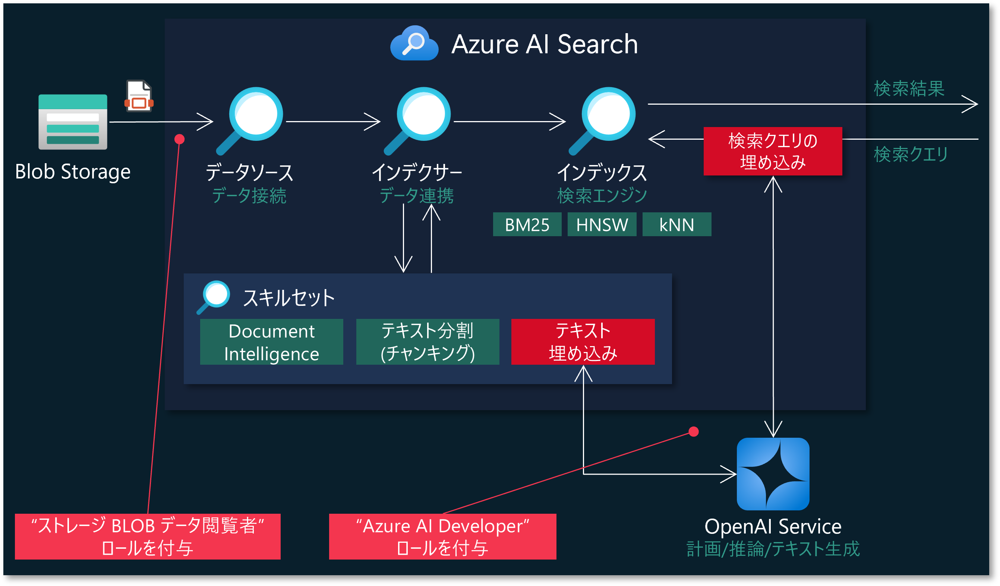

## Azure AI Search の設定

### システム割り当てマネージド ID を有効化
まず AI Search のシステム割り当てマネージド ID を有効化します。  
サイドメニューの```[リソースグループ]```をクリックします (表示されてなければ、[すべてのサービス]>[全般]>[リソースグループ]をクリック)。  
すると、リソースグループのページが表示されます。ここでは、リソースグループに属する Azure リソース一覧が表示されます。この Azure リソースは配置されているリージョンは関係ありません。プロジェクトなど、何かの単位で Azure リソースをまとめたい場合にリソースグループを活用します。単位は、アクセス権限の付与の単位や、不要になったときにまとめて削除する単位(リソースグループ削除すれば、中の Azure リソースは全て削除される)であったりします。  
Azure リソース一覧の中にある、先ほど作成した AI Search アカウント(```種類``` が ```Search Service``` のリソース)の名前をクリックします。
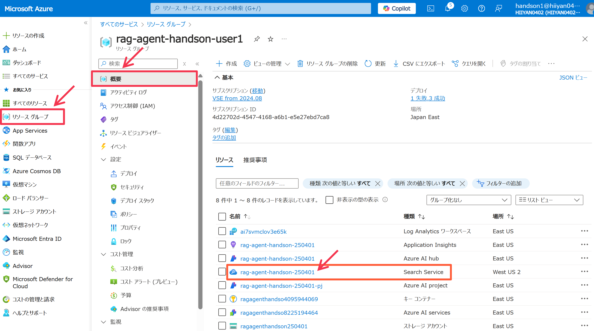

すると、AI Search アカウントのページが表示されます。サイドメニューの設定カテゴリ内の ```[ID]``` をクリックし、```[状態]``` を ```[オン]``` にして、```[保存]``` ボタンをクリックします。
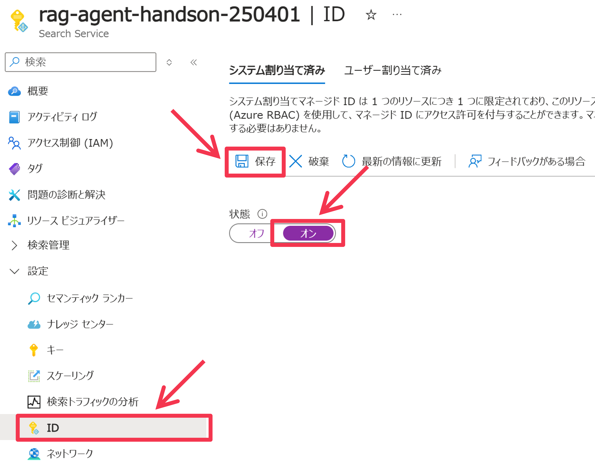

AI Search アカウントのシステム割り当てマネージド ID を有効化する確認ウィンドウが表示されるため、```[はい]``` をクリックして有効化します。
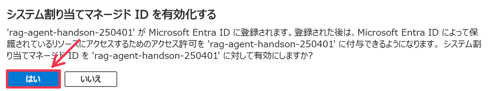

### セマンティックリランカの有効化
また、AI Search のセマンティックランカーの有効化を行います。これを行わなくても、毎月1,000件のリランキング処理(検索リクエスト)は無料で処理することができますが、それを超えるとエラーを出すようになってしまいます。念のため、```Standardプラン```の ```[プランの選択]``` ボタンをクリックして、Standard プランを有効化します (Standard プランでも毎月1,000件の処理を無料で行ってくれます)
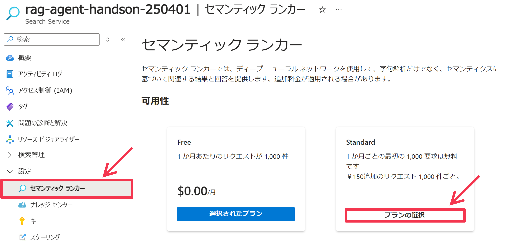

セマンティックリランカのプラン更新の確認ウィンドウが表示されるので、```[はい]``` をクリックして、更新を確定します。
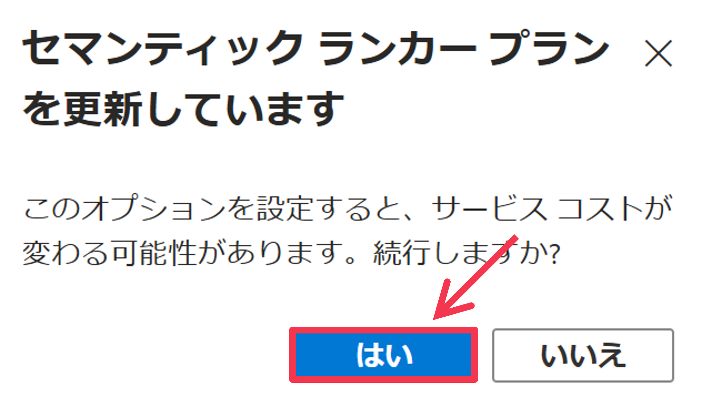

## Azure Storage の設定
次に、Blob ストレージにおけるコンテナ(ファイルシステムでのフォルダ/ディレクトリのようなもの)を作成し、今回 AI Search に登録する PDF ファイルをアップロードします。そして、AI Search に対して "ストレージ BLOB データ閲覧者" ロールを付与して、Blob データ読み取りのみのアクセスを許可します。  

### PDF ファイルのアップロード
先ほどと同様に、リソースグループのページを表示して、Azure リソース一覧の中にある、先ほど作成した Storage アカウント(```種類``` が ```ストレージアカウント``` のリソース)の名前をクリックします。
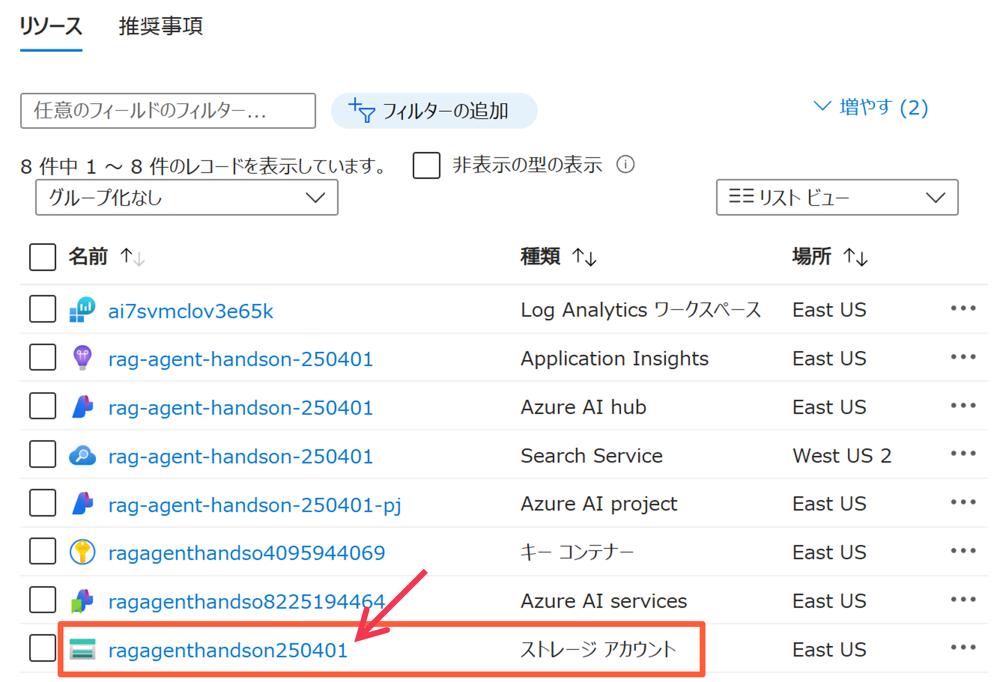

すると、ストレージアカウントのページが表示されます。サイドメニューのデータストレージカテゴリ内の ```[コンテナー]``` をクリックします。コンテナ一覧が表示されるため、その画面の上部メニューの ```[＋コンテナ]``` をクリックします。そして、```[名前]``` に ```search-docs``` と入力し、```[作成]``` ボタンをクリックします。
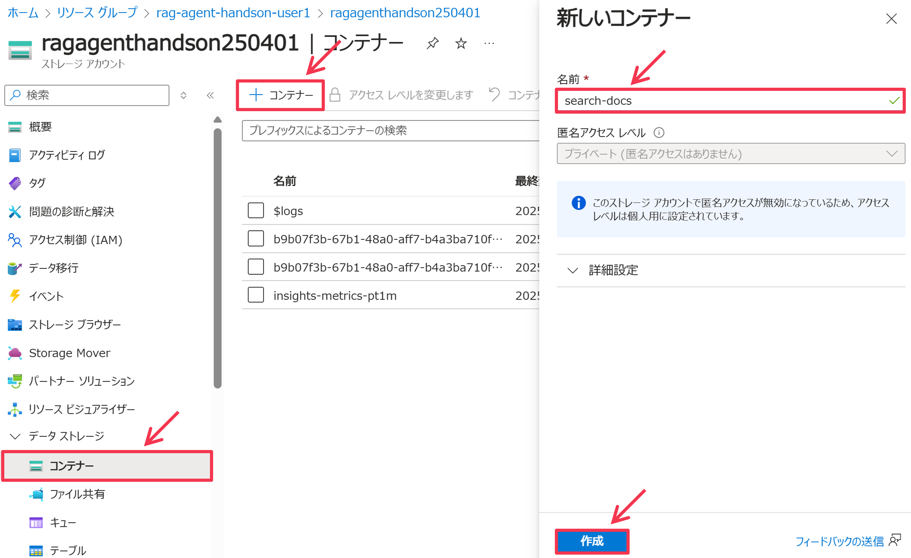

コンテナ "search-docs" が作成されました。この"search-docs" をクリックすると、コンテナに含まれる Blob 一覧が表示されます (Azure Blob Storage でのファイルのことを Blob と呼びます)。
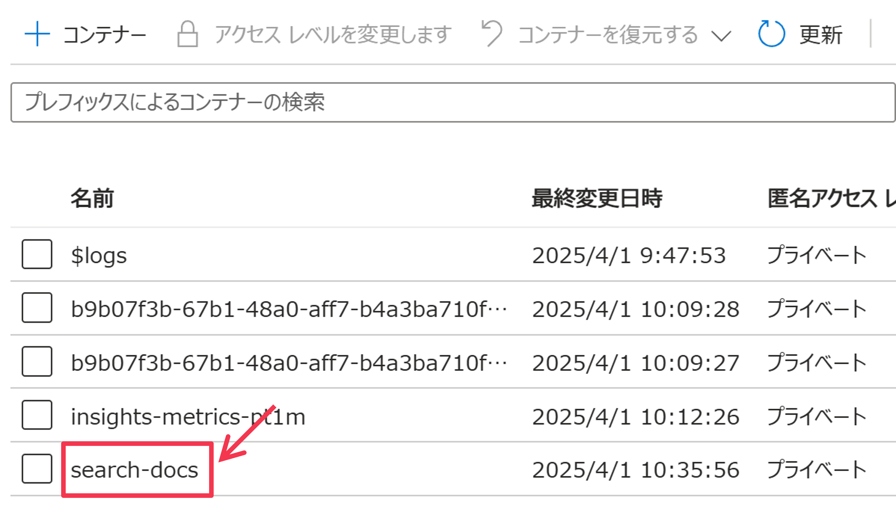

このコンテナに、Azure AI Search に処理をさせる PDF ファイルをアップロードします。以下の3つのPDF ファイルをダウンロードして、コンテナにアップロードします。
1. [index-add-custom-analyzers.pdf](https://raw.githubusercontent.com/mahiya/az-ai-agent-handson-training/refs/heads/main/ai-search/pdfs/index-add-custom-analyzers.pdf)
2. [index-add-scoring-profiles.pdf](https://raw.githubusercontent.com/mahiya/az-ai-agent-handson-training/refs/heads/main/ai-search/pdfs/index-add-scoring-profiles.pdf)
3. [index-ranking-similarity.pdf](https://raw.githubusercontent.com/mahiya/az-ai-agent-handson-training/refs/heads/main/ai-search/pdfs/index-ranking-similarity.pdf)
  
3つの PDF ファイルをダウンロードしたら、画面上部メニューの ```[アップロード]``` をクリックして、Blob のアップロードウィンドウを表示させます。先ほどダウンロードした3つの PDF ファイルを選択し、```[アップロード]``` ボタンをクリックします。
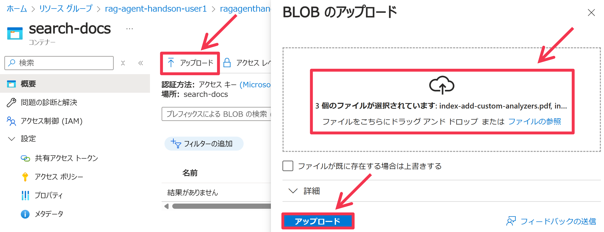

アップロードが完了すると、画面右上に完了通知メッセージが表示され、コンテナ内の Blob 一覧に表示されます。
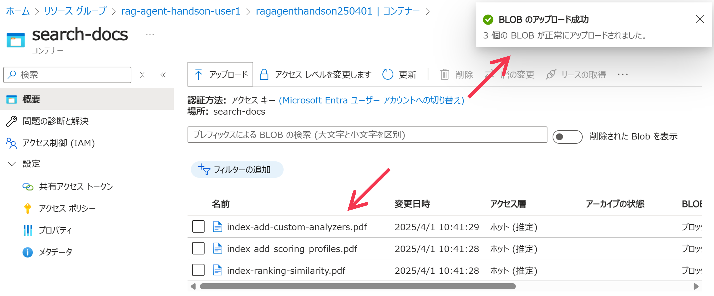

### AI Search へのロールの付与
また、ストレージアカウントのページのサイドメニューにある ```[アクセス制御(IAM)]``` をクリックします。すると、このストレージアカウントに対するロール(権限)付与状況を確認するための画面が表示されます。画面上部メニューの ```[＋追加]``` をクリックし、続いて ```[ロ－ルの割り当ての追加]``` をクリックします。
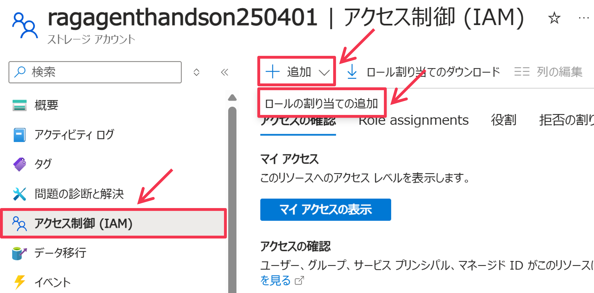

ストレージアカウントに対するロールの付与を行うためのウィンドウが表示されます。まず付与するロールを選択します。選択できるロールが多すぎるため、まず検索ボックスに ```blob``` と入力してフィルタリングします。```[ストレージ BLOB データ閲覧者]``` が一覧に表示されると思うので、これをクリックし、```[次へ]``` ボタンをクリックします。
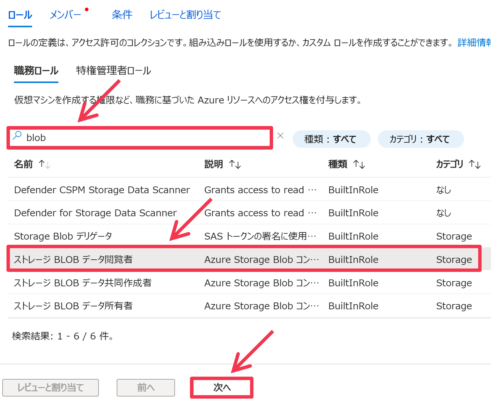

次に、ロールの付与対象を選択します。まず、```アクセスの割当先``` の ```[マネージドID]``` をチェックし、```[＋メンバーを選択する]``` をクリックします。すると、画面右にロールを付与する対象のマネージド ID を選択するウィンドウが表示されるので、```マネージド ID``` に ```[Search Service]``` を選択し、表示された ```先ほど作成した AI Search アカウントの名前``` を選択し、```[選択]```ボタンをクリックします。
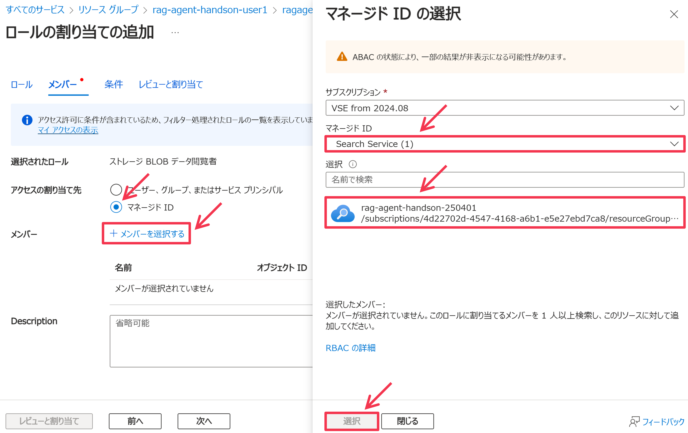

ロールの割当先を確認し、```[レビューと割り当て]``` ボタンをクリックします。
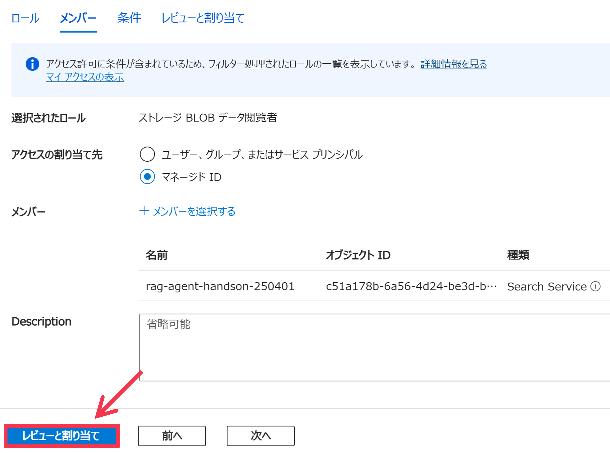

ロールの割当内容を確認し、```[レビューと割り当て]``` ボタンをクリックして、AI Search へのストレージアカウントに対する Blob 読み取り権限を付与を完了させます。
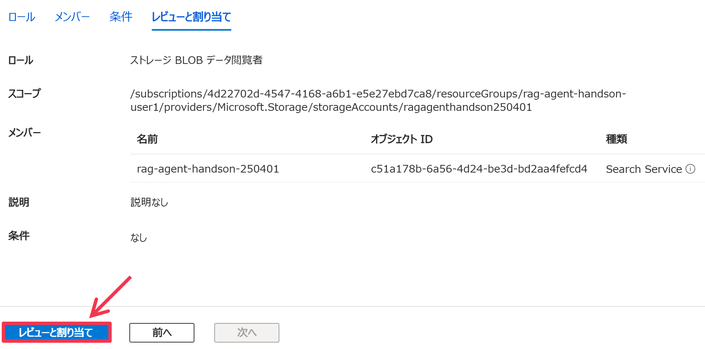

## Azure AI Service の設定
最後に、AI Search に対して AI Service アカウント(Azure OpenAI Service 利用のためのアカウント) に対する "Azure AI Developer" ロールを付与して、AI モデル利用 (gpt-4o/gpt-4o-mini と text-embedding-3-large) のアクセスを許可します。  
  
先ほどと同様に、リソースグループのページを表示して、Azure リソース一覧の中にある、Azure AI Hub 作成時に作成された AI Service アカウント(```種類``` が ```Azure AI services``` のリソース)の名前をクリックします。
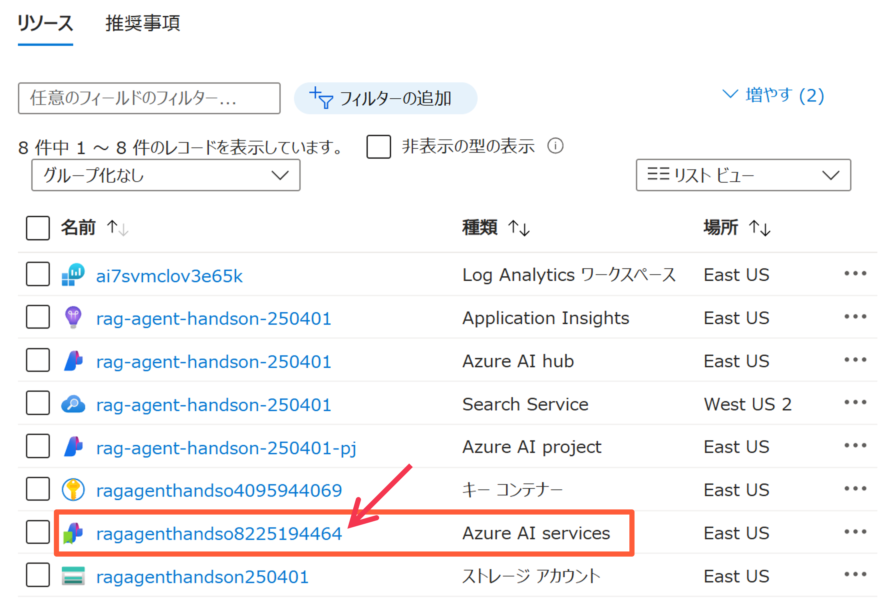

クリックした AI Service アカウントのページが表示されます。サイドメニューにある ```[アクセス制御(IAM)]``` をクリックすると、このアカウントに対するロール(権限)付与状況を確認するための画面が表示されます。画面上部メニューの ```[＋追加]``` をクリックし、続いて ```[ロ－ルの割り当ての追加]``` をクリックします。
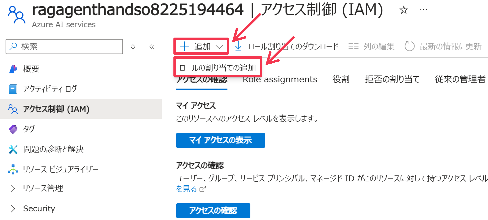

先ほど同様に、アカウントに対するロールの付与を行うためのウィンドウが表示されます。まず付与するロールを選択します。検索ボックスに ```Azure AI Developer``` と入力してフィルタリングします。表示された ```[Azure AI Developer]``` をクリックし、```[次へ]``` ボタンをクリックします。
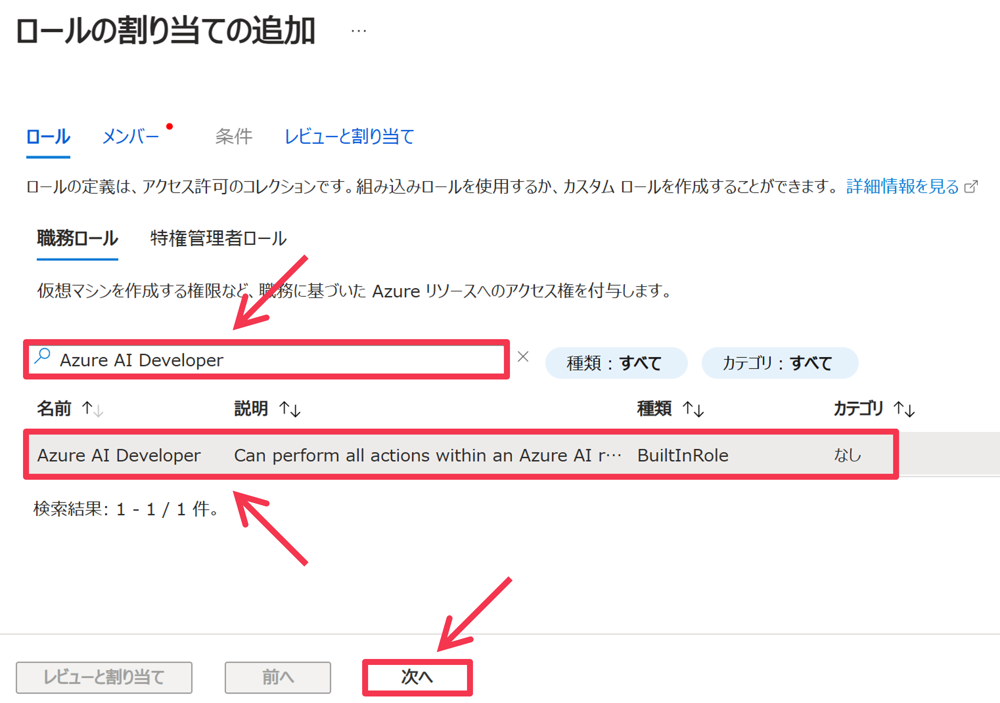

次に、ロールの付与対象を選択します。まず、```アクセスの割当先``` の ```[マネージドID]``` をチェックし、```[＋メンバーを選択する]``` をクリックします。すると、画面右にロールを付与する対象のマネージド ID を選択するウィンドウが表示されるので、```マネージド ID``` に ```[Search Service]``` を選択し、表示された ```先ほど作成した AI Search アカウントの名前``` を選択し、```[選択]```ボタンをクリックします。
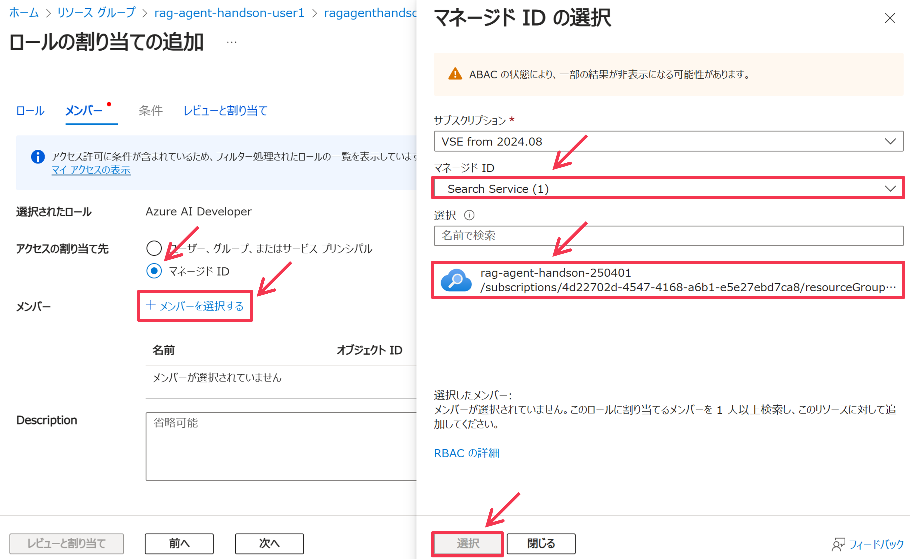

ロールの割当先を確認し、```[レビューと割り当て]``` ボタンをクリックします。
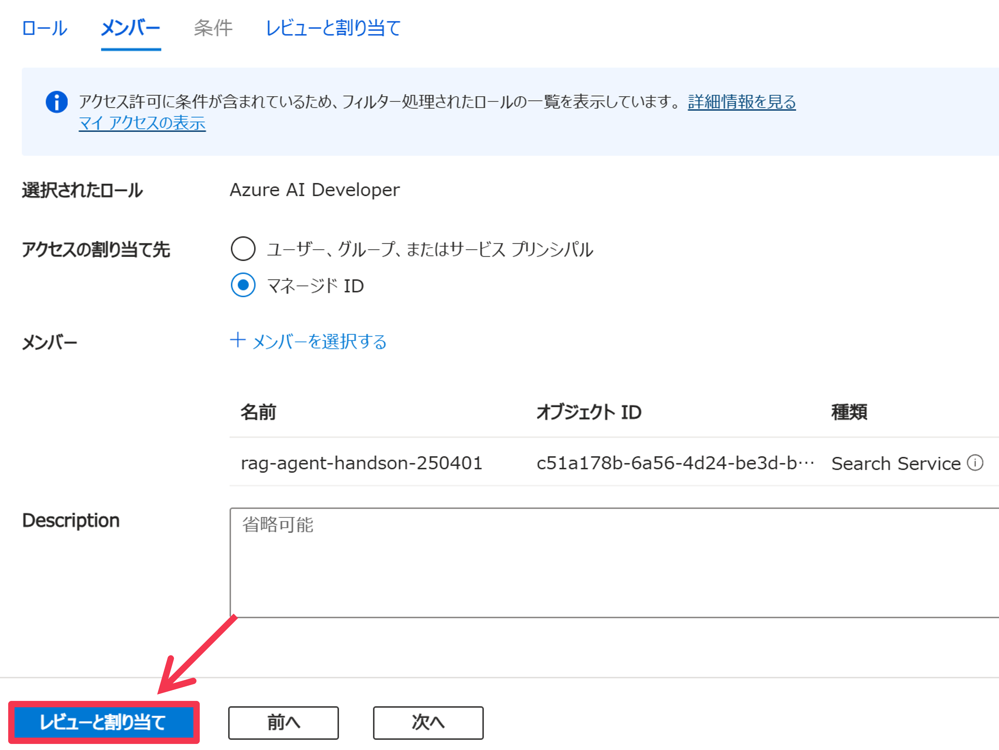

ロールの割当内容を確認し、```[レビューと割り当て]``` ボタンをクリックして、AI Search への AI Service アカウントに対するモデル利用の権限を付与を完了させます。
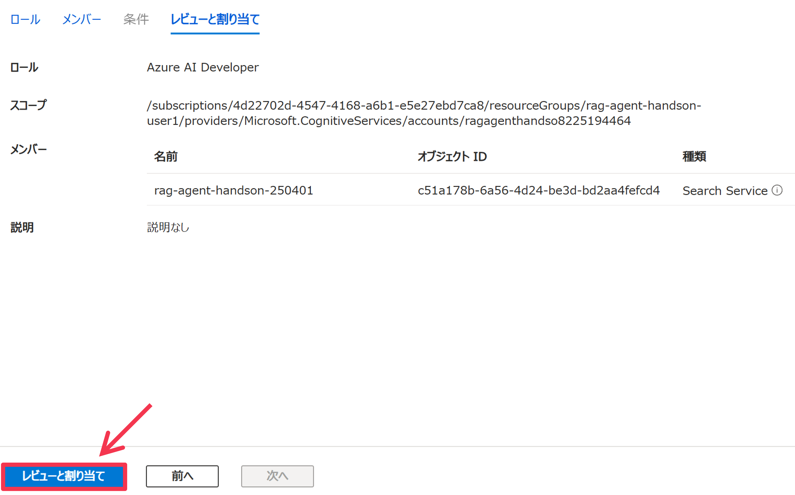