# 3. Azure AI Search インデックスの作成
Azure AI Agent Service で開発する AI エージェントのために、Azure AI Search にインデックスを作成して、中に検索ドキュメントを格納して検索できる状態とします。インデックスへの検索ドキュメントの格納方法は大きく Pull 型と Push 型の2つのやり方に分類されます。

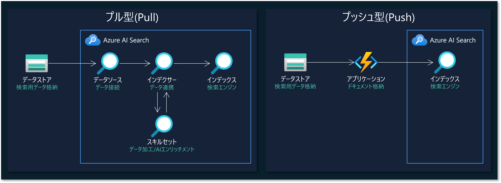

Pull 型は、AI Search の機能である「データソース」「インデクサー」「スキルセット」を用いて、AI Search が定期的にデータストアにアクセスしに行き、データを収集と加工処理を行い、インデックスに格納するという処理を行います。これらは JSON の定義だけ(ローコード)で処理を実現できるため、少ない手間でデータ格納を実現することができます。  
一方で、Push 型は [AI Search の REST API](https://learn.microsoft.com/en-us/rest/api/searchservice/documents/?view=rest-searchservice-2024-07-01&tabs=HTTP) 経由で、検索ドキュメントをインデックスに格納する方式です。これを実現するために、基本的にプログラムを実装することになるため、柔軟な検索ドキュメント作成ができることがメリットです。  
  
今回は、Pull 型でインデックスを用意していきたいと思います。インデックス用意のために、以下の要素を JSON 定義または GUI 操作で作成していきます。
- インデックス
- データソース
- スキルセット
- インデクサー

## 3.1 インデックスの準備

先ほどと同様に、リソースグループのページの Azure リソース一覧にある、今回使用する AI Search アカウントをクリックして、AI Search アカウントのページを表示します。
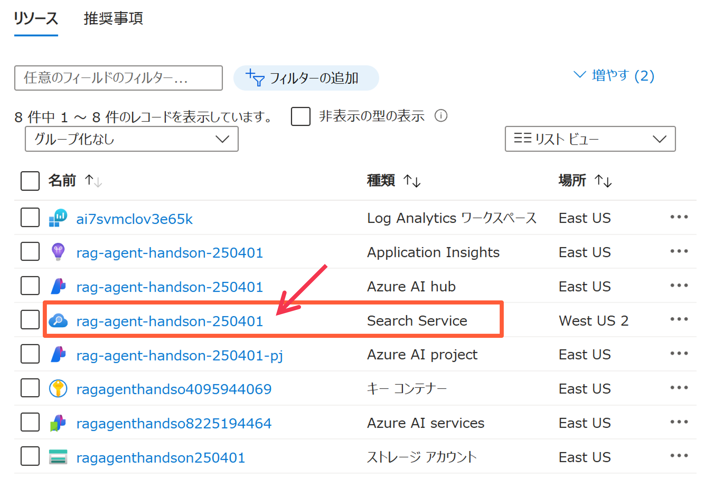

### 3.1.1 インデックスの作成
AI Search アカウントのページのサイドメニューの検索管理カテゴリ内の ```[インデックス]``` をクリックすると、このアカウントに作成されているインデックス一覧が表示されます。画面上部メニューの ```[＋インデックスの追加]``` をクリックし、続いて ```[インデックスの追加(JSON)]``` をクリックします。
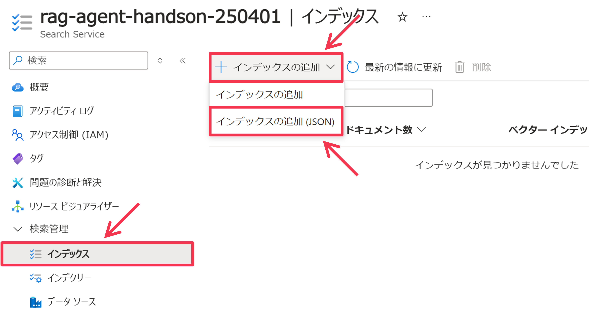

JSON の指定によるインデックスの追加画面が表示されます。  
基本的に [index.json](../../ai-search/index.json#L117) の JSON 定義を入力しますが、以下の117行目の```{OPENAI_SERVICE_NAME}``` を、先ほど AI Search にロールを付与をした AI Service アカウントの名前に置き換えてください。
```json
"vectorizers": [
    {
        "name": "vectorizer",
        "kind": "azureOpenAI",
        "azureOpenAIParameters": {
            "resourceUri": "https://{OPENAI_SERVICE_NAME}.openai.azure.com",
            "deploymentId": "text-embedding-3-large",
            "modelName": "text-embedding-3-large"
        }
    }
],
```
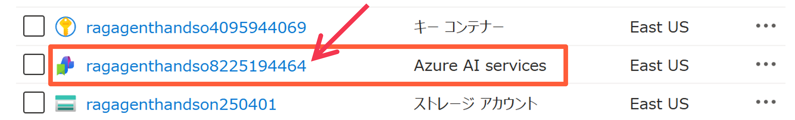

もし、この OpenAI Service アカウントへの認証を、Entra 認証ではなく API キー認証を使用する場合、以下の様な指定を行い、```apiKey``` にアカウントの API キーを指定してください。
```json
"vectorizers": [
    {
        "name": "vectorizer",
        "kind": "azureOpenAI",
        "azureOpenAIParameters": {
            "resourceUri": "https://{OPENAI_SERVICE_NAME}.openai.azure.com",
            "apiKey": "{OPENAI_SERVICE_API_KEY}",
            "deploymentId": "text-embedding-3-large",
            "modelName": "text-embedding-3-large"
        }
    }
],
```


修正後の JSON 定義を、元々入力されていた JSON を置き換えて、```[保存]``` ボタンをクリックします。
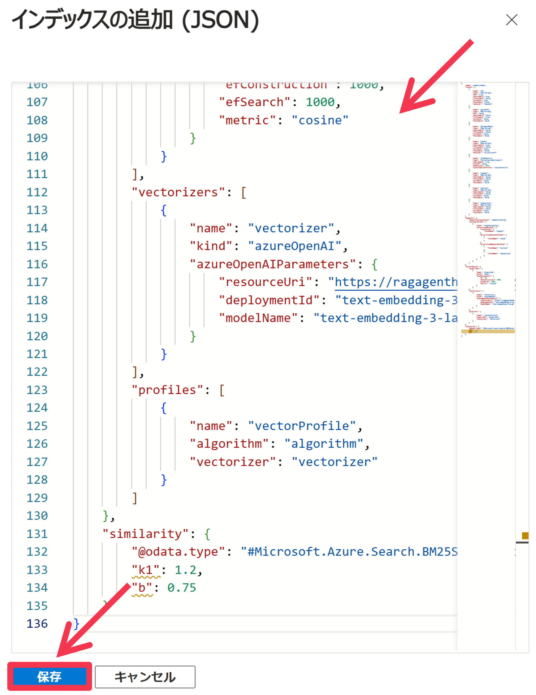

### 3.1.2 データソースの作成
続いて、サイドメニューの検索管理カテゴリ内の ```[データソース]``` をクリックすると、このアカウントに作成されているデータソース一覧が表示されます。画面上部メニューの ```[＋データソースの追加]``` をクリックし、続いて ```[データソースの追加]``` をクリックします。
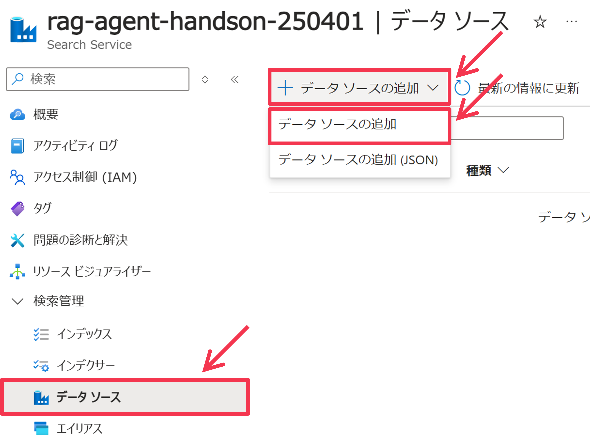

GUI ベースでのデータソースの追加画面が表示されます。まず ```[名前]``` に ```"sample-datasource"``` と入力します。次に、```[ストレージアカウント]``` に、先ほど作成した Azure Storage のアカウントを指定します。また、```[BLOBコンテナー]``` には ```[search-docs]``` を選作成ます。そして、```[マネージド ID を使用して認証する]``` にチェックし、```[作成]``` ボタンをクリックします。
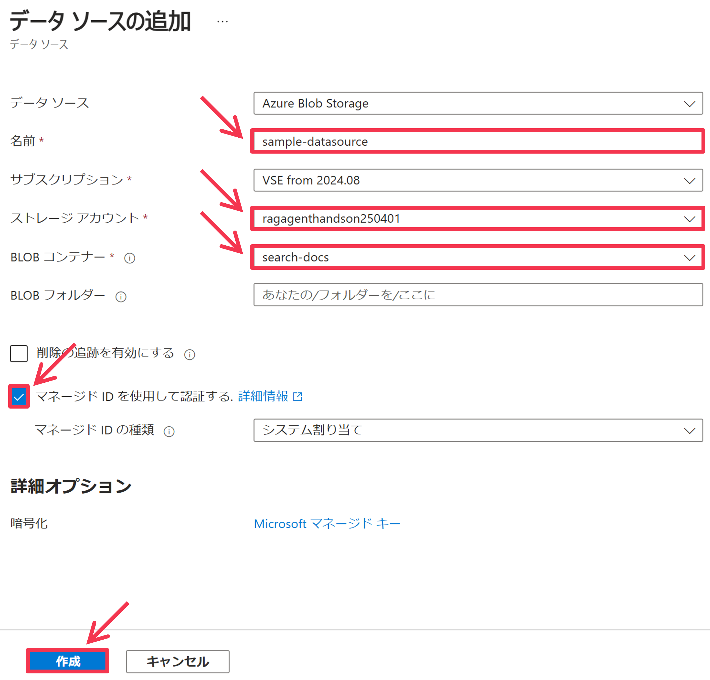

### 3.1.3 スキルセットの作成
続いて、サイドメニューの検索管理カテゴリ内の ```[スキルセット]``` をクリックすると、このアカウントに作成されているスキルセット一覧が表示されます。画面上部メニューの ```[＋スキルセットの追加]``` をクリックします。
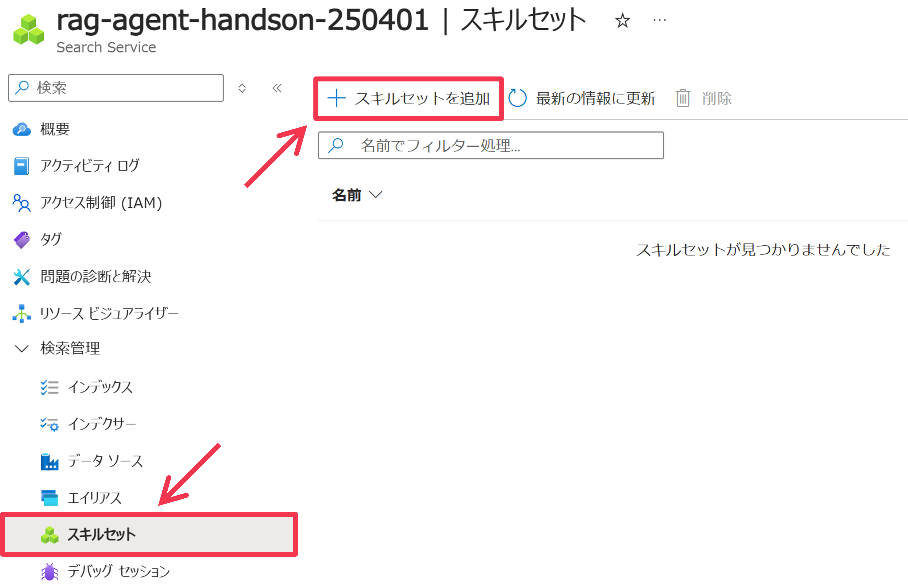

スキルセットの追加画面が表示されます。スキルセットは JSON でのみ定義を行うことができます(GUIベースでの設定はできません)。
インデックスと同様に、基本的に [skillset.json](../../ai-search/skillset.json#L49) の JSON 定義を入力しますが、以下の49行目の```{OPENAI_SERVICE_NAME}``` を、先ほど AI Search にロールを付与をした AI Service アカウントの名前に置き換えてください。
```json
{
    "@odata.type": "#Microsoft.Skills.Text.AzureOpenAIEmbeddingSkill",
    "context": "/document/markdown_document/*/pages/*",
    "resourceUri": "https://{OPENAI_SERVICE_NAME}.openai.azure.com",
    "deploymentId": "text-embedding-3-large",
    "modelName": "text-embedding-3-large",
    "dimensions": 3072,
    "inputs": [
        {
            "name": "text",
            "source": "/document/markdown_document/*/pages/*"
        }
    ],
    "outputs": [
        {
            "name": "embedding",
            "targetName": "text_vector"
        }
    ]
}
```

先ほどと同様に、この OpenAI Service アカウントへの認証を、Entra 認証ではなく API キー認証を使用する場合、以下の様な指定を行い、```apiKey``` にアカウントの API キーを指定してください。
```json
{
    ...
    "resourceUri": "https://{OPENAI_SERVICE_NAME}.openai.azure.com",
    "deploymentId": "text-embedding-3-large",
    "modelName": "text-embedding-3-large",
    "apiKey": "{OPENAI_SERVICE_API_KEY}",
    ...
}
```

修正後の JSON 定義を、元々入力されていた JSON を置き換えて、```[保存]``` ボタンをクリックします。
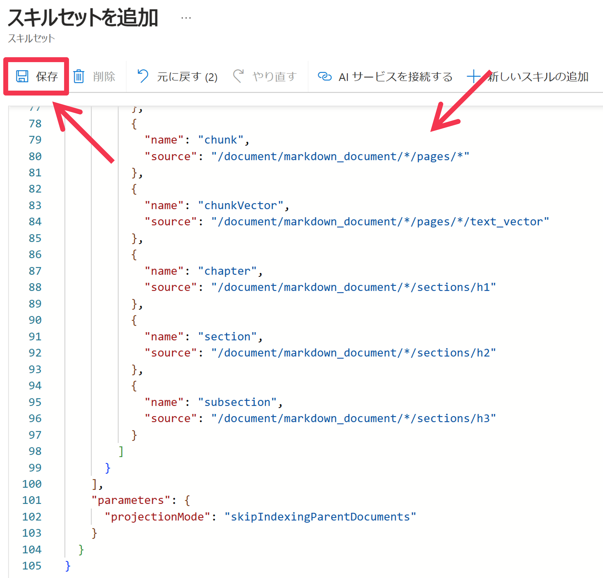

### 3.1.4 インデクサーの作成と実行
続いて、サイドメニューの検索管理カテゴリ内の ```[インデクサー]``` をクリックすると、このアカウントに作成されているインデクサー一覧が表示されます。画面上部メニューの ```[＋インデクサーの追加]``` をクリックし、続いて ```[インデクサー(JSON)の追加]``` をクリックします。
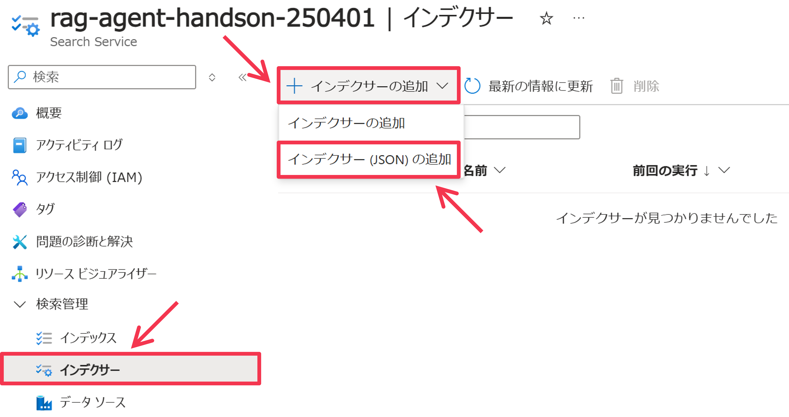

[indexer.json](../../ai-search/indexer.json) の JSON 定義の内容を、元々入力されていた JSON を置き換えて、```[保存]``` ボタンをクリックします。
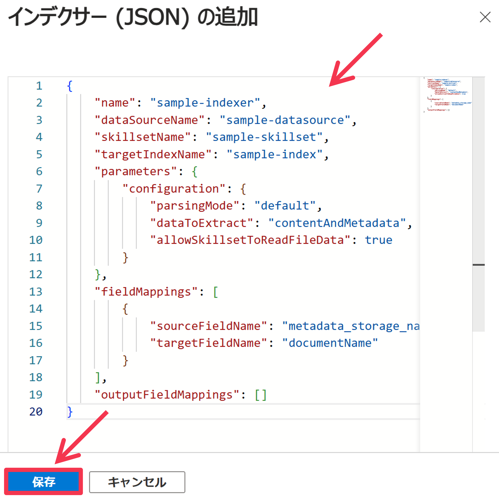

インデクサー一覧に先ほど作成したインデクサーが表示されます。状態が ```処理中``` なっていることがわかります。作成したインデクサーの名前である ```sample-indexer``` をクリックして、詳細を確認します。
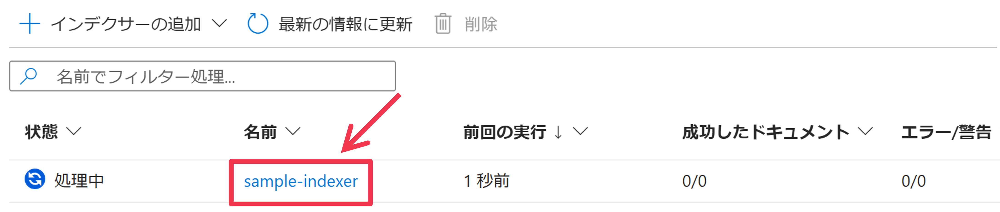

この画面で、インデクサーの実行や、データソースのどのファイルまで処理したかの記録のリセット(一度処理したファイルは二度処理されないための仕組み)、インデクサーの過去の実行履歴と実行成否を確認することができます。画面右側に、作成時の実行結果が表示されていることがわかります。```[状態]```が ```"成功"``` となっていて、```[成功したドキュメント数]``` が ```"3"``` になっていることを確認します。
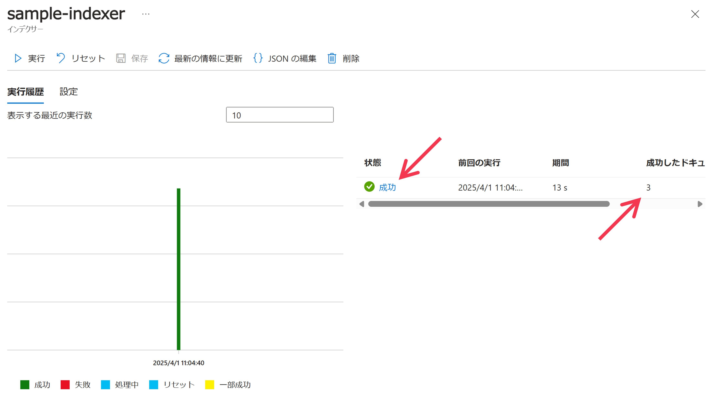

## 3.2 インデックス JSON 定義の解説

### 3.2.1 定義の大枠: ルートフィールド

インデックスのJSON定義の大枠は以下の通りになっています。  
```fields``` には、名前の通り "id" やら "text" やらのフィールドを指定します。どこのフィールドで検索を行うのか？もここで指定します。   
```semantic``` には、セマンティック検索に関する設定を定義します。  
```vectorSearch``` には、ベクトル検索に関する設定を定義します。
```similarity``` には、BM25 によるテキスト検索に関する設定を定義します。
```json
{
    "name": "sample-index",
    "fields": [],
    "semantic": {},
    "vectorSearch": {},
    "similarity": {}
}
```
他にも CORS に関する設定の ```corsOptions```や、[スコアリングプロファイル](https://learn.microsoft.com/en-us/azure/search/index-add-scoring-profiles)(テキスト検索における各フィールドのスコア重みづけ設定を行うための機能)設定の ```scoringProfiles```、[サジェスター](https://learn.microsoft.com/en-us/azure/search/index-add-suggesters)(検索クエリ補完のための機能)設定の ```suggesters``` といったルートフィールドがあります。詳しくは以下のドキュメントを参考ください。

> [Search index overview - Azure AI Search | Microsoft Learn](https://learn.microsoft.com/en-us/azure/search/search-what-is-an-index)  
> [Indexes - Create Or Update - REST API (Azure Search Service) | Microsoft Learn](https://learn.microsoft.com/en-us/rest/api/searchservice/indexes/create-or-update?view=rest-searchservice-2024-07-01&tabs=HTTP)  

### 3.2.2 フィールド(fields)の定義
フィールドを定義する```fields```は配列型であり、その中に以下の様にフィールドを定義します。  
```json
{
    "fields": [
        {
            "name": "id",
            "type": "Edm.String",
            "key": true,
            "searchable": true,
            "filterable": false,
            "sortable": true,
            "facetable": false,
            "analyzer": "keyword"
        },
        {
            "name": "chunk",
            "type": "Edm.String",
            "searchable": true,
            "filterable": false,
            "sortable": false,
            "facetable": false,
            "analyzer": "en.microsoft"
        },
        {
            "name": "chunkVector",
            "type": "Collection(Edm.Single)",
            "searchable": true,
            "stored": false,
            "dimensions": 3072,
            "vectorSearchProfile": "vectorProfile"
        },
        ...
    ]
}
```
まずフィールド名である ```name``` と、データ型である ```type``` を指定します。データ型には文字列型である "Edm.String" 、32bit整数値型である "Edm.Int32"、主にベクトル値格納用途に使用される 32bit浮動小数点配列型である "Collection(Edm.Single)" などをサポートしています。サポートしているデータ型は、[このドキュメント](https://learn.microsoft.com/en-us/rest/api/searchservice/supported-data-types)を参考にしてください。  
いわゆる ID フィールドを表すフィールドには ```key``` を true にしておく必要があります。規定値は false です。  
そして、テキスト検索の対象となるフィールドには、```searchable``` を true にしておきます。これはベクトル検索が可能なフィールドではありません。```searchable``` が true のフィールドには ```analyzer``` にて使用するアナライザーを指定することができます。アナライザーは文章をトークン(LLM でのトークンとは異なる)に分割するために使用します。英語は各単語がスペースで区切られているためトークン分割が用意な部類の言語ですが、そうでない日本語などの場合は、形態素解析が必要となり、このアナライザーの選択が非常に重要になります。アナライザーとしては、Lucene アナライザと、Microsoft が用意した言語アナライザ、そしてユーザがトークナイザやフィルタを組み合わせて作成するカスタムアナライザーから選択することができます。ここでアナライザーを指定しないと、標準アナライザと呼ばれる、日本語の場合だと非常にトークン分割精度が良くないアナライザが使われることになるため、必ず適した言語アナライザを設定しましょう。日本語と英語が組み合わされるドキュメントの場合、日本語用の Lucene アナライザである "ja.lucene" がお勧めです。サポートされているアナライザについては、[このドキュメント](https://learn.microsoft.com/en-us/azure/search/search-analyzers)をご参照ください。
ベクトル検索の対象となるフィールドには、まず ```type``` を "Collection(Edm.Single)" や "Collection(Edm.Byte)" といった、ベクトル値を格納するためのデータ型を指定して、かつ ```dimensions``` でベクトルの次元数を、そして ```vectorSearchProfile``` で、後述するベクトル検索の設定(プロファイル)の名前を指定します。```stored``` はベクトル値を検索ドキュメントに含めるかの設定で、false に指定すると、ベクトル値は検索にのみ使用されます。これにより、検索結果にベクトル値が含まれなくなり、ドキュメント用のストレージサイズの大幅な節約に繋がります。  
```filterable``` は重要なフィールドで、このフィールドの値でフィルタリング(RDB の SQL における WHERE 句のような)したうえでドキュメント検索を行うことができます。  
```facetable``` は[ファセット機能](https://learn.microsoft.com/en-us/azure/search/search-faceted-navigation)の対象にするかの設定です。ファセットはユーザ側でフィルタリングの設定を容易にするための機能です。

> [Supported data types - Azure AI Search | Microsoft Learn](https://learn.microsoft.com/en-us/rest/api/searchservice/supported-data-types)  
> [Analyzers for linguistic and text processing - Azure AI Search | Microsoft Learn](https://learn.microsoft.com/en-us/azure/search/search-analyzers)  
> [Add a faceted navigation category hierarchy - Azure AI Search | Microsoft Learn](https://learn.microsoft.com/en-us/azure/search/search-faceted-navigation)  

### 3.2.3 セマンティック検索の設定 (semantic)
AI Search の[セマンティック検索](https://learn.microsoft.com/en-us/azure/search/semantic-search-overview)は、Microsoft Bing の検索技術で培われた L2 ランキング処理を適用した検索処理のことを指します。これは AI Search ではセマンティックリランキングと呼ばれ、テキスト検索、ベクトル検索、またはその両方の検索(ハイブリッド検索)の検索結果として取得したN個の検索ドキュメント(ランク付き)を、小規模言語モデル(SLM)を用いて、各検索ドキュメントの検索スコア(検索クエリへの関連度)を再計算する処理を行います。ハイブリッド検索等であたりをつけて、少数になったドキュメントを言語モデルベースで再検索をするイメージですね。以下が、クエリ送信からハイブリッド検索、RRF (Reciprocal Rank Fusion) によるランク融合処理、セマンティックリランキング処理の流れを表した図です。
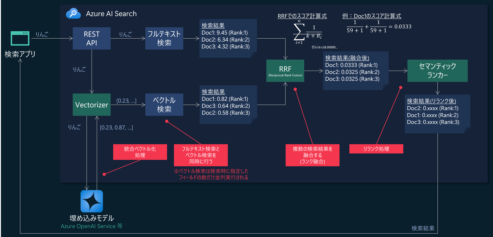

セマンティック検索の設定は ```semantic``` フィールドは以下で行います。セマンティック検索設定は ```configurations``` 配下に複数定義することができ、名前(```name```)とリランキング処理に使用するフィールド(```prioritizedFields```)を定義します。ここで指定するフィールドは先ほど指定したフィールドです。フィールドは、検索ドキュメントのタイトルである ```titleField``` と、メインコンテンツのフィールドである ```prioritizedContentFields```、キーワードフィールド ```prioritizedKeywordsFields``` が指定できます。これらのフィールドの内容をもとに、SLM で要約を作成し、かつ検索クエリとの類似度を計算し、その結果を検索スコアに反映させる、という動きを行います。  

```defaultConfiguration``` フィールドでは、アプリケーションが AI Search に検索リクエストを送信した際に、セマンティック検索を行うが、具体的な configuration 名を指定していない場合に、既定で選択される configuration を指定することができます。 
```json
"semantic": {
    "defaultConfiguration": "semanticConfig",
    "configurations": [
        {
            "name": "semanticConfig",
            "prioritizedFields": {
                "titleField": {
                    "fieldName": "chapter"
                },
                "prioritizedContentFields": [
                    {
                        "fieldName": "chunk"
                    }
                ],
                "prioritizedKeywordsFields": [
                    {
                        "fieldName": "section"
                    },
                    {
                        "fieldName": "subsection"
                    }
                ]
            }
        }
    ]
}
```

> [Semantic ranking - Azure AI Search | Microsoft Learn](https://learn.microsoft.com/en-us/azure/search/semantic-search-overview)

### 3.2.3 ベクトル検索の設定 (vectorSearch)
```vectorSearch``` フィールドでは、ベクトル検索に関する設定を行います。具体的には、検索アルゴリズム(```algorithms```)、クエリのベクトル化に関する設定(```vectorizers```)、プロファイル(```profiles```, 検索アルゴリズムとベクトル化設定の組み合わせ) を指定します。また、```compressions``` フィールドでベクトルの量子化設定も行うことができます。インデックスに格納する検索ドキュメントが多すぎるためベクトルストレージのサイズを圧縮したいときに有効なオプションです。もし興味がありましたら、[このドキュメント](https://learn.microsoft.com/en-us/azure/search/vector-search-how-to-configure-compression-storage)を参照すると良いと思います。  

目的は、上記で定義したベクトル検索用のフィールドの ```vectorSearchProfile``` で指定するためのプロファイルを定義することです。プロファイルを定義するために、検索アルゴリズムとクエリベクトル化設定を行います。  

```algorithms``` フィールドでは、複数のベクトル検索アルゴリズムを指定することができます。ここで指定できるアルゴリズム(```kind```)は kNN (exhaustiveKnn) か [HNSW](https://arxiv.org/abs/1603.09320) (hnsw) です。kNN はいわゆる全件走査検索なので、クエリ処理時間に強い制限がなく、データ量が1万件以下等の小規模な検索で活用することができます。基本的には、HNSW を使用します。HNSW を選択した場合、アルゴリズムのパラメータ(```hnswParameters```)を指定することができます。各パラメータの説明は、後述の Appendix を参考いただければと思いますが、基本的に値を上げると検索精度が向上するが(検索範囲が広がる)、検索速度が遅くなる、と認識すれば概ね大丈夫です。また、```metric``` でベクトル間の類似度計算方法を指定することができます。特にこだわりがなければ ```cosine``` (コサイン類似度)を指定しておけば大丈夫です。  

```vectorizers``` フィールドでは、検索クエリのベクトル化に関する設定ができます。設定は複数個指定することができ、各設定では、どのように検索クエリをベクトル化するか？を指定することができます。以下の例では、Azure OpenAI Service の text-embedding-3-large モデルを用いてベクトル化処理を行う設定をしていますが、[Azure AI Foundry の Model Catalog](https://learn.microsoft.com/en-us/azure/search/vector-search-integrated-vectorization-ai-studio?tabs=inference-image) でデプロイしたモデルや、Web API 経由でのベクトル化、また画像のベクトル化にも対応しています。また、以下の例では OpenAI Service アクセスのための認証方法として Microsoft Entra 認証を指定していますが、```apiKey``` フィールドで API キーを指定することで、キー認証も指定することができます。開発時など簡単に検証したいときは、この認証方法が容易です。  

最後に、```profiles``` フィールドで、設定したアルゴリズム(algorithms)とベクトル化設定(vectorizers)の組み合わせをプロファイルとして定義します。プロファイルは複数定義することができ、各プロファイルには名前(```name```)を指定します。このプロファイルの名前を、ベクトルフィールドのプロパティ ```vectorSearchProfile``` で指定します。すると、そのフィールドへのベクトル検索は、プロファイルに紐づくアルゴリズムと検索クエリベクトル化設定が使われることになります。

```json
"vectorSearch": {
    "algorithms": [
        {
            "name": "algorithm",
            "kind": "hnsw",
            "hnswParameters": {
                "m": 10,
                "efConstruction": 1000,
                "efSearch": 1000,
                "metric": "cosine"
            }
        }
    ],
    "vectorizers": [
        {
            "name": "vectorizer",
            "kind": "azureOpenAI",
            "azureOpenAIParameters": {
                "resourceUri": "https://{OPENAI_SERVICE_NAME}.openai.azure.com",
                "deploymentId": "text-embedding-3-large",
                "modelName": "text-embedding-3-large"
            }
        }
    ],
    "profiles": [
        {
            "name": "vectorProfile",
            "algorithm": "algorithm",
            "vectorizer": "vectorizer"
        }
    ]
}
```

#### Appendix: HNSW (Hierarchical Navigable Small World)
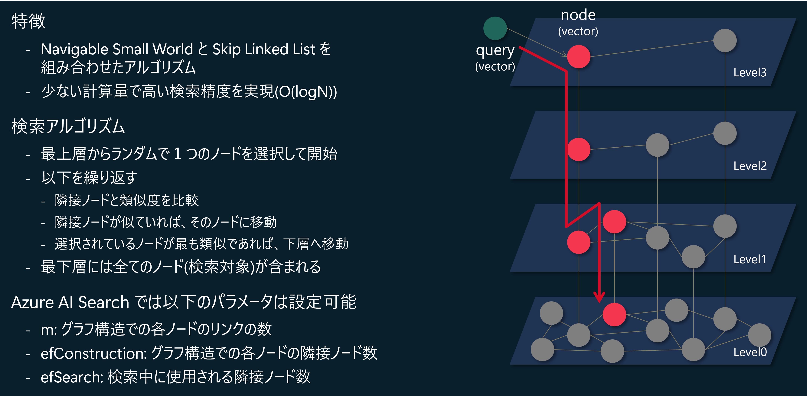

#### Appendix: Azure AI Search でサポートするベクトル類似度メトリック
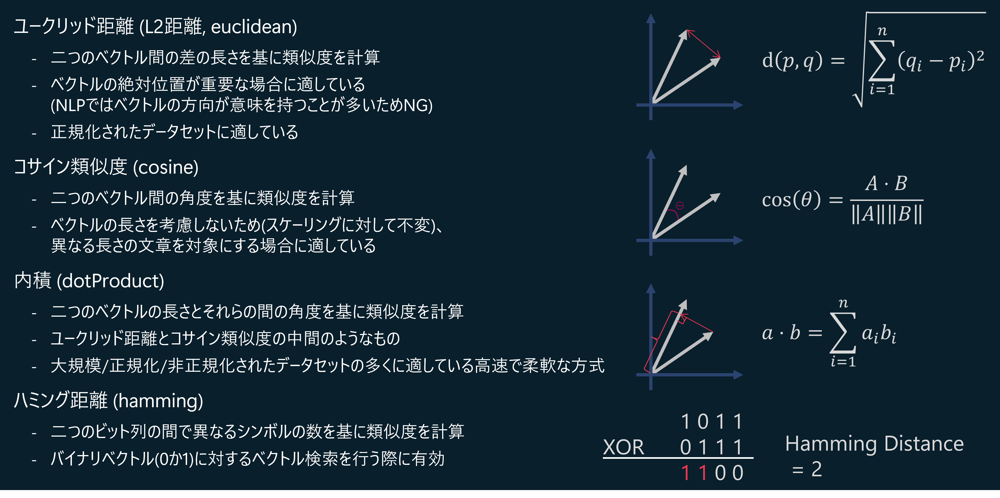

#### Appendix: ベクトルフィールドの圧縮
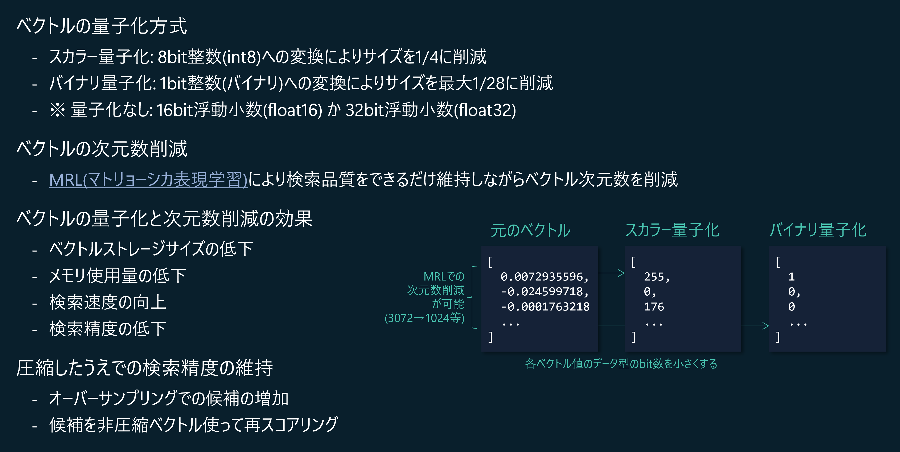

> [Vector search - Azure AI Search | Microsoft Learn](https://learn.microsoft.com/en-us/azure/search/vector-search-overview)

### 3.2.4 テキスト検索の設定 (similarity)
AI Search のテキスト検索には、[Okapi BM25](https://en.wikipedia.org/wiki/Okapi_BM25) が使われています。BM25 はかなりざっくりと説明すると、[TF-IDF (Term Frequency-Inverse Document Frequency)](https://en.wikipedia.org/wiki/Tf%E2%80%93idf) と呼ばれる「全ドキュメント間であまり登場しない単語は検索スコアへの上昇影響度が高い条件で、検索対象の単語が多く登場するドキュメントを検索する」方式に、文章の長さを考慮した方式です。

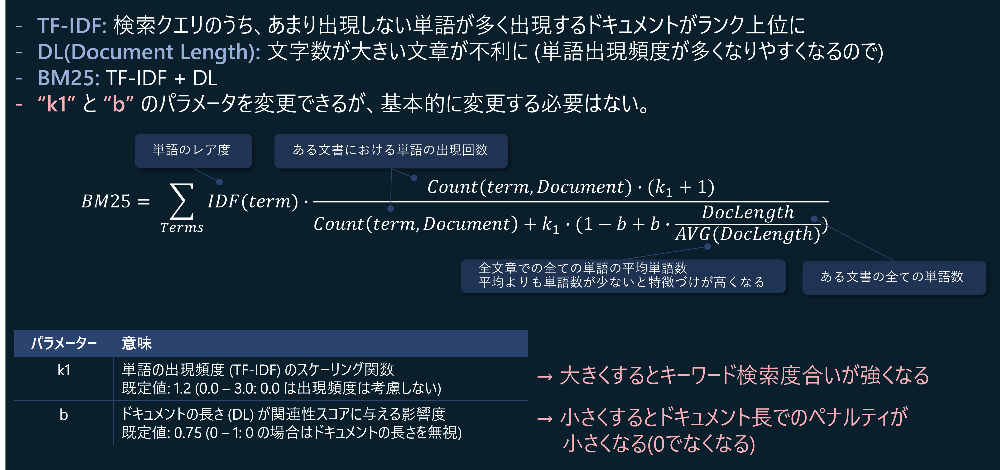

AI Search では、パラメータ ```k1 (0.0~3.0)``` と ```b (0~1)``` を設定することができます。k1 は全ドキュメント間での単語の出現頻度、つまり単語のレア度への影響度で、値が大きいとレアな単語ほど、検索スコアに大きな影響を与えるようになります(逆に0は一切考慮しない)。b はドキュメントの長さの影響度で、0の場合は一切考慮しなくなります。こだわりがなければ、規定値である k1=1.2, b=0.75 のままで大丈夫ですが、k1=3.0 とするとキーワード検索の度合いが強くなるので、場合によっては採用すると良いかもしれません。

```json
"similarity": {
    "@odata.type": "#Microsoft.Azure.Search.BM25Similarity",
    "k1": 1.2,
    "b": 0.75
}
```

> [Configure BM25 relevance scoring - Azure AI Search | Microsoft Learn](https://learn.microsoft.com/en-us/azure/search/index-ranking-similarity)

## 3.3 データソース JSON 定義の解説
今回は GUI ベースでデータ定義を行いましたが、以下のような JSON 定義でデータソースを作成したことになります。  
データソースが Azure Blob ストレージであるため、```type``` が ```azureblob``` です。AI Search でデータソースとして指定できるものは、[このドキュメント](https://learn.microsoft.com/en-us/azure/search/search-data-sources-gallery)をご参照ください。また、Blob ストレージにアクセスするための情報として、認証情報(```credentials```)とアクセス先のコンテナ情報(```container```)を指定しています。認証情報は、今回は Microsoft Entra 認証を使用したため、リソース ID を指定していますが、Blob ストレージの接続文字列(Connection String, ストレージのエンドポイントと認証キーを含む文字列)を指定することで、キー認証も使用することができます。

```json
{
    "name": "sample-datasource",
    "type": "azureblob",
    "credentials": {
        "connectionString": "ResourceId=/subscriptions/{SUBSCRIPTION_ID}/resourceGroups/{RESOURCE_GROUP}/providers/Microsoft.Storage/storageAccounts/{STORAGE_ACCOUNT}/;"
    },
    "container": {
        "name": "search-docs"
    }
}
```

## 3.4 インデクサー JSON 定義の解説
今回は以下の通りにインデクサーを定義しています。定義に必要なのは、連携するデータソース名(```dataSourceName```)、スキルセット名(```skillsetName```)、インデックス名(```targetIndexName```)です。また、どこまで処理対象のドキュメント情報をスキルセットに提供するかも、ここで指定することができます(```parameters.configuration``` 内の ```dataToExtract``` と ```allowSkillsetToReadFileData```)。ここで、このインデクサーで処理するファイルタイプのフィルタリング設定も行うことができます。例えば、PDF ファイルのみを処理するなどの設定です。  
  
また、スキルセットの結果やメタデータをここでフィールドマッピングすることもできます。```fieldMappings``` 内での ```metadata_storage_name``` は Blob ストレージをデータソースにした際に付与されるメタデータで、Blob 名(metadata_storage_name)やコンテンツタイプ(metadata_storage_content_type)が格納されます。この値がインデックスの ```documentName``` フィールドに格納されます。詳しくは[このドキュメント](https://learn.microsoft.com/en-us/azure/search/search-howto-indexing-azure-blob-storage)をご参照ください。

```json
{
    "name": "sample-indexer",
    "dataSourceName": "sample-datasource",
    "skillsetName": "sample-skillset",
    "targetIndexName": "sample-index",
    "parameters": {
        "configuration": {
            "parsingMode": "default",
            "dataToExtract": "contentAndMetadata",
            "allowSkillsetToReadFileData": true
        }
    },
    "fieldMappings": [
        {
            "sourceFieldName": "metadata_storage_name",
            "targetFieldName": "documentName"
        }
    ],
    "outputFieldMappings": []
}
```

## 3.5 スキルセット JSON 定義の解説

### 3.5.1 定義の大枠: ルートフィールド
スキルセットのJSON定義の大枠は以下の通りになっていて、主に ```name```, ```skills``` を定義します。また、1つのファイル(PDF ファイル等)から複数の検索ドキュメントをインデックスに出力する場合は、[インデックスプロジェクション](https://learn.microsoft.com/en-us/azure/search/search-how-to-define-index-projections?tabs=rest-create-index%2Crest-create-index-projection)を ```indexProjections``` にて定義する必要があります。
```json
{
    "name": "sample-skillset",
    "skills": [],
    "indexProjections": {}
}
```

そのほか、Azure AI Services への接続設定の ```cognitiveServices```, [ナレッジストア](https://learn.microsoft.com/en-us/azure/search/knowledge-store-concept-intro?tabs=portal)の利用設定の ```knowledgeStore```, 暗号化設定の ```encryptionKey``` などが設定できます。詳細については、[このドキュメント](https://learn.microsoft.com/en-us/azure/search/cognitive-search-defining-skillset)をご参照ください。

> [Skillset concepts - Azure AI Search | Microsoft Learn](https://learn.microsoft.com/en-us/azure/search/cognitive-search-working-with-skillsets)  
> [Create a skillset - Azure AI Search | Microsoft Learn](https://learn.microsoft.com/en-us/azure/search/cognitive-search-defining-skillset)
> [Define index projections - Azure AI Search | Microsoft Learn](https://learn.microsoft.com/en-us/azure/search/search-how-to-define-index-projections?tabs=rest-create-index%2Crest-create-index-projection)

### 3.5.2 スキルの追加: ドキュメント分析
```skills``` は配列型になっているので、その配下にスキルを追加していきます。  
まず入力される PDF ファイルからテキストを抽出するための処理として、[ドキュメントレイアウトスキル](https://learn.microsoft.com/en-us/azure/search/cognitive-search-skill-document-intelligence-layout)を追加します。スキルの追加方法として、Microsoft 公式が公開しているドキュメント (Microsoft Learn) を参照しながら追加するのがオススメで、今から追加するドキュメントレイアウトスキルは、[このページ](https://learn.microsoft.com/en-us/azure/search/cognitive-search-skill-document-intelligence-layout)を使用します。  
まず ```@odata.type``` を確認すると、公式ドキュメントには [Microsoft.Skills.Util.DocumentIntelligenceLayoutSkill](https://learn.microsoft.com/en-us/azure/search/cognitive-search-skill-document-intelligence-layout#section) と書いてあるので、その値を指定します。   


次に、```context``` を指定します。これはこのスキルセットで処理をする入出力データのルートパスのようなもので、1つ目のスキルセットであれば、```/document``` を指定しておけば大丈夫です。  
続いて、スキルのパラメータを指定します。公式ドキュメントによると、ドキュメントレイアウトスキルには ```outputMode``` と、```markdownHeaderDepth``` の2パラメータ指定することができるので、それぞれを指定します。  
また、スキルの入力(```inputs```)の出力(```outputs```)を確認します。入力には ```file_data``` が指定でき、出力として ```markdown_document``` を取得することができることが分かります。
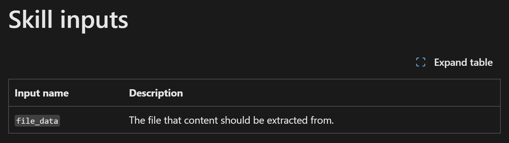
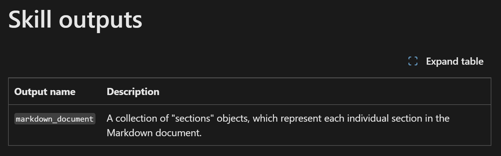

また、公式ドキュメントにてサンプルの定義とサンプルの出力を確認することができるので、それをもとに以下の様なスキル定義を追加します。
```/document/file_data``` に入力されたデータ(PDFファイル等)が含まれていて、以下のような構造になっています(わかりやすいようにJSONで表現)。
```json
{
    "document": {
        "file_data": {
            "$type": "file",
            "contentType": "application/pdf",
            "data": "JVBERi0xLjQKJdPr6eEKMSAwIG9iago8PC9...",
            "url": "https://xxxxx.blob.core.windows.net/....",
        }
    }
}
```

```inputs``` の ```text``` の値(```source```)には、```/document/file_data``` を指定します。また、outputs として ```markdown_document``` を出力させます。

```json
{
    "@odata.type": "#Microsoft.Skills.Util.DocumentIntelligenceLayoutSkill",
    "context": "/document",
    "outputMode": "oneToMany",
    "markdownHeaderDepth": "h3",
    "inputs": [
        {
            "name": "file_data",
            "source": "/document/file_data"
        }
    ],
    "outputs": [
        {
            "name": "markdown_document",
            "targetName": "markdown_document"
        }
    ]
}
```

すると、スキルの出力 ```markdown_document``` は以下のように出力されます(わかりやすいようにJSONで表現)。
```json
{
    "document": {
        "file_data": {},
        "markdown_document": [
            { 
                "content": "Interpolations set the shape of the slope...", 
                "sections": { 
                    "h1": "Character filters add processing before a string reaches the tokenizer...", 
                    "h2": "Character filters", 
                    "h3": "" 
                },
                "ordinal_position": 0
            }, 
            {},
            {},
            ...
        ]
    }
}
```

> [Document Layout skill - Azure AI Search | Microsoft Learn](https://learn.microsoft.com/en-us/azure/search/cognitive-search-skill-document-intelligence-layout)

### 3.5.3 スキルの追加: チャンク分割
続いて、ドキュメントレイアウトスキルで抽出したテキストをチャンク分割するために、[テキスト分割スキル](https://learn.microsoft.com/en-us/azure/search/cognitive-search-skill-textsplit)を追加します。  ドキュメントレイアウトスキルの時点で、既に章や節レベルで分割されているため、このスキルは不要かもしれませんが、非常に長い章や節に対応するため、一応このスキルを追加します。  先ほどと同様に、この[スキルセットのリファレンス](https://learn.microsoft.com/en-us/azure/search/cognitive-search-skill-textsplit)を見ながら、JSON定義を完成させます。   
重要なのは、```context``` で、```/document/markdown_document``` は上記の通り配列であるため、アスタリスク(*)をつけて、その内部にある全ての要素をこのスキルで処理することを、この context で指定します ([参考](https://learn.microsoft.com/en-us/azure/search/cognitive-search-skill-annotation-language))。  
あとは先ほどと同様に、「スキルのパラメータ」「スキルへの入力」「スキルからの出力」を定義します。今回は、1024トークン(オーバラップ256トークン)でチャンク分割することとしています。また、スキルへの入力の ```text``` の値として、```/document/markdown_document``` の各要素の ```content``` を入力したいので、```/document/markdown_document/*/content``` を指定します。こうやって配列要素をスキルへ入力します。

```json
{
    "@odata.type": "#Microsoft.Skills.Text.SplitSkill",
    "context": "/document/markdown_document/*",
    "textSplitMode": "pages",
    "maximumPageLength": 1024,
    "pageOverlapLength": 256,
    "defaultLanguageCode": "en",
    "unit": "azureOpenAITokens",
    "azureOpenAITokenizerParameters": {
        "encoderModelName": "cl100k_base"
    },
    "inputs": [
        {
            "name": "text",
            "source": "/document/markdown_document/*/content"
        }
    ],
    "outputs": [
        {
            "name": "textItems",
            "targetName": "pages"
        }
    ]
}
```

分割されたチャンク(文字列配列)が ```textItems``` として出力されます。ここでは ```pages``` という名前で出力させていますが、この後、以下のようなデータ構造になります(わかりやすいようにJSONで表現)。```context``` が ```/document/markdown_document/*``` なので、```/document/markdown_document/*/pages``` に出力されるということですね。
```json
{
    "document": {
        "file_data": {},
        "markdown_document": [
            { 
                "content": "Interpolations set the shape of the slope...", 
                "sections": { 
                    "h1": "Character filters add processing before a string reaches the tokenizer...", 
                    "h2": "Character filters", 
                    "h3": "" 
                },
                "pages": [
                    "Interpolations set the shape of the slope..."
                ]
                "ordinal_position": 0
            }, 
            {},
            {},
            ...
        ]
    }
}
```

> [Text split skill - Azure AI Search | Microsoft Learn](https://learn.microsoft.com/en-us/azure/search/cognitive-search-skill-textsplit)  
- [Skill context and input annotation reference language - Azure AI Search | Microsoft Learn](https://learn.microsoft.com/en-us/azure/search/cognitive-search-skill-annotation-language)

### 3.5.4 スキルの追加: テキスト埋め込み
最後に、チャンク分割したテキストの埋め込み(ベクトル値)を Azure OpenAI Service を使って生成するため、[Azure OpenAI Embedding スキル
](https://learn.microsoft.com/en-us/azure/search/cognitive-search-skill-azure-openai-embedding) を追加します。  先ほどと同様に、[リファレンス](https://learn.microsoft.com/en-us/azure/search/cognitive-search-skill-azure-openai-embedding)を見ながら、JSON定義を完成させます。   
```context``` は文字列配列の ```pages``` を指定したいので ```/document/markdown_document/*/pages/*``` と指定します。これでmarkdown_document (配列)内の全要素の pages (配列) を処理対象とさせます。そして、先ほどと同様に、「スキルのパラメータ」「スキルへの入力」「スキルからの出力」を定義します。主に、使用する埋め込みモデルに関する指定を行います。今回は、Azure OpenAI Service への認証方法として Microsoft Entra 認証を使用していますが、```apiKey``` プロパティで API キーを指定することで、API 認証も使用することができます。

```json
{
    "@odata.type": "#Microsoft.Skills.Text.AzureOpenAIEmbeddingSkill",
    "context": "/document/markdown_document/*/pages/*",
    "resourceUri": "https://{OPENAI_SERVICE_NAME}.openai.azure.com",
    "deploymentId": "text-embedding-3-large",
    "modelName": "text-embedding-3-large",
    "dimensions": 3072,
    "inputs": [
        {
            "name": "text",
            "source": "/document/markdown_document/*/pages/*"
        }
    ],
    "outputs": [
        {
            "name": "embedding",
            "targetName": "text_vector"
        }
    ]
}
```

API キーを使用した認証を行う場合は、以下の様に指定してください。
```json
{
    "@odata.type": "#Microsoft.Skills.Text.AzureOpenAIEmbeddingSkill",
    "context": "/document/markdown_document/*/pages/*",
    "resourceUri": "https://{OPENAI_SERVICE_NAME}.openai.azure.com",
    "apiKey": "xxxxxxxxxxxxxxxxxxxxxxxxxxxxxxxxxxxxxxxx",
    "deploymentId": "text-embedding-3-large",
    "modelName": "text-embedding-3-large",
    ...
}
```

このスキルを実行した後は、以下のようなデータ構造になります(わかりやすいようにJSONのように表現)。```context``` が ```/document/markdown_document/*/pages/*``` なので、```/document/markdown_document/*/pages/*/text_vector``` 配下に出力されます(ちょっと独特なデータ構造になります)。
```json
{
    "document": {
        "file_data": {},
        "markdown_document": [
            { 
                "content": "Interpolations set the shape of the slope...", 
                "sections": { 
                    "h1": "Character filters add processing before a string reaches the tokenizer...", 
                    "h2": "Character filters", 
                    "h3": "" 
                },
                "pages": [
                    {
                        "Interpolations set the shape of the slope...",
                        { "text_vector": [0.321780, 0.745397, ...] }
                    }
                ]
                "ordinal_position": 0
            }, 
            {},
            {},
            ...
        ]
    }
}
```

> [Azure OpenAI Embedding skill - Azure AI Search | Microsoft Learn](https://learn.microsoft.com/en-us/azure/search/cognitive-search-skill-azure-openai-embedding)

### 3.5.5 インデックスプロジェクション
AI Search の Azure Blob データソースでは、[インデックスプロジェクション](https://learn.microsoft.com/en-us/azure/search/search-how-to-define-index-projections?tabs=rest-create-index%2Crest-create-index-projection)を使用しない限り、1ファイル1検索ドキュメントという原則があります。今回は1ファイルから複数の検索ドキュメント(チャンク分割されたテキストとその付随情報)が生成されているため、インデックスプロジェクションを定義して、複数の検索ドキュメントとしてインデックスに登録させます。  
主に ```selectors``` 配下にセレクタを定義します。セレクタは出力先インデックスごとに定義することができます(そのため、複数インデックスへの出力が可能？)。

```json
"indexProjections": {
    "selectors": [
        {
            "targetIndexName": "sample-index",
            "parentKeyFieldName": "parentId",
            "sourceContext": "/document/markdown_document/*/pages/*",
            "mappings": [
                {
                    "name": "documentName",
                    "source": "/document/metadata_storage_name"
                },
                {
                    "name": "chunk",
                    "source": "/document/markdown_document/*/pages/*"
                },
                {
                    "name": "chunkVector",
                    "source": "/document/markdown_document/*/pages/*/text_vector"
                },
                {
                    "name": "chapter",
                    "source": "/document/markdown_document/*/sections/h1"
                },
                {
                    "name": "section",
                    "source": "/document/markdown_document/*/sections/h2"
                },
                {
                    "name": "subsection",
                    "source": "/document/markdown_document/*/sections/h3"
                }
            ]
        }
    ],
    "parameters": {
        "projectionMode": "skipIndexingParentDocuments"
    }
}
```

セレクタでは、格納先のインデックス名(```targetIndexName```)、親ドキュメントIDを格納するインデックスのフィールド名(```parentKeyFieldName```)、ここから複数検索ドキュメントに分離するルートであるコンテキスト(```sourceContext```)、そしてフィールドマッピングを定義します。```parentKeyFieldName``` は今回のインデックスでいうと[以下のフィールド]((../../ai-search/index.json#L15))です。インデックスプロジェクションを使用する場合、キーフィールドは検索可能にする(searchable=true)必要があり、またキーワードアナライザ(analyzer=keyword)にしないといけない仕様があります。

```json
{
    "fields": [
        {
            "name": "id",
            "type": "Edm.String",
            "key": true,
            "searchable": true,
            "filterable": false,
            "sortable": true,
            "facetable": false,
            "analyzer": "keyword"
        },
        {
            "name": "parentId",
            "type": "Edm.String",
            "key": false,
            "searchable": false,
            "filterable": true,
            "sortable": false,
            "facetable": false
        },
        ....
    ]
}
```

```mappings``` には、今回スキルセットで作成したデータ(/document 以下の変数)とインデックスのフィールドとのマッピングを定義します。以下の例だと、インデックスの ```chunkVector``` フィールドには、生成したチャンクの埋め込みの値が格納されます。```/document/metadata_storage_name``` は Blob ストレージをデータソースにした際に付与されるメタデータで、Blob 名(metadata_storage_name)やコンテンツタイプ(metadata_storage_content_type)が格納されます。詳しくは[このドキュメント](https://learn.microsoft.com/en-us/azure/search/search-howto-indexing-azure-blob-storage)をご参照ください。
```json
"mappings": [
    {
        "name": "documentName",
        "source": "/document/metadata_storage_name"
    },
    {
        "name": "chunk",
        "source": "/document/markdown_document/*/pages/*"
    },
    {
        "name": "chunkVector",
        "source": "/document/markdown_document/*/pages/*/text_vector"
    },
    ...
]
```

> [Define index projections - Azure AI Search | Microsoft Learn](https://learn.microsoft.com/en-us/azure/search/search-how-to-define-index-projections?tabs=rest-create-index%2Crest-create-index-projection)  
> [Azure blob indexer - Azure AI Search | Microsoft Learn](https://learn.microsoft.com/en-us/azure/search/search-howto-indexing-azure-blob-storage)

## 3.6 デバッグ機能で動作を確認する
AI Search の[デバッグセッション](https://learn.microsoft.com/en-us/azure/search/cognitive-search-debug-session)を使うことで、スキルセットの動作を細かく確認することができ、また動作に問題があれば、スキルセットの内容を修正し動作を再確認、ということを繰り返すことができます。  

AI Search アカウントのページのサイドメニューの検索管理カテゴリ内の ```[デバッグセッション]``` をクリックすると、このアカウントに作成されているデバッグセッション一覧が表示されます。画面上部メニューの ```[＋デバッグセッションの追加]``` をクリックすると、画面右側に、デバッグセッション作成のウィンドウが表示されるため、```[デバッグセッション名]``` として ```"sample-debug"``` と、また ```[インデクサーテンプレート]``` に ```[sample-indexer]``` を選択、```[最初のドキュメントを選択]``` をチェックし、```[ストレージアカウント]``` に今回作成したストレージアカウントを指定します。そして、```[保存]``` ボタンをクリックします。
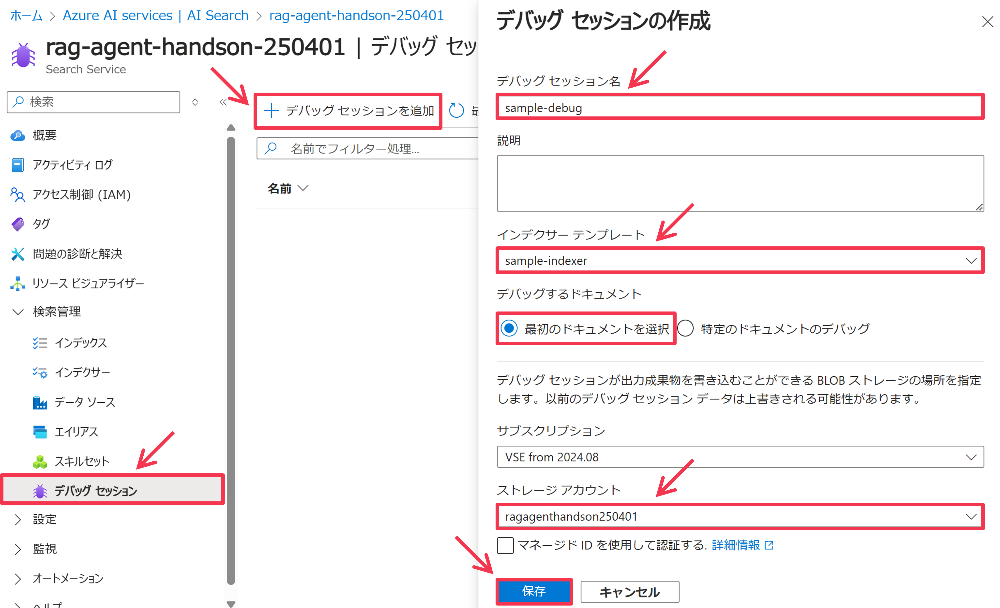

すると、インデクサーの実行が始まります。インデクサーの実行が完了すると、以下のようなダイアグラムと、生成されたデータ構造を確認することができます。左側のダイアグラムでは、各スキルセットとインデックスマッピングの関係性を把握することができ、また右側のウィンドウでは各スキルセットの入力/出力の値を確認することができます。
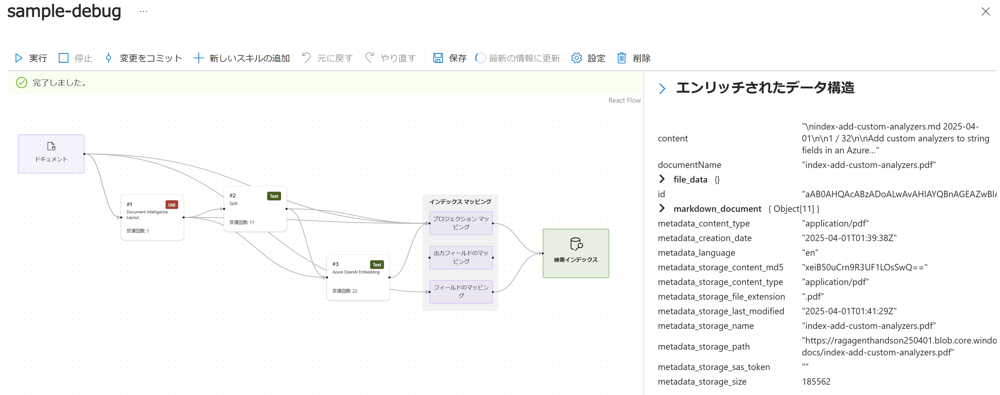

> [Debug Sessions concepts - Azure AI Search | Microsoft Learn](https://learn.microsoft.com/en-us/azure/search/cognitive-search-debug-session)

## Appendix: REST API 経由でのインデックスの作成
Azure AI Search の[インデックス](https://learn.microsoft.com/en-us/rest/api/searchservice/operation-groups?view=rest-searchservice-2024-07-01)、[データソース](https://learn.microsoft.com/en-us/rest/api/searchservice/data-sources/create?view=rest-searchservice-2024-07-01&tabs=HTTP)、[スキルセット](https://learn.microsoft.com/en-us/rest/api/searchservice/skillsets/create?view=rest-searchservice-2024-07-01&tabs=HTTP)、[インデクサー](https://learn.microsoft.com/en-us/rest/api/searchservice/indexers/create?view=rest-searchservice-2024-07-01&tabs=HTTP)といった各種要素は、[REST API](https://learn.microsoft.com/en-us/rest/api/searchservice/operation-groups?view=rest-searchservice-2024-07-01) 経由で作成したり、削除したりすることができます。  
  
例えば、```curl``` でインデックスを作成する場合は、以下の様なコマンドを実行することで作成できます。以下の場合は、```ai-search/index.json``` の JSON ファイルの定義に従ってインデックスを作成します。
```bash
AI_SEARCH_NAME="" # Azure AI Search のアカウント名
AI_SEARCH_ADMIN_KEY="" # Azure AI Search の管理キー
curl -X POST https://$AI_SEARCH_NAME.search.windows.net/indexes?api-version=2024-07-01 \
    -H 'Content-Type: application/json' \
    -H 'api-key: '$AI_SEARCH_ADMIN_KEY \
    -d @ai-search/index.json
```

もちろん、REST API が使えれば手段は何でもよいです。以下は Python プログラムでインデックスを作成する例です。
```py
import json
import requests

AI_SEARCH_NAME = ""
AI_SEARCH_ADMIN_KEY = ""

with open("ai-search/index.json", "r") as f:
    index_definition = json.load(f)

url = f"https://{AI_SEARCH_NAME}.search.windows.net/indexes?api-version=2024-07-01"
headers = {"Content-Type": "application/json", "api-key": AI_SEARCH_ADMIN_KEY}
requests.post(url, json=index_definition, headers=headers)
```

また、Azure AI Search Client Library が提供されているプログラミング言語([.NET](https://learn.microsoft.com/en-us/dotnet/api/overview/azure/search.documents-readme), [Python](https://learn.microsoft.com/en-us/python/api/overview/azure/search-documents-readme), [Java](https://learn.microsoft.com/en-us/java/api/overview/azure/search-documents-readme), [JavaScript](https://learn.microsoft.com/en-us/javascript/api/overview/azure/search-documents-readme?view=azure-node-latest))であれば、そのライブラリを使うことでより簡単にインデックス等の管理を行うことができるようになります。
```py
import json
from azure.core.credentials import AzureKeyCredential
from azure.search.documents.indexes import SearchIndexClient
from azure.search.documents.indexes.models import SearchIndex

AI_SEARCH_NAME = ""
AI_SEARCH_ADMIN_KEY = ""

with open("ai-search/index.json", "r") as f:
    index_json = json.load(f)
    index = SearchIndex.from_dict(index_json)

index_client = SearchIndexClient(
    endpoint=f"https://{AI_SEARCH_NAME}.search.windows.net",
    credential=AzureKeyCredential(AI_SEARCH_ADMIN_KEY),
    api_version="2024-07-01",
)
index_client.create_or_update_index(index=index)
```