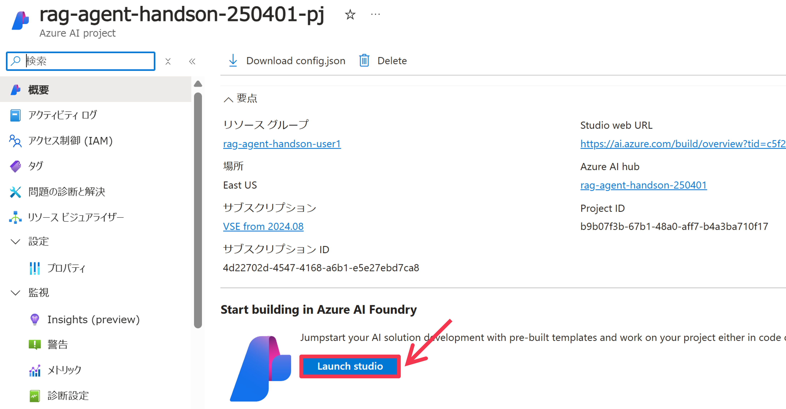
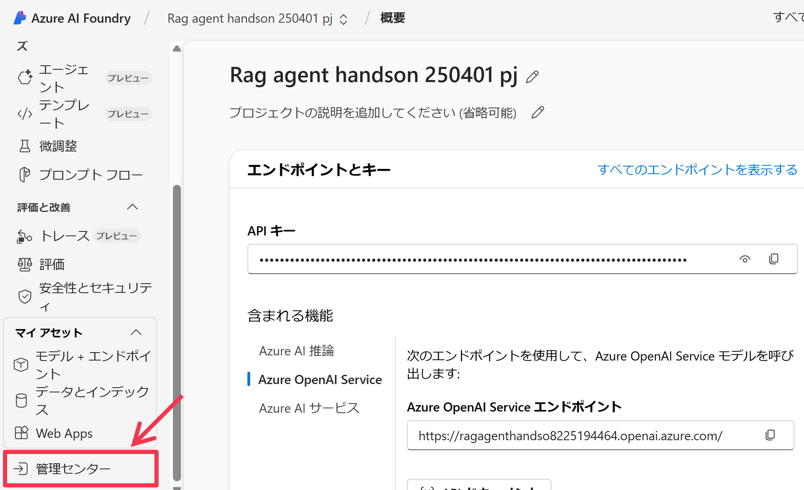
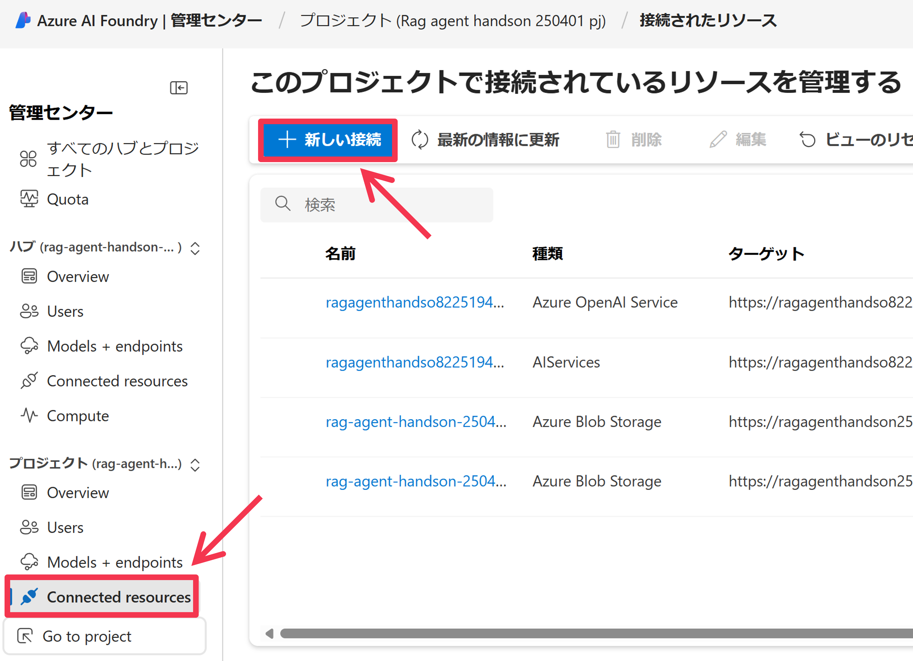

# 4. Azure AI Agent Service での AI エージェントの開発
Azure AI Agent Service を使って、AI エージェントを開発します。まず事前準備を行い、その後、用意された Python プログラムをベースに、AI Agent Service を呼び出す処理の実装を行います。最後には、チャットアプリの実装を行い、Azure Web Apps へデプロイします。

## 4.1 事前準備

### 4.1.1 AI Project 接続文字列の取得
リソースグループのページを表示して、Azure リソース一覧の中にある、先ほど作成した AI Project (```種類``` が ```Azure AI project``` のリソース)の名前をクリックします。


クリックした AI Project のページが表示されるので、Azure AI Foundry Portal へ移動するため、```[Launch Studio]``` ボタンをクリックします。


AI Foundry Portal での AI Project のページが表示されます。サイドメニューの ```[概要]``` をクリックし、画面右の ```[プロジェクトの詳細]>[プロジェクト接続文字列]``` の右側にあるクリップボードにコピーするための ```[四角アイコン]``` をクリックして、AI Project の接続文字列を、クリップボードへコピーします。


以下の通りにコマンドを実行して、ファイル [src/.env_template](../../src/.env_template) をコピーして、```src/.env``` を作成します。
```bash
cp src/.env_template src/.env
```

そして、.env 内の以下の ```AZURE_AI_AGENT_PROJECT_CONNECTION_STRING``` の値として、先ほどクリップボードにコピーした AI Project の接続文字列を貼り付けます。
```bash
# Azure AI Project Settings
AZURE_AI_AGENT_PROJECT_CONNECTION_STRING="{REGION}.api.azureml.ms;{SUBSCRIPTION_ID};{RESOURCE_GROUP_NAME};{AI_PROJECT_NAME}"
AI_SEARCH_CONNECTION_NAME="{Input your AI Search Connection Name in AI Project}"
AZURE_AI_AGENT_MODEL_DEPLOYMENT_NAME="gpt-4o-mini" # gpt-4o or gpt-4o-mini
```

### 4.1.2 AI Project へ接続リソースの追加
続いて、AI Project に先ほど用意した Azure AI Search アカウントへの接続を設定します。  
サイドメニューの ```[管理センター]``` をクリックします。


AI Hub と Project の管理センターが表示されます。ここではユーザや接続リソースの管理を主に行います。サイドメニューの ```[Connected resources]``` をクリックすると、プロジェクトに接続されているリソース一覧が表示されます。```[＋新しい接続]``` をクリックします。


リソース接続の追加ウィンドウが表示されます。```[Azure AI 検索]``` をクリックします。


接続できる AI Search アカウントの一覧が表示されます。今回作成した AI Search アカウントの ```[接続を追加する]``` ボタンをクリックし、追加ができたら ```[閉じる]``` ボタンをクリックします。


先ほど選択した AI Search アカウントが追加されていることを確認します。この名前(リソース接続名)をコピーしておき(以下の例だと"ragagenthandson250401")、```src/.env``` ファイルの ```AI_SEARCH_CONNECTION_NAME``` の値として貼り付けます。また、```AZURE_AI_AGENT_MODEL_DEPLOYMENT_NAME``` の値も、今回使用する GPT モデルの名前に応じて修正してください。


```bash
# Azure AI Project Settings
AZURE_AI_AGENT_PROJECT_CONNECTION_STRING="{REGION}.api.azureml.ms;{SUBSCRIPTION_ID};{RESOURCE_GROUP_NAME};{AI_PROJECT_NAME}"
AI_SEARCH_CONNECTION_NAME="{Input your AI Search Connection Name in AI Project}"
AZURE_AI_AGENT_MODEL_DEPLOYMENT_NAME="gpt-4o" # gpt-4o or gpt-4o-mini
```

### 4.1.3 Azure CLI のセットアップ
これから Azure AI Agent Service を使用して AI エージェントを実装しますが、サービス認証に、参加者の Microsoft Entra アカウントを使用します。開発端末でアカウントの認証情報を設定する簡単な方法として [Azure CLI](https://learn.microsoft.com/en-us/cli/azure/what-is-azure-cli) が挙げられるので、これをインストールして、Entra テナントへのログイン、Azure サブスクリプションの選択を実施します (認証情報は Azure CLI や Azure Powershell, Visual Studio Code, そしてサービスに設定されているマネージドID から使用されます。詳しくはこの[ドキュメント](https://learn.microsoft.com/en-us/dotnet/api/azure.identity.defaultazurecredential?view=azure-dotnet)をご参照ください)。  

インストール先の環境に合わせて、以下のドキュメントを参考にして、Azure CLI をインストールしてください (GitHub Codespaces の場合、[Linux 環境へのインストール](https://learn.microsoft.com/en-us/cli/azure/install-azure-cli-linux?pivots=apt)を参考にしてください)
- [Windows 環境へのインストール](https://learn.microsoft.com/en-us/cli/azure/install-azure-cli-windows?pivots=msi)
- [Mac OS 環境へのインストール](https://learn.microsoft.com/en-us/cli/azure/install-azure-cli-macos)
- [Linux 環境へのインストール](https://learn.microsoft.com/en-us/cli/azure/install-azure-cli-linux?pivots=apt)

インストール後、以下のコマンドを実行して、Azure CLI の設定を完了させてください。

```bash
# インストールされていることの確認
az version

# Azure サブスクリプションへログイン
az login --use-device-code
## 以下のようなメッセージが表示されるので、Web ブラウザで "https://microsoft.com/devicelogin" へアクセスし、表示される画面にアクセス許可コードを入力(以下の例だと"IH4XXXXX")し、参加者の Entra アカウントでログインしてください
## > To sign in, use a web browser to open the page https://microsoft.com/devicelogin and enter the code IH4XXXXX to authenticate.

# 選択した Azure サブスクリプションとログインユーザ情報を表示
az account show

# もし表示されている Azure サブスクリプションが今回使用しているものと異なる場合は、以下で設定する
az account set -s "{YOUR_SUBSCRIPTION_ID}"
```

### 4.1.4 Python 実行環境の構築
これから実行する Python アプリケーションは、Python 3.11.9 で動作確認ができています。それ以降のバージョンであればまず動くと考えられます。もし Python の実行環境がない場合は、以下のドキュメントを参考に、端末にインストールしてください。   
[Download Python | Python.org](https://www.python.org/downloads/)

### 4.1.5 Python 仮想環境の構築
以下のコマンドを実行して、Python の仮想環境の構築と、必要なパッケージをインストールしてください。
```bash
# src フォルダへ移動
cd src

# Python 仮想環境の構築 と有効化
python -m venv .venv
source .venv/bin/activate

# 必要な Python パッケージのインストール
python -m pip install -r requirements.txt
```

## 4.2 AI Agent Service を利用するプログラムの実装 (Hello World)
まず、Azure AI Agent Service を利用するための基本的なコードを実装します。   
コードは、既に [1.hello_world.py](../../src/1.hello_world.py) で実装されているので、以下のコマンドでプログラム実行します。

```bash
python 1.hello_world.py
```

コードを実行すると、```.output/1.hello_world``` 配下に、メッセージの処理単位である ```run``` の中身を出力した ```run.json```、また全メッセージと最新のアシスタントからのメッセージを出力した ```messages.json``` と ```message.json``` が出力されているので、興味がありましたらご参照ください。  
　　
コードの説明をします。　　
以下のコードでは、Azure AI Project へのアクセスクライアントを接続文字列とその認証情報(Entra 認証である ```DefaultAzureCredential``` のみをサポート)を指定することで作成します。接続文字列には、接続先の AI Project を特定する情報(サブスクリプションID, リソースグループ名, リソース名)が含まれます。```AIProjectClient``` クラスは、[azure-ai-projects](https://pypi.org/project/azure-ai-projects/) パッケージで提供されています。
```py
# Create Azure AI Agent Service client
project = AIProjectClient.from_connection_string(
    conn_str=AZURE_AI_AGENT_PROJECT_CONNECTION_STRING,
    credential=DefaultAzureCredential(),
)
```

次に、エージェントとスレッドを作成します。エージェントを作成する際に、使用するモデル(具体的にはデプロイ名)、エージェントの名前、指示(instructions)を指定します。```instructions``` でエージェントの動作の具体的な指示を出します。またスレッドを作成します。スレッドではメッセージを管理し、エージェントはスレッドのメッセージ内容をモデル(やツール)を用いて、instructions で指示された内容に従って処理を行います。
```py
# Create an agent
agent = project.agents.create_agent(
    model=AZURE_AI_AGENT_MODEL_DEPLOYMENT_NAME,
    name="hello-world-agent",
    instructions="You are a helpful assistant.",
)

# Create a thread
thread = project.agents.create_thread()
```

エージェントとスレッド、またファイルの構成関係は以下の通りです。


以下の処理では、スレッドにユーザメッセージを追加して、エージェント上でスレッドを実行しています。今回は、実行を開始して終了まで待機する ```create_and_process_run``` メソッドを使用しています。
```py
# Add a message to the thread
user_message = "Hello my AI agent."
project.agents.create_message(thread_id=thread.id, role="user", content=user_message)

# Process the thread with the agent (wait until the agent finishes processing)
run = project.agents.create_and_process_run(agent_id=agent.id, thread_id=thread.id)
```

エージェントからのユーザメッセージに対する返答がスレッドに格納されているため、スレッドのメッセージ一覧(```messages```)を取得して、かつエージェントからの最新メッセージ(```message```)を取得し、エージェントからの返答内容をコンソール出力しています。
```py
# List messages
messages = project.agents.list_messages(thread_id=thread.id)

# Get and display a latest message from an assistant
message = messages.get_last_text_message_by_role(role="assistant")
print(message.text.value)
```

[1.hello_world.py](../../src/1.hello_world.py) のコードにより、Azure AI Agent Service で AI エージェントを作成して、挨拶のやり取りを行うプログラムを実現できました。

## 4.3 AI Agent Service を利用するプログラムの実装 (AI Search での RAG)
次に、回答に情報な必要を Azure AI Search インデックスから取得して、その情報を元に回答させる、いわゆる RAG (Retrieval-Augmented Generation) を行う AI エージェントを実装します。   
コードは、既に [2.rag.py](../../src/2.rag.py) で実装されているので、以下のコマンドでプログラム実行します。
```bash
python 2.rag.py
```

コードで注目するべき点は以下の箇所で、エージェントを作成する際に、ツールを指定しています。今回は、ツールとして Azure AI Search のツール(AzureAISearchTool) を追加していますが、そのツールを定義する際に、Azure AI Project で接続リソースの名前から接続リソースIDを取得し、それを指定することでツール定義を行っています。AI Search ツールはツールセット(ToolSet)インスタンスに入れて、エージェント作成時に指定しています。このインスタンスには、複数のツールを追加することができます (例えば、AI Search ツールと Code Interpreter ツールといった組み合わせ)。
```py
# Define tools for the agent
ai_search_connection_id = project.connections.get(connection_name=AI_SEARCH_CONNECTION_NAME).id
ai_search = AzureAISearchTool(index_connection_id=ai_search_connection_id, index_name=AI_SEARCH_INDEX_NAME)
toolset = ToolSet()
toolset.add(ai_search)

# Create an agent
agent = project.agents.create_agent(
    model=AZURE_AI_AGENT_MODEL_DEPLOYMENT_NAME,
    name="rag-agent",
    instructions="""
    - Please respond to user inquiries.
    - For questions related to Azure AI Search, search the connected Azure AI Search index for relevant documents and provide answers based on those documents.
    """,
    toolset=toolset,
)
```

また今回は、実行過程を JSON ファイルとして出力し(.output/3.code_interpreter/run_steps.json)、またコンソール出力しています。エージェントが最新のアシスタントメッセージを出力するために、どのような過程を経たのかを確認することができます。
```py
# List run steps
run_steps = project.agents.list_run_steps(thread_id=thread.id, run_id=run.id)
write_json(f"{OUTPUT_DIR}/run_steps.json", run_steps.as_dict())
for i, run_step in enumerate(reversed(run_steps.data)):
    run_step = run_step.as_dict()
    message = f"[Step {i}] {run_step['type']}"
    step_details = run_step["step_details"]
    if step_details["type"] == "tool_calls":
        used_queries = ", ".join([f'Query: {d["azure_ai_search"]["input"]}' for d in step_details["tool_calls"] if d["type"] == "azure_ai_search"])
        message += f" ({used_queries})"
    print(message)
```

## 4.4 AI Agent Service を利用するプログラムの実装 (Code Interpreter)
今度は、回答のために Python コードを生成し、サンドボックス環境で実行することができるツールである [Code Interpreter](https://learn.microsoft.com/en-us/azure/ai-services/agents/how-to/tools/code-interpreter?tabs=python&pivots=overview) を使用する AI エージェントを実装します。   
コードは、既に [3.code_interpreter.py](../../src/3.code_interpreter.py) で実装されているので、以下のコマンドでプログラム実行します。
```bash
python 3.code_interpreter.py
```

先ほどと同様に、エージェントが使用するツールを定義します。今回は、Code Interpreter を使用するツール(CodeInterpreterTool)を指定します。
```py
# Define tools for the agent
code_interpreter = CodeInterpreterTool()
toolset = ToolSet()
toolset.add(code_interpreter)
```

以下のコードでは、メッセージにファイル([sample.csv](../../src/materials/sample.csv))を添付し、メッセージと共にスレッドに追加しています。ファイルは、上記のツール定義時点で指定することもできます。
```py
# Upload a file to the AI project
file = project.agents.upload_file_and_poll(file_path="materials/sample.csv", purpose=FilePurpose.AGENTS)
attachment = MessageAttachment(file_id=file.id, tools=CodeInterpreterTool().definitions)

# Add a message to the thread
user_message = """
The uploaded file is a CSV file that represents the vector sizes of a specific search document when compressed using various “vector compression methods,” “dimensions,” and “data type bit sizes” of Azure AI Search.
From this file, please create a horizontal bar graph to make it easier to understand the vector sizes for each method.
"""
project.agents.create_message(thread_id=thread.id, role="user", content=user_message, attachments=[attachment])
```

実行されたユーザメッセージでは「CSV ファイルの中身をグラフ化して可視化して」と要求しているため、恐らく、エージェントは画像ファイルが生成されたかと思います。そのため以下の処理で、生成された画像ファイルを AI Agent Service から取得して、ローカルファイル保存を行います。保存された画像ファイルは、```.output/3.code_interpreter``` フォルダ配下に出力されています。
```py
# Output generated images
for image_content in messages.image_contents:
    project.agents.save_file(
        file_id=image_content.image_file.file_id,
        target_dir=OUTPUT_DIR,
        file_name=f"{os.path.basename(image_content.image_file.file_id)}.png",
    )
```

## 4.5 AI Agent Service を利用するプログラムの実装 (ストリーム形式のレスポンス)
Web アプリケーションで AI エージェントと対話させる場合、ユーザビリティ向上のため、エージェントからのレスポンスが生成され次第受け取り画面に表示させることがあります。これを実現するためのコードは [4.streaming.py](../../src/4.streaming.py) で実装されています。以下のコマンドでプログラム実行します。
```bash
python 4.streaming.py
```

今回は、エージェントでスレッドのメッセージの処理を開始する際に、今まで呼び出していた ```create_and_process_run``` メソッドではなく、```create_stream``` メソッドを呼び出しています。これにより、AI Agent Service からストリーミング形式のレスポンスを受け取ることができるので、これでレスポンスを逐次受け取り、途中のステップ情報や、回答が生成され次第にストリーミング形式で画面にその内容を表示する、といったことができるようになります。どういったイベントをストリーミング形式で受け取っているかの詳細は、```.output/4.streaming``` フォルダ配下に出力されている JSON ファイル (event_types.json, stream_events.json) をご参照ください。
```py
# Process the thread with the agent (receive messages as they are generated)
stream = project.agents.create_stream(thread_id=thread.id, agent_id=agent.id)

# Display the messages as they are generated
event_types = []
stream_events = []
for event_type, data, func_rt in stream.event_handler:
    # Show streaming responses
    if event_type == "thread.message.delta":
        for c in data.delta.content:
            print(c.text.value, end="")
    # Show annotations in the final message
    elif event_type == "thread.message.completed":
        for c in data.content:
            print(c.text.annotations)
    event_types.append(event_type)
    stream_events.append({"event_type": event_type, "data": data.as_dict() if type(data) is not str else None})
```

## 4.6 Web アプリケーションの Azure Web Apps へのデプロイ
Azure AI Agent Service を活用した、AI エージェントとのチャット Web アプリケーションを開発し、Web アプリケーションをホストするためのフルマネージドサービスである [Azure Web Apps](https://learn.microsoft.com/en-us/azure/app-service/overview) へデプロイしてみましょう。

### 4.6.1 ローカル環境での Web アプリケーションの実行
Web アプリケーションは既に [app.py](../../src/app.py)  で実装されています。まず、以下のコマンドを実行して、この Web アプリケーションをローカル環境で実行してみます。
```bash
python app.py
```

Web アプリケーションが無事に起動されたら、[http://127.0.0.1:5000](http://127.0.0.1:5000) へアクセスし、AI Agent とチャットするための Web アプリケーションを利用してみましょう。画面右下のチャットウィンドウにメッセージを入力し、Enter キーを押下することで、AI Agent へメッセージを送信することができます。また、AI Agent からのレスポンスが画面に表示されます。


### 4.6.2 Azure Web Apps へのデプロイ
Azure CLI を使用して、Web アプリケーションを Azure Web Apps へデプロイします。このデプロイで、以下の処理を Azure CLI で行います。
- Azure App Service Plan リソースと Azure Web Apps リソースの作成
- 作成した Azure Web Apps に Web アプリケーションをデプロイ
- 作成した Azure Web Apps の環境変数を設定
- 作成した Azure Web Apps のシステム割り当てマネージド ID を有効にする
- 作成した Azure Web Apps へ Azure AI Project へのアクセス権限付与
  
まず、[src](../../src)ディレクトリにて、以下のコマンドを実行して、Azure App Service Plan リソースと Azure Web Apps リソースの作成して、Web アプリケーションをデプロイします。```$RESOURCE_GROUP``` といった変数には以下の通りの値に置き換えたうえで、コマンドを実行してください。
|変数名|入力するべき値|
|--|--|
|$RESOURCE_GROUP|デプロイ先のリソースグループ名|
|$APP_PLAN_NAME|作成する App Service Plan の名前(サブスクリプション内で一意の名前である必要がある)|
|$WEB_APP_NAME|作成する Web Apps の名前(グローバルで一意の名前である必要がある)|

```bash
az webapp up --resource-group $RESOURCE_GROUP --location "japaneast" --plan $APP_PLAN_NAME --sku "B1" --name $WEB_APP_NAME --runtime "PYTHON:3.11"
```

デプロイが完了するまで、以下のようなメッセージが表示されます。
```bash
The webapp 'sample-webapp-20250403' doesn't exist
Creating AppServicePlan 'sample-webapp-20250403' or Updating if already exists
Readonly attribute name will be ignored in class <class 'azure.mgmt.web.v2023_01_01.models._models_py3.AppServicePlan'>
Resource provider 'Microsoft.Web' used by this operation is not registered. We are registering for you.
Registration succeeded.
Creating webapp 'sample-webapp-20250403' ...
Configuring default logging for the app, if not already enabled
Creating zip with contents of dir C:\Codes\GitHub\az-ai-agent-handson-training\src ...
Getting scm site credentials for zip deployment
Starting zip deployment. This operation can take a while to complete ...
Deployment endpoint responded with status code 202
You can launch the app at http://sample-webapp-20250403.azurewebsites.net
Setting 'az webapp up' default arguments for current directory. Manage defaults with 'az configure --scope local'
--resource-group/-g default: sample-webapp-20250403
--sku default: B1
--plan/-p default: sample-webapp-20250403
--location/-l default: japaneast
--name/-n default: sample-webapp-20250403
{
  "URL": "http://sample-webapp-20250403.azurewebsites.net",
  "appserviceplan": "sample-webapp-20250403",
  "location": "japaneast",
  "name": "sample-webapp-20250403",
  "os": "Linux",
  "resourcegroup": "sample-webapp-20250403",
  "runtime_version": "PYTHON|3.11",
  "runtime_version_detected": "-",
  "sku": "BASIC",
  "src_path": ""
}
Please access to:  https://sample-webapp-20250403.azurewebsites.net/
```

続いて、以下のコマンドを実行して、Azure Web Apps リソースの環境変数を設定します。```$RESOURCE_GROUP``` といった変数には以下の通りの値に置き換えたうえで、コマンドを実行してください。
|変数名|入力するべき値|
|--|--|
|$RESOURCE_GROUP|先ほど作成した Web Apps が属するリソースグループ名|
|$WEB_APP_NAME|先ほど作成した Web Apps の名前|
|$AZURE_AI_AGENT_PROJECT_CONNECTION_STRING|.env の AZURE_AI_AGENT_PROJECT_CONNECTION_STRING の値|
|$AI_SEARCH_CONNECTION_NAME|.env の AI_SEARCH_CONNECTION_NAME の値|
|$AZURE_AI_AGENT_MODEL_DEPLOYMENT_NAME|.env の AZURE_AI_AGENT_MODEL_DEPLOYMENT_NAME の値|
|$AI_SEARCH_INDEX_NAME|.env の AI_SEARCH_INDEX_NAME の値|
```bash
az webapp config appsettings set --resource-group $RESOURCE_GROUP --name $WEB_APP_NAME --settings SCM_DO_BUILD_DURING_DEPLOYMENT=true AZURE_AI_AGENT_PROJECT_CONNECTION_STRING=$AZURE_AI_AGENT_PROJECT_CONNECTION_STRING AI_SEARCH_CONNECTION_NAME=$AI_SEARCH_CONNECTION_NAME AZURE_AI_AGENT_MODEL_DEPLOYMENT_NAME=$AZURE_AI_AGENT_MODEL_DEPLOYMENT_NAME  AI_SEARCH_INDEX_NAME=$AI_SEARCH_INDEX_NAME
```

また、以下のコマンドを実行して、Azure Web Apps のシステム割り当てマネージド ID を有効にします。
|変数名|入力するべき値|
|--|--|
|$RESOURCE_GROUP|先ほど作成した Web Apps が属するリソースグループ名|
|$WEB_APP_NAME|先ほど作成した Web Apps の名前|
```bash
az webapp identity assign -g $RESOURCE_GROUP -n $WEB_APP_NAME
```

このコマンドを実行すると、以下のような JSON の値が表示されます。ここでの ```principalId``` は、Azure Web Apps にシステム割り当てマネージド ID として割り当てられているサービスプリンシパルの ID です。これは後ほど使用するのでメモしておきます。
```json
{
  "principalId": "46b4d867-9d8b-4bd5-bd40-c3854db01a04",
  "tenantId": "cf2a3596-1d54-4fec-a7af-d8964955f052",
  "type": "SystemAssigned",
  "userAssignedIdentities": null
}
```

この後のコマンドで、サブスクリプションID を指定する必要があるため、以下のコマンドを実行することで確認します。
```bash
az account show --query "id" --output tsv
```

最後に、以下のコマンドを実行することで、作成した Azure Web Apps へ AI Project へのアクセス権限を付与します。```$RESOURCE_GROUP``` といった変数には以下の通りの値に置き換えたうえで、コマンドを実行してください。
|変数名|入力するべき値|
|--|--|
|$SUBSCRIPTION_ID|先ほど確認したサブスクリプション ID (UUID)|
|$RESOURCE_GROUP|先ほど作成した Web Apps が属するリソースグループ名|
|$AI_PROJECT_NAME|このワークショップで作成した AI Project の名前|
|$WEB_APP_PRINCIPAL_ID|先ほど確認した、Web Apps のマネージドID のサービスプリンシパルのID(principalId)|
```bash
az role assignment create \
    --role "Azure AI Developer" \
    --scope subscriptions/$SUBSCRIPTION_ID/resourceGroups/$RESOURCE_GROUP/providers/Microsoft.MachineLearningServices/workspaces/$AI_PROJECT_NAME \
    --assignee-object-id $WEB_APP_PRINCIPAL_ID \
    --assignee-principal-type ServicePrincipal
```

そして、念のため、以下のコマンドを実行して Web Apps を再起動して、作成された Web Apps の URL にアクセスし、デプロイした Web アプリケーションを使用してみます。
```bash
# Azure Web Apps インスタンスを再起動する
az webapp restart --resource-group $RESOURCE_GROUP --name $WEB_APP_NAME

# 以下の URL へアクセスする
https://$WEB_APP_NAME.azurewebsites.net/
```