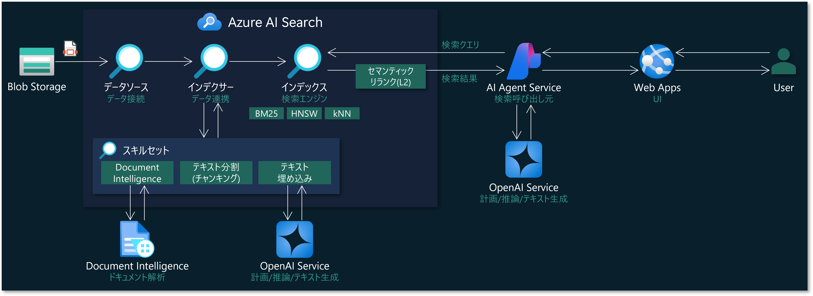

# Azure AI Agent 開発ハンズオントレーニング

## 本ハンズオントレーニングで実現する構成図

## 本ハンズオントレーニングで学ぶことができること
1. Azure Portal で以下の Azure リソースのデプロイ
  - Azure Storage
  - Azure AI Search
  - Azure AI Foundry (AI Hub / AI Project)
2. Azure AI Search でのインデックス作成
  - データソース・スキルセット・インデクサーを用いた Pull 型でのインデックス作成
  - ドキュメント分析スキル・チャンク分割スキル・テキスト埋め込みスキルを使った、RAG のための PDF ファイル処理の実現
  - インデックス・スキルセットの具体的な定義方法
  - デバッグセッションの使い方
3. Azure AI Agent Service を使った AI エージェントの開発
  - Python プログラムからの AI Agent Service の利用 (AI Search ツール, Code Interpretor ツール)
  - AI エージェントと対話する Web アプリの開発
  - Web アプリの Azure Web App へのデプロイ

## ハンズオントレーニングのドキュメント
|ドキュメント|トレーニングパート|内容|
|--|--|--|
|[1.deploy-resources.md](1.deploy-resources.md)|1. Azure リソースのデプロイ|今回のトレーニングで使用する Azure リソースとして、Storage アカウント、AI Search アカウント、AI Foundry ハブ/プロジェクトを Azure Portal 上で作成します|
|[2.setting-resources.md](2.setting-resources.md)|2. Azure リソースの設定|作成した Azure リソースの設定を行います。Storage へのファイルアップロードや、アクセス権限付与(RBAC)を行います|
|[3.prepare-index.md](3.prepare-index.md)|3. Azure AI Search インデックスの作成|作成した AI Search にインデックス、データソース、スキルセット、インデクサーを作成し、Pull 型でのインデックス作成を行います。このインデックスは AI エージェントの回答情報として使用されます|
|[4.develop-agent.md](4.develop-agent.md)|4. Azure AI Agent Service での AI エージェントの開発|AI Agent Service を使用して AI エージェントを開発します。基本的な処理から、ストリーミング出力を行う Python プログラムを実装します。そして、Web アプリケーションを実装して Azure Web Apps へデプロイします。|
|[5.extra-trainings.md](5.extra-trainings.md)|5. 追加のトレーニング|時間があれば行うコンテンツです。Semantic Kernel Agent Framework でマルチエージェント開発を行います|
|[6.clean-up.md](6.clean-up.md)|6. 後片付け|今回作成した Azure リソースを削除します。また GitHub Codespaces を使用している場合は、今回使用した Codespace も削除します。|

## GitHub Codespaces でこのレポジトリを使用する
[GitHub Codespaces を起動](https://github.com/codespaces/new?hide_repo_select=true&ref=main&repo=959139172&skip_quickstart=true&ref=main)
